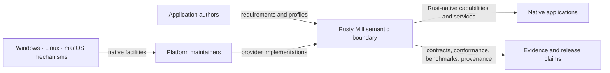
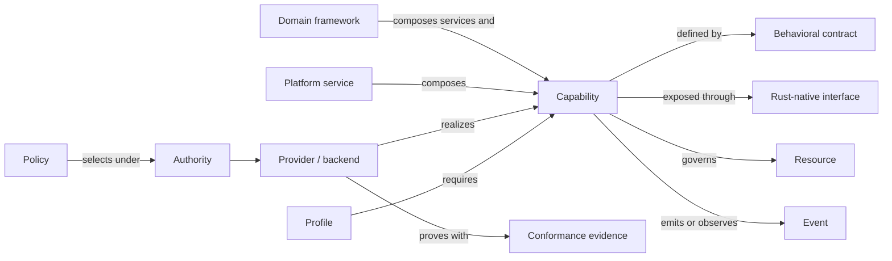
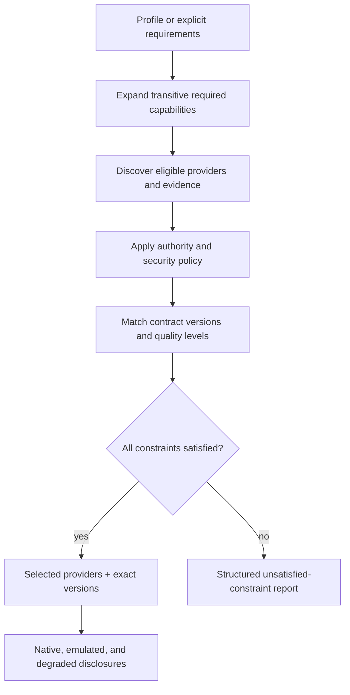
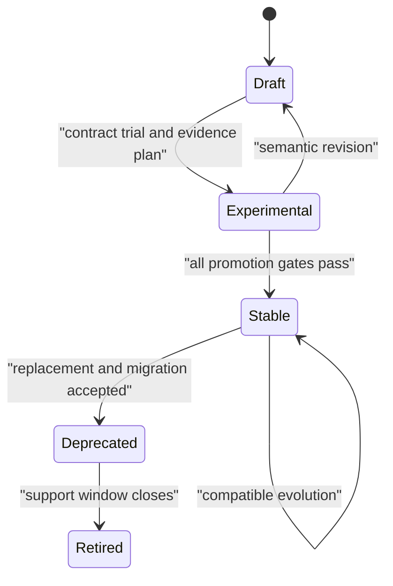
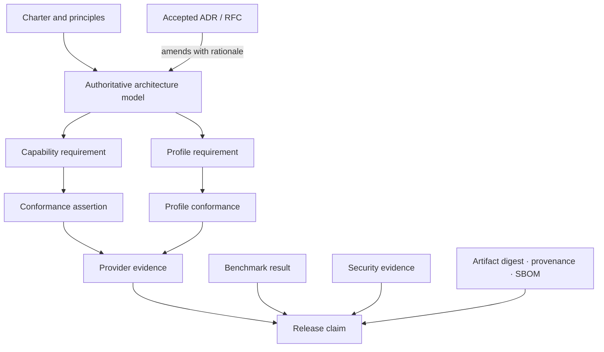
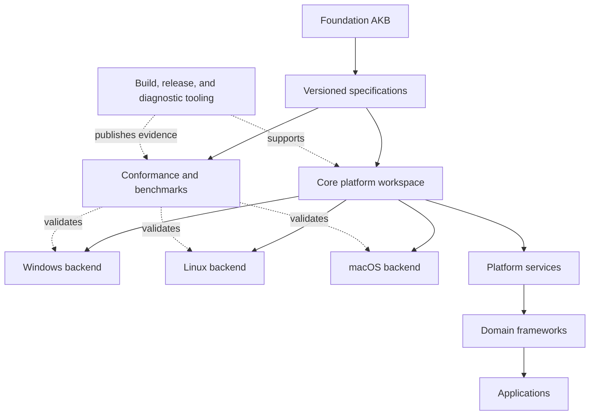

# Rusty Mill authoritative architecture model

**Status:** Accepted  
**Authority:** Normative source of truth  
**Version:** 1.77.0
**Last updated:** 2026-08-08  
**Decision:** [ADR-0004](../adr/0004-authoritative-architecture-model.md)

## 1. Authority and interpretation

This document is the authoritative model for Rusty Mill's platform architecture. It defines the system's boundaries, layers, architectural entities, dependency rules, contract model, quality obligations, evolution process, ecosystem shape, and evidence chain.

Supporting documents provide rationale, templates, domain detail, research, and operational procedure. If a supporting document conflicts with this model, this model governs unless a later accepted ADR explicitly supersedes the relevant rule. Draft capability specifications cannot amend this model implicitly.

Normative terms **MUST**, **MUST NOT**, **SHOULD**, **SHOULD NOT**, and **MAY** express architectural obligations. Examples are illustrative unless labeled normative.

## 2. Mission and boundary

Rusty Mill is a Rust-first, high-performance, capability-based operating-system abstraction and application platform for native applications on Windows, Linux, and macOS.

Its central axiom is:

> **Abstract capabilities, not operating systems.**

Applications state the behavior and quality they require. Rusty Mill selects providers that realize those requirements with native mechanisms, while exposing unsupported behavior and meaningful variance instead of hiding them.

Rusty Mill is not:

- A kernel or replacement for operating-system system libraries.
- A one-for-one wrapper over Win32, POSIX, Cocoa, or another native API family.
- A lowest-common-denominator portability layer.
- A promise that different platforms have identical mechanisms or performance.
- Permission to create public APIs or crates before their contracts and boundaries are understood.

The working maxim is:

> **Specify completely. Implement faithfully. Verify continuously. Evolve deliberately.**

## 3. System context

Application authors consume Rust-native capabilities, services, and frameworks. Platform maintainers implement backend contracts against operating-system mechanisms. Rusty Mill owns the semantic boundary between them and the evidence that the boundary is honored.

## 4. Architecture pyramid

### 4.1 Layers

| Layer | Owns | Must not own |
|---|---|---|
| Applications | Product behavior and product policy | Portable OS mechanism abstractions |
| Domain frameworks | Application-oriented compositions and workflows | Backend selection or raw OS calls |
| Platform services | Coordination, orchestration, and policy across capabilities | Platform-specific mechanisms |
| Common APIs | Stable Rust-native interaction surfaces and semantic types | Native handles as the normal abstraction |
| Capability framework | Discovery, negotiation, authority, provider selection, lifecycle, and degradation reporting | Domain-specific application policy |
| Backend contracts | Provider obligations and adaptation boundary | Application workflows |
| OS backends | Native mechanism use, unsafe/FFI isolation, platform diagnostics | Portable policy or public semantic redefinition |

### 4.2 Dependency rules

1. Dependencies **MUST** point downward through the immediately adjacent layer.
2. A layer **MUST NOT** reach around an intermediate layer to use a lower implementation directly.
3. Shared specifications, schemas, test vectors, and evidence formats **MAY** remain dependency-neutral.
4. Backend-specific handles **MUST NOT** cross common APIs except through an explicitly specified escape hatch.
5. Domain logic **MUST** remain independent of OS APIs, FFI bindings, and I/O frameworks.
6. A cross-layer exception requires an accepted ADR, stated scope, and migration path.

The default deployment architecture is a modular monolith. A separate process or service requires a forcing function such as independent scaling, ownership, language boundary, privilege separation, or fault isolation.

## 5. Architectural entity model

### 5.1 Capability

The smallest independently describable, selectable, securable, testable, and evolvable unit of platform behavior. A capability describes an outcome, not an OS symbol, crate, trait, or implementation.

Stable identity uses `rm.<domain>.<capability>`. Contract versions attach to the identity using SemVer. A capability specification records purpose, non-goals, maturity, owner, dependencies, semantics, authority, quality levels, platform mappings, verification, and history.

### 5.2 Behavioral contract

The normative definition of what consumers may rely on and providers must prove. It covers:

- Preconditions, outputs, invariants, guarantees, and non-guarantees.
- Resource ownership, borrowing, transfer, cleanup, and behavior after failure.
- Ordering, concurrency, thread safety, reentrancy, fairness, and atomicity.
- Async and sync behavior, blocking, cancellation, and backpressure.
- Typed errors, partial completion, recovery, retry safety, and idempotency.
- Authority, privilege, trust boundaries, and sensitive information.
- Performance, accessibility, internationalization, and observability.
- Platform realization, emulation, degradation, and incompatibility.
- Compatibility, deprecation, conformance assertions, and benchmarks.

Every normative statement receives a stable identifier of the form `RM-<DOMAIN>-<CAPABILITY>-<NNNN>`. Identifiers survive editorial movement and are never reused after retirement.

### 5.3 Interface

The Rust-native typed surface through which a consumer uses a contract. Interface design follows accepted semantics. A public type or trait is not itself the contract and cannot silently strengthen or weaken it.

### 5.4 Provider and backend

A provider realizes one or more capabilities. An OS backend is a provider at the native platform boundary. Providers declare exact contract versions, quality levels, platform constraints, and evidence. Selection is based on requirements and evidence, not OS name alone.

### 5.5 Resource

An owned or borrowed entity with explicit lifetime, authority, concurrency, cancellation, and cleanup rules. Illegal resource states should be unrepresentable where practical. Native resource identities stay behind the backend boundary unless an escape contract says otherwise.

### 5.6 Event

A typed observation of a transition or external occurrence. Contracts define ordering, duplication, loss, backpressure, timestamp domain, delivery context, and shutdown behavior.

### 5.7 Policy

A separately configurable rule governing provider selection, authority, fallback, quality, budgets, or orchestration. Backends implement mechanism; policy chooses acceptable behavior. Policy must not be hidden in platform-specific code.

Security policy evaluation is advisory: it may return permit, deny, indeterminate, or not-applicable with provenance and freshness, but the protected native operation remains the authorization point. A prior permit never guarantees later success ([ADR-0010](../adr/0010-native-operation-is-the-authorization-point.md)).

### 5.8 Service

A cohesive runtime facility that coordinates multiple capabilities, resources, and policies. Coordination belongs in a service when placing it in a base capability would create dependency cycles or mix independent lifecycles.

### 5.9 Domain framework

An application-oriented composition above platform services. Frameworks may offer opinionated workflows but cannot redefine capability guarantees.

### 5.10 Profile

A named, versioned declaration of required, conditional, optional, and prohibited capabilities and services, contract ranges, quality levels, and security constraints for a workload class. Initial foundation profile families are CLI, Desktop, Server, and Embedded/headless; their current exact membership is specified while missing application domains remain explicit gaps.

Profiles select exact capability contracts and platform services—not undifferentiated domains, crates, or OS features. Members are required, conditional, optional, or prohibited and carry independent quality, authority, interaction, budget, degradation, and evidence constraints. Current `foundation` profiles preserve explicit domain gaps and cannot imply complete application support. Satisfied resolution produces an immutable evidence-bound report ([ADR-0013](../adr/0013-profiles-select-contracts-not-domains.md)).

## 6. Capability dependency graph

The graph is a versioned architecture artifact derived from capability specifications.

### 6.1 Edge types

- `requires`: the source cannot satisfy its minimum contract without the target.
- `optionally-uses`: the target improves quality or enables declared optional behavior.
- `conflicts-with`: the specified nodes or versions cannot coexist under stated conditions.

Edges may carry version constraints, conditions, rationale, and requirement identifiers.

### 6.2 Invariants

1. The directed `requires` subgraph **MUST** be acyclic.
2. Every edge **MUST** appear in the source specification.
3. A required edge **MUST** target the narrowest sufficient capability.
4. An optional edge **MUST NOT** silently change minimum guarantees.
5. A conflict **MUST** state whether it is semantic, authority, resource, or transitional.
6. OS names, crate names, and implementation symbols **MUST NOT** be graph targets.
7. Resolution **MUST** produce a satisfiable graph or diagnostics for every unsatisfied constraint.

Required cycles indicate an incorrect capability boundary or orchestration that belongs in a service.

## 7. Capability availability and negotiation

Provider availability is one of:

- **Native:** satisfied using a first-class platform mechanism.
- **Emulated:** satisfied with explicitly documented cost or limitations.
- **Degraded:** a declared weaker quality level remains within the contract.
- **Unavailable:** requested semantics or quality cannot be satisfied.

Unknown is a research/specification state, not a runtime availability claim.

Resolution consumes a profile or explicit requirements plus policy and authority. It returns selected providers, exact versions and quality levels, emulation/degradation disclosures, and diagnostics for unsatisfied constraints. Silent fallback or silent weakening is prohibited.

## 8. Portability and platform variance

Portability means stable promised semantics, explicit discovery, typed failures, declared variance, and testable behavior—not identical implementation.

Each capability classifies its expected Windows, Linux, and macOS realization and records native mechanisms as research. Platform-specific extensions are permitted when a truthful common contract is impossible. Consumers opt into them explicitly; their presence cannot be inferred merely from OS identity.

Escape hatches must preserve ownership and safety, declare lost portability, and avoid making common paths depend on native handles.

Filesystem paths are lossless platform-native semantic values, not necessarily Unicode strings. Display conversion, normalization, case behavior, and object identity are separate concerns ([ADR-0006](../adr/0006-paths-are-lossless-native-values.md)). Security-sensitive filesystem lookup begins from explicit directory authority and uses declared handle-relative resolution strength; lexical canonicalization alone cannot prove containment ([ADR-0007](../adr/0007-directory-relative-resolution-is-the-security-boundary.md)).

Filesystem namespace visibility, atomicity, and durability are distinct guarantees. Atomic same-filesystem replacement remains a capability; stronger durable publication may compose it with file/directory synchronization as a platform service ([ADR-0008](../adr/0008-atomic-replacement-is-a-capability.md)). Providers declare resolution quality and durability level against exact filesystem and storage contexts rather than inheriting guarantees from OS identity.

Portable process creation begins with direct launch of an explicit executable, structured native arguments, explicit environment construction, and allowlisted inheritance. Shell parsing, executable search, activation, elevation, and durable service registration are separate opt-in contracts. Where an OS requires command-line serialization, providers declare the target parsing convention and cannot claim universal round-trip fidelity ([ADR-0014](../adr/0014-direct-process-launch-is-the-base-contract.md)).

Executable resolution is separate from launch and consumes explicit ordered directory authority; ambient path/current-directory search is not a base behavior ([ADR-0016](../adr/0016-executable-search-uses-explicit-authority.md)). Control of one owned child is a capability. Supervision of a dynamic process set is a platform service with scoped containment evidence; observed ancestry cannot be represented as a universally contained process tree ([ADR-0015](../adr/0015-process-set-supervision-is-a-service.md)).

Anonymous byte pipes are independent IPC capabilities with directional ownership, EOF, broken-peer, backpressure, atomicity, and async quality semantics. Process spawning only binds compatible endpoints; multi-process pipeline lifecycle is a service/framework composition ([ADR-0017](../adr/0017-byte-pipes-are-independent-ipc-capabilities.md)).

Pseudoterminals are stateful protocol-bearing terminal resources, not byte pipes. Their capability owns attachment, character-cell size, wire profile, terminal state, transport, resize, and hangup. A terminal session service composes process launch/supervision; emulation, rendering, structured input, Unicode layout, and accessible presentation remain higher layers with separate evidence ([ADR-0018](../adr/0018-pseudoterminals-are-not-byte-pipes.md)).

Terminal emulation is a domain framework above the terminal session boundary. Portable parser/state, structured input, renderer and accessibility adapters, privileged-effect policy, and recording remain narrow framework/service contracts. OS backends cannot redefine emulator semantics, and no component's conformance implies whole-terminal-product conformance ([ADR-0019](../adr/0019-terminal-emulation-is-a-domain-framework.md)).

Portable window state is negotiated rather than synchronously assigned. Requests and effective native state are distinct; logical extent, scale/transform, surface extent, display association, and presentation-surface generation are committed atomically in revisioned snapshots. Native callback reentrancy is contained behind ordered portable delivery, and exact placement/global coordinates remain optional provider claims ([ADR-0020](../adr/0020-window-state-is-negotiated.md)).

Window logical, surface-pixel, display-logical, and backend-native coordinates are distinct spaces. Conversion uses an explicit revision-bound transform and declared rounding; physical DPI and global placement are optional observations rather than universal truths ([ADR-0021](../adr/0021-coordinate-spaces-are-typed.md)). Windowing owns presentation-surface lifetime and generation, while graphics owns rendering and presentation mechanics.

Graphics providers are selected against exact versioned workload vectors rather than API names or a scalar acceleration label. The base architecture does not standardize a universal rendering command interface before multiple concrete renderers establish shared semantics ([ADR-0022](../adr/0022-graphics-selection-uses-workload-contracts.md)). Devices, queues, resources, synchronization, and evidence are scoped to immutable device epochs; loss requires explicit terminal classification and re-resolution.

Windowing owns the presentation-surface generation. A graphics presentation service composes that surface with device, queue, image-pool, synchronization, color, and frame policy. Frame leases are bounded; submission, presentation acceptance, and observed display are distinct milestones; reconfiguration creates a new session generation ([ADR-0023](../adr/0023-presentation-is-a-graphics-service.md)).

Keyboard observations and text input are separate coordinated contracts. Physical control, logical key meaning, modifier/layout revision, provisional composition, and committed Unicode text remain distinguishable. A text-input service owns focused editable-target context, surrounding-text disclosure, caret/selection geometry, composition, commit, and cancellation; backends do not synthesize committed text by blindly mapping keys ([ADR-0024](../adr/0024-text-input-is-not-keyboard-input.md)).

Input provenance is evidence rather than authority. Hardware-associated, OS/accessibility, remote, replayed, application-synthetic, and unknown origins remain explicit; security-sensitive actions authorize independently. Focused input, background observation, capture/lock/confinement, and injection are separately negotiated capabilities with independent authority ([ADR-0025](../adr/0025-input-provenance-is-not-authority.md)).

Semantic Unicode text remains authoritative across editing, text services, layout, accessibility, search, and copy. Glyphs, pixels, bidi visual order, and generated layout content are derived artifacts with explicit revisioned mappings; glyph IDs are local to one exact font face instance ([ADR-0026](../adr/0026-semantic-text-is-not-glyph-output.md)). Every position/range names its encoding or semantic unit and text revision.

Font discovery/resolution precedes reproducible shaping. It converts policy plus a versioned collection snapshot into an immutable ordered plan of exact artifact, face, variation, fallback, trust, and license identities. Shaping consumes that plan without ambient discovery or network access ([ADR-0027](../adr/0027-font-resolution-precedes-shaping.md)). Segmentation, bidi, shaping, line layout, and rasterization remain separately versioned stages.

Accessibility semantics are application/domain state independent of renderer output and native API vocabularies. Applications publish immutable revisioned roles, states, relationships, focus, text/ranges, geometry, actions, and live-update intent; UI Automation, AT-SPI, and macOS Accessibility are adapter mappings with declared variance ([ADR-0028](../adr/0028-accessibility-semantics-are-domain-state.md)). Pixels, glyphs, and untrusted content cannot establish privileged semantic truth.

Accessibility invocations become versioned semantic action requests through the ordinary domain command path. They retain provenance but do not grant authority or bypass state, confirmation, sandbox, destructive-operation, or audit policy. Request acceptance, command completion, state commitment, and native notification are separate milestones ([ADR-0029](../adr/0029-accessibility-actions-use-domain-command-path.md)).

Clipboard and drag-and-drop compose immutable typed data offers whose metadata can be inspected without rendering payloads. Materialization requests one exact representation under explicit size, time, resource, destination, authority, and conversion policy and returns a bounded async stream. Conversion provenance and source/offer lifetime remain explicit ([ADR-0030](../adr/0030-data-transfer-uses-lazy-typed-offers.md)).

Cross-application move is a committed transfer, not a gesture result. The target selects, materializes, validates, and commits content before acknowledging success; only then may the source apply declared deletion/mutation. Target commit and source cleanup failures remain separate outcomes, and global atomicity is not implied ([ADR-0031](../adr/0031-move-is-a-committed-transfer.md)).

Locale-sensitive operations consume an immutable explicit locale context resolved from versioned user-preference snapshots, application policy/resources, and exact Unicode/CLDR/time-zone/provider data. Requested resource language, formatting region, script, calendar, numbering, collation, measurement, and time zone remain distinct, and preference/data changes create new coordinated contexts rather than mutating ambient process behavior ([ADR-0032](../adr/0032-locale-sensitive-operations-use-explicit-context.md)).

Localized formatting is human presentation, not canonical serialization, identity, database/protocol data, signature input, filesystem semantics, or a guaranteed parse round trip. Parsing and collation are explicit versioned contracts with ambiguity and scope; collation equivalence never establishes security or object identity ([ADR-0033](../adr/0033-localized-output-is-not-canonical-data.md)).

## 9. Execution and concurrency model

Rusty Mill is **async-first and sync-complete**.

1. Potentially blocking capabilities **MUST** provide an async path that does not occupy a worker thread solely while waiting when native completion/readiness is available.
2. Stable capabilities **MUST** document a synchronous path.
3. Sync implementations **MUST NOT** create or nest a hidden async runtime.
4. Async implementations **MUST** define cancellation safety, completion ownership, executor assumptions, and backpressure.
5. Sync and async paths **MUST** share behavioral guarantees unless the contract explicitly documents a difference.
6. Thread safety, ordering, reentrancy, and fairness are contract properties, not framework assumptions.

Cancellation is cooperative unless an operation contract proves stronger native behavior. A cancellation request races with normal completion and is not confirmation that an operation was aborted.

## 10. Cross-cutting quality obligations

Every capability, profile, backend, service, framework, and stable release addresses these dimensions or gives a reviewable reason they do not apply.

### 10.1 Security

- Capability possession and authority are distinct where useful.
- Least privilege and safe defaults are mandatory.
- External input is validated at boundaries.
- Unsafe and native boundaries are isolated, documented, reviewed, and tested.
- Sensitive operations provide auditability without exposing secrets.
- Threat assumptions and degradation effects are explicit.

Principal claims, security-context snapshots, authority, grants, and constraints are distinct. Identity does not confer authority. Security-sensitive base contracts accept explicit resource- and operation-scoped authority where practical; portable derivation is attenuation-only; constraints compose by intersection; and missing required evidence fails closed ([ADR-0009](../adr/0009-identity-is-not-authority.md)). Authority is not serializable or transferable unless a dedicated contract defines its security properties.

Restricted execution is a platform service rather than a scalar capability. It composes process creation, authority attenuation, explicit inheritance, native isolation, readiness, and supervision from an immutable deny-by-default manifest. Required restrictions are applied and verified before child-controlled code runs; degradation requires prior policy permission ([ADR-0011](../adr/0011-restricted-execution-is-a-platform-service.md)).

Secret protection is negotiated as a scoped vector of persistence, boundary, subject binding, interaction, exportability, availability, replication, deletion, and assurance—not as a boolean or total security level. Unknown dimensions fail required constraints. Secret-value exposure semantics and secret-store persistence semantics remain distinct ([ADR-0012](../adr/0012-secret-protection-is-a-vector.md)).

### 10.2 Performance

- Native performance is a requirement, not an unsupported claim.
- Avoidable allocations, copies, indirection, context switches, and wakeups are measured and minimized.
- Benchmarks separate native baseline, abstraction overhead, and end-to-end workload.
- Latency distributions, throughput, memory, allocation, startup, binary size, CPU, and power are measured where relevant.
- Regression budgets are capability-specific and evidence-based.

### 10.3 Accessibility

User-facing capabilities preserve semantic roles, focus, input behavior, assistive-technology integration, user preferences, and accessible fallback behavior.

### 10.4 Internationalization

Text, locale, time, collation, input, and layout behavior avoids implicit host-locale assumptions. Encoding, normalization, directionality, and formatting semantics are explicit.

### 10.5 Observability

Diagnostics use stable structured events, correlation, and causal context. Instrumentation is low-overhead, privacy-aware, exporter-neutral, and optional where the contract permits.

## 11. Specification and maturity lifecycle

Capabilities progress through:

- **Draft:** semantics are being discovered; no compatibility promise.
- **Experimental:** implementation may exist for learning; interfaces can change.
- **Stable:** contract and compatibility promises are active.
- **Deprecated:** supported temporarily with replacement and migration path.
- **Retired:** no longer supported; identifiers and history remain reserved.

Stable promotion requires accepted semantics, supported-platform providers, profile analysis, security and quality review, compatibility policy, conformance coverage, benchmark baselines, ownership, and release evidence.

Disposable research spikes are allowed but cannot establish stable precedent or become dependencies of stable code without review.

## 12. Architecture governance

### 12.1 Decision instruments

- **Architecture model:** current normative system rules.
- **ADR:** immutable record of a durable decision, alternatives, and consequences.
- **RFC:** reviewed proposal for new stable capabilities, public contracts, cross-repository changes, governance, compatibility, or delivery mechanisms.
- **Capability specification:** normative domain behavior after acceptance.
- **Research note:** descriptive evidence without decision authority.

### 12.2 Change procedure

A model change requires:

1. An ADR or RFC stating the affected rule, alternatives, and consequences.
2. Impact analysis across capabilities, profiles, security, performance, compatibility, repositories, conformance, benchmarks, and releases.
3. Review by the relevant architecture and specialist owners.
4. An atomic update to this document and affected elaborations.
5. Migration guidance when stable consumers or providers are affected.

Accepted ADRs preserve why the model changed. This document preserves what the architecture currently is.

## 13. Evidence and traceability

### 13.1 Rules

1. A Stable normative requirement **MUST** have a verification method or documented justification for manual evidence.
2. A passing test establishes no promise unless it traces to a normative requirement.
3. Benchmarks identify workload, environment, baseline, contract version, and statistical method.
4. Provider claims identify provider version, platform, architecture, configuration, and evidence.
5. Waivers are explicit, owned, time-bounded, and visible in release claims.
6. Release claims bind evidence to immutable artifact digests and provenance.

## 14. Conformance and benchmark architecture

Contract assertions are backend-neutral. Provider adapters supply setup and platform evidence without changing expected semantics. Suites cover success, failure, boundaries, cancellation, concurrency, cleanup, security, and declared degradation.

Benchmarks compare an idiomatic native baseline, Rusty Mill abstraction path, and representative workload separately. Results include environmental variance and do not compare unlike guarantees.

Stable release gates include required-profile conformance, security and compatibility checks, supply-chain evidence, and performance within accepted budgets. Exceptions require a time-bounded decision with owner and remediation.

## 15. Ecosystem and repository architecture

Repository boundaries follow cohesion, ownership, release cadence, native toolchain boundaries, security isolation, and independent lifecycle—not one repository per concept.

Repository classes may include the foundation AKB, specifications, core platform, backends, frameworks, verification, and tooling. Start cohesive work as a modular monolith. Extract only when a concrete forcing function appears.

Crates have one coherent responsibility and narrow typed interfaces. Workspaces group shared build, test, and release mechanics. Public semantic types live above backend implementations. Platform bindings remain private where possible. Feature flags are additive capability selection, not incompatible product modes. Final names and boundaries require evidence from at least two real call sites or an accepted RFC.

Documentation flows from this model to domain specifications, capability contracts, repository guides, crate/API documentation, and operational runbooks. Lower levels add detail but cannot contradict higher-level rules.

## 16. Compatibility, packaging, and supply chain

SemVer applies to independently published crates and versioned contracts, but behavioral compatibility matters in addition to Rust signatures. Coordinated release labels do not require every repository to share a version.

Release artifacts include appropriate checksums, licenses, debug information, SBOMs, and provenance. Applications use authenticated updates, signed manifests, staged rollout, rollback, and downgrade protection where required. Update mechanism and product update policy remain separate.

CI and release inputs are pinned; third-party dependencies are minimized and reviewed. Publishing credentials use least privilege. Reproducibility, vulnerability response, license policy, signing-key rotation, and maintainer recovery are designed before production release.

## 17. Current application of the model

The [runtime and time vertical slice](../02-capabilities/runtime-time/README.md) is the first trial. Its monotonic-clock, deadline-timer, cancellation, and orderly-shutdown documents exercise the entity, dependency, service, contract, quality, and evidence rules. [ADR-0005](../adr/0005-orderly-shutdown-is-a-platform-service.md) classifies orderly shutdown as a platform service rather than a capability. The specifications remain Draft and cannot amend this model.

The [filesystem foundations vertical slice](../02-capabilities/filesystem/README.md) is the second trial. It exercises lossless semantic values, directory authority, race-resistant resolution, resource identity and lifetime, partial asynchronous I/O, metadata availability, namespace atomicity, and durability boundaries. Its specifications remain Draft and cannot amend this model.

The [windowing foundations vertical slice](../02-capabilities/windowing/README.md) defines negotiated top-level window state, display topology, typed coordinate spaces, event delivery, and generation-scoped presentation surfaces. Graphics, input interpretation, widget layout, and application accessibility content remain separate domains. Its specifications remain Draft and cannot amend this model.

The [graphics and presentation vertical slice](../02-capabilities/graphics/README.md) defines workload-vector resolution, device epochs, resource memory, explicit submission/synchronization, bounded frame scheduling, and a presentation service over window surfaces. Rendering command models, shaders, text, UI scenes, and codecs remain unresolved pending concrete workload evidence. Its specifications remain Draft and cannot amend this model.

The [input foundations vertical slice](../02-capabilities/input/README.md) defines keyboard, pointer, touch, focus/capture routing, provenance, and a revision-bound text composition service. Shortcut resolution, widget focus, editing behavior, gestures, terminal encoding, and input injection remain higher-layer or separate capability concerns. Its specifications remain Draft and cannot amend this model.

The [text, fonts, and layout vertical slice](../02-capabilities/text/README.md) defines typed Unicode positions, exact font resolution, shaping/cluster maps, bidi/line layout, caret/hit-test geometry, and rasterization boundaries. Editing models, widget semantics, application localization content, and platform accessibility adapters remain separate concerns. Its specifications remain Draft and cannot amend this model.

The [accessibility foundations vertical slice](../02-capabilities/accessibility/README.md) defines application-owned semantic trees, accessible text ranges, focus/actions/events/live updates, user preferences, virtualization, and native adapter services. It requires end-to-end assistive-technology evidence in addition to headless semantic tests. Its specifications remain Draft and cannot amend this model.

The [clipboard and drag-and-drop data-transfer vertical slice](../02-capabilities/data-transfer/README.md) defines typed lazy offers, clipboard ownership/generations, drag negotiation and commit, file/content promises, streaming, authority, privacy, accessibility, interoperability, and failure recovery. Data remains untrusted at every cross-process boundary. Its specifications remain Draft and cannot amend this model.

The [internationalization and localization vertical slice](../02-capabilities/internationalization/README.md) defines locale preference snapshots/contexts, resource and typed-message resolution, formatting/parsing, calendar/time-zone behavior, collation/search, data-version evidence, pseudolocalization, and live preference/resource changes. Its specifications remain Draft and cannot amend this model.

The [configuration and change-notification vertical slice](../02-capabilities/configuration/README.md) defines typed versioned schemas, explicit source plans and provenance, coherent immutable snapshots, validation and reload policy, secret-reference boundaries, and reconciliation after native invalidation or loss. Native notifications trigger re-read and convergence; they are not represented as a lossless cross-platform write journal ([ADR-0034](../adr/0034-configuration-publishes-validated-snapshots.md), [ADR-0035](../adr/0035-configuration-notifications-trigger-reconciliation.md)). Its specifications remain Draft and cannot amend this model.

The [observability, diagnostics, and crash-reporting vertical slice](../02-capabilities/observability/README.md) defines stable structured event schemas, explicit causal context and clock quality, bounded metrics/tracing pipelines, exporter-independent production, diagnostic bundles, privacy governance, loss accounting, and a minimal separated fatal-capture path. Telemetry is evidence rather than authority, exporter acceptance is not backend durability, and raw crash memory is restricted diagnostic data ([ADR-0036](../adr/0036-observability-producers-are-exporter-independent.md), [ADR-0037](../adr/0037-fatal-capture-is-a-minimal-separated-path.md)). Its specifications remain Draft and cannot amend this model.

The [application lifecycle and session-integration vertical slice](../02-capabilities/lifecycle/README.md) defines application-instance epochs, typed activation, session/power observations, cooperative termination and scoped inhibition, readiness milestones, and disposable restoration metadata. No lifecycle callback is a portable cleanup guarantee; durable state is committed during ordinary operation and orderly shutdown runs only when the observed native request permits it ([ADR-0038](../adr/0038-lifecycle-events-do-not-guarantee-cleanup.md), [ADR-0039](../adr/0039-restoration-state-is-disposable-continuity-metadata.md)). Its specifications remain Draft and cannot amend this model.

The [networking foundations vertical slice](../02-capabilities/networking/README.md) defines service intent and endpoint types, expiring resolution candidates, bounded connection racing, full-duplex byte streams, datagrams, listeners, path observations, and secure-channel composition. Resolution is neither identity nor authority; transport establishment, cryptographic security, peer authentication, and application readiness are separate milestones ([ADR-0040](../adr/0040-resolution-results-are-candidates-not-authority.md), [ADR-0041](../adr/0041-secure-channels-compose-over-transports.md)). Its specifications remain Draft and cannot amend this model.

The [memory and mapping foundations vertical slice](../02-capabilities/memory/README.md) defines virtual-region state, file and shared mappings, protection, residency/discard controls, allocation-service boundaries, and separately authorized executable-memory publication. Address reservation, backing commitment, residency, locking, and durability are independent claims; mapped bytes do not automatically form safe typed Rust objects ([ADR-0042](../adr/0042-address-reservation-is-not-memory-commitment.md), [ADR-0043](../adr/0043-executable-memory-is-a-separate-authorized-service.md)). Its specifications remain Draft and cannot amend this model.

The [plugin and module lifecycle vertical slice](../02-capabilities/plugins/README.md) defines immutable package identity/provenance, metadata-only discovery, interface and dependency resolution, trust/isolation classes, attenuated authority, lifecycle generations, staged updates, rollback, and supply-chain evidence. In-process native plugins are fully trusted host components rather than a sandbox, and updates use immutable generation replacement rather than assuming unload safety ([ADR-0044](../adr/0044-in-process-native-plugins-are-fully-trusted.md), [ADR-0045](../adr/0045-plugin-updates-use-generation-replacement.md)). Its specifications remain Draft and cannot amend this model.

The [threading and synchronization foundations vertical slice](../02-capabilities/threading/README.md) defines native thread lifecycle, mutex/reader-writer lock semantics, condition/semaphore/event waiting, Rust-model atomics, scheduling/affinity/realtime requests, and thread-local lifecycle. Scheduling controls are scoped requests rather than execution guarantees, and poisoning is optional application consistency policy rather than base lock semantics ([ADR-0046](../adr/0046-scheduling-controls-are-scoped-requests.md), [ADR-0047](../adr/0047-poisoning-is-consistency-policy-not-lock-semantics.md)). Its specifications remain Draft and cannot amend this model.

The [audio foundations vertical slice](../02-capabilities/audio/README.md) defines generation-scoped endpoints, exact PCM formats, render/capture streams, explicit routing, device-sample clocks, monotonic correlation, XRUN/discontinuity evidence, and restricted realtime processing. Stream progress follows the device sample clock rather than inferred wall time, and realtime callbacks use a bounded data plane separated from control-plane work ([ADR-0048](../adr/0048-audio-stream-time-follows-the-device-sample-clock.md), [ADR-0049](../adr/0049-realtime-audio-callbacks-are-a-restricted-execution-domain.md)). Codecs, containers, MIDI, speech, and general media graphs remain separate. Its specifications remain Draft and cannot amend this model.

The [device discovery and hardware-change foundations vertical slice](../02-capabilities/devices/README.md) defines scoped queries, coherent revisioned snapshots, generation-bound references, typed/provenanced properties and topology, change reconciliation, privacy, and class-specific handoff. Native identifiers are identity evidence rather than universal physical identity, and device notifications trigger reconciliation rather than forming a portable lossless journal ([ADR-0050](../adr/0050-device-identity-is-generation-scoped-evidence.md), [ADR-0051](../adr/0051-device-notifications-trigger-reconciliation.md)). Device-class protocols and authority remain separate. Its specifications remain Draft and cannot amend this model.

The [asynchronous I/O foundations vertical slice](../02-capabilities/async-io/README.md) defines completion-oriented operations over native completion engines, readiness translation, and disclosed blocking adapters; exact terminal progress; registration/resource generations; bounded load; runtime separation; cancellation lifetime; observability; conformance; and benchmarks. Readiness remains a backend hint rather than portable completion, and cancellation does not release operation-owned state before terminal acknowledgement ([ADR-0052](../adr/0052-portable-asynchronous-io-is-completion-oriented.md), [ADR-0053](../adr/0053-cancellation-does-not-end-operation-lifetime.md)). Domain capabilities retain their own I/O semantics. Its specifications remain Draft and cannot amend this model.

The [storage volumes and removable-media foundations vertical slice](../02-capabilities/storage/README.md) defines distinct device/media/region/filesystem/mount entities, namespace-scoped observation, capacity/properties, mount arbitration, staged removal, durability evidence, authority, accessibility, conformance, and benchmarks. A mount is a namespace relationship rather than volume identity, and safe removal is observable coordination rather than a stronger durability or continued-presence guarantee ([ADR-0054](../adr/0054-a-mount-is-a-namespace-relationship-not-volume-identity.md), [ADR-0055](../adr/0055-safe-removal-is-coordination-not-a-durability-guarantee.md)). Destructive storage management remains separate. Its specifications remain Draft and cannot amend this model.

The [camera and media-capture foundations vertical slice](../02-capabilities/capture/README.md) defines side-effect-free camera observation, explicit revocable capture authority, negotiated session generations, exact raw frame/color/orientation layouts, capture clocks, controls, bounded delivery, privacy/accessibility, conformance, and benchmarks. Capture authority is revalidated per session, while raw capture remains distinct from preview, still processing, encoding, recording, transport, and storage ([ADR-0056](../adr/0056-capture-authority-is-session-scoped-and-revocable.md), [ADR-0057](../adr/0057-raw-capture-is-not-recording-or-encoding.md)). Its specifications remain Draft and cannot amend this model.

The [notifications and user-attention foundations vertical slice](../02-capabilities/notifications/README.md) defines typed localized content, acceptance/presentation evidence, user-controlled attention policy, untrusted action activation, replacement/progress/badges, scheduling, privacy/accessibility, conformance, and benchmarks. Submission acceptance is not a presentation or delivery guarantee, and every response re-enters through ordinary lifecycle activation and domain authorization ([ADR-0058](../adr/0058-notification-submission-is-not-presentation.md), [ADR-0059](../adr/0059-notification-actions-are-untrusted-activation.md)). Remote push transport and exceptional alert classes remain separate. Its specifications remain Draft and cannot amend this model.

The [power and energy-management foundations vertical slice](../02-capabilities/power/README.md) defines qualified battery/power/saver/thermal observations, workload adaptation intent, scoped sleep/display assertion leases, lifecycle reconciliation, energy measurement, privacy/accessibility, conformance, and benchmarks. Power observations are estimates rather than budgets, and assertions are bounded requests rather than continued-execution guarantees ([ADR-0060](../adr/0060-power-observations-are-estimates-not-budgets.md), [ADR-0061](../adr/0061-power-assertions-are-scoped-leases-not-guarantees.md)). Privileged system power transitions and device power controls remain separate. Its specifications remain Draft and cannot amend this model.

The [credential and identity-session foundations vertical slice](../02-capabilities/identity-session/README.md) defines provider-scoped principal evidence, generation-bound login sessions and security-context snapshots, explicit authentication ceremonies, opaque credential handles, change reconciliation, and restricted delegated execution. Authentication results are scoped evidence rather than credentials or authority, and impersonation is a bounded operation boundary that never flows implicitly through asynchronous execution ([ADR-0062](../adr/0062-authentication-results-are-scoped-evidence.md), [ADR-0063](../adr/0063-impersonation-is-a-restricted-operation-boundary.md)). Federation, account lifecycle, and protocol-specific credentials remain separate. Its specifications remain Draft and cannot amend this model.

The [printing and document-output foundations vertical slice](../02-capabilities/printing/README.md) defines revisioned destination/capability discovery, immutable paginated document sources, whole-ticket negotiation, bounded rendering/color, job lifecycle evidence, and separate durable artifact output. Resolved plans bind destination generation and document format, while completion is evidence scoped to the reporting boundary rather than proof of physical output or collection ([ADR-0064](../adr/0064-print-plans-bind-destination-generation-and-format.md), [ADR-0065](../adr/0065-print-completion-is-boundary-scoped-evidence.md)). Editing, accessible-document authoring, protocol delivery, and physical attestation remain separate. Its specifications remain Draft and cannot amend this model.

The [display and color-management foundations vertical slice](../02-capabilities/display-color/README.md) defines immutable semantic image descriptions, revisioned display color evidence, generation-scoped surface negotiation, conversion/gamut/tone mapping, profile/calibration boundaries, lifecycle reconciliation, and measurement-qualified conformance. ICC is one representation rather than the color model, and compositor acceptance is not proof of calibrated physical appearance ([ADR-0066](../adr/0066-color-is-an-immutable-semantic-description.md), [ADR-0067](../adr/0067-display-color-is-compositor-negotiation-not-appearance-proof.md)). Direct display ownership and privileged calibration/configuration remain separate. Its specifications remain Draft and cannot amend this model.

The [still-image and image-codec foundations vertical slice](../02-capabilities/still-image/README.md) defines bounded format probing, container/item inspection, multidimensional decode limits, exact immutable pixel resources, provisional progressive output, region/tile decoding, separate animation composition, metadata projection, and explicit encode/transcode plans. Detection is evidence rather than trust, and decoded images are bounded immutable resources rather than generic mutable RGBA buffers ([ADR-0068](../adr/0068-image-format-detection-is-evidence-not-trust.md), [ADR-0069](../adr/0069-decoded-images-are-bounded-immutable-resources.md)). Editing, media graphs, document semantics, and format-specific public APIs remain separate. Its specifications remain Draft and cannot amend this model.

The [time-based media foundations vertical slice](../02-capabilities/time-media/README.md) defines bounded source/container/track inspection, exact multi-domain timelines, generation-scoped codec sessions and raw resources, playback clock/synchronization, negotiated seek/buffering discontinuities, timed text/accessibility, encode/mux/recording boundaries, and protected-content separation. Media time is exact, domain-tagged, and discontinuous, while seek is a negotiated generation change rather than an instantaneous cursor assignment ([ADR-0070](../adr/0070-media-time-is-exact-domain-tagged-and-discontinuous.md), [ADR-0071](../adr/0071-media-seek-is-a-negotiated-discontinuity.md)). Adaptive streaming, license acquisition, editing, conferencing, and application UX remain separate. Its specifications remain Draft and cannot amend this model.

The [application activation and association foundations vertical slice](../02-capabilities/activation/README.md) defines typed outgoing intents, revisioned handler/default observations, user-controlled broker resolution, file capability and URI safety, incoming instance routing, registration/update rules, and boundary-scoped milestones. Activation is untrusted intent rather than authority, and broker acceptance is not application receipt, readiness, content open, or domain completion ([ADR-0072](../adr/0072-activation-is-untrusted-intent-not-authority.md), [ADR-0073](../adr/0073-activation-acceptance-is-not-handler-completion.md)). Shells, executable launch/search, default-setting, and cooperative workflow protocols remain separate. Its specifications remain Draft and cannot amend this model.

The [screen and window capture foundations vertical slice](../02-capabilities/screen-capture/README.md) defines trusted source selection, source-generation grants, revocable session authority, exact frame/color/geometry/time semantics, explicit cursor and audio streams, bounded delivery, protection nonclaims, privacy/accessibility, conformance, and benchmarks. Capture authority binds the exact user-selected source generation, while frames are provider observations rather than proof of what the user saw, semantic completeness, or confidentiality ([ADR-0074](../adr/0074-capture-authority-binds-an-exact-selected-source-generation.md), [ADR-0075](../adr/0075-capture-frames-are-provider-observations-not-content-proof.md)). Encoding, recording, persistence, transmission, analysis, camera/microphone capture, and remote input remain separate. Its specifications remain Draft and cannot amend this model.

The [remote presentation and controlled input foundations vertical slice](../02-capabilities/remote-interaction/README.md) composes selected screen observation with separately secured transport, participant evidence, role/action grants, generation-bound coordinate/keymap mappings, untrusted remote input intent, bounded native injection, explicit state cleanup, local consent/indication/stop, accessibility, conformance, and latency evidence. Remote-control authority is participant-, session-, and action-scoped, while injected input is a privileged attributed side effect rather than replay or domain-success proof ([ADR-0076](../adr/0076-remote-control-authority-is-participant-session-and-action-scoped.md), [ADR-0077](../adr/0077-injected-input-is-a-privileged-attributed-side-effect.md)). Codecs/signaling, unattended access, clipboard/files, elevation, secure attention, credentials, and domain commands remain separate. Its specifications remain Draft and cannot amend this model.

The [application services, background execution, and durable scheduling foundations vertical slice](../02-capabilities/background-services/README.md) defines immutable service/job definitions, transactional registration, user/system execution scopes, demand activation and readiness, civil/monotonic schedules, trigger reconciliation, attempts/checkpoints/retries, resource policy, generation updates, accessibility, conformance, and benchmarks. Durable schedules persist intent rather than execution guarantees, and triggers are at-least-once reconciliation hints rather than work authority ([ADR-0078](../adr/0078-durable-schedules-persist-intent-not-execution-guarantees.md), [ADR-0079](../adr/0079-background-triggers-are-reconciliation-hints-not-work-authority.md)). Exactly-once domain effects, interactive UI, elevation, credentials, package distribution, application protocols, and product work policy remain separate. Its specifications remain Draft and cannot amend this model.

The [cryptographic operations and key-management foundations](../02-capabilities/security/crypto-README.md) extend the security slice with versioned workload policy, exact algorithm suites/parameters/encodings, opaque generation-scoped keys, separately attenuated key operations, hash/MAC/KDF/password derivation, authenticated encryption, signatures/verification/agreement, bounded transfer formats, provider/hardware/attestation/certification evidence, operation lifecycle, conformance vectors, and benchmarks. Key handles authorize operations rather than material, and cryptographic policy precedes provider selection ([ADR-0080](../adr/0080-key-handles-authorize-operations-not-key-material.md), [ADR-0081](../adr/0081-cryptographic-policy-precedes-provider-selection.md)). PKI/certificate lifecycle, protocol negotiation, code/document signing workflows, remote vault/HSM protocols, backup/escrow, and product policy remain separate. Its specifications remain Draft and cannot amend this model.

The [certificate, trust-store, and PKI-validation foundations](../02-capabilities/security/pki-README.md) extend the security slice with bounded certificate evidence parsing, generation-scoped anchors/distrust/purpose policy, bounded candidate path construction, exact path validation, typed reference-identity matching, revocation/status freshness, privacy-constrained network/cache behavior, evidence-rich results and lifecycle, platform mappings, conformance corpora, and benchmarks. Presented certificates are candidates rather than a chain, and trust results are context-bound evidence rather than identity or authority ([ADR-0082](../adr/0082-presented-certificates-are-candidates-not-a-chain.md), [ADR-0083](../adr/0083-trust-results-are-context-bound-evidence-not-identity-or-authority.md)). Issuance/enrollment, certificate/private-key renewal, transparency operation, protocol proof-of-possession, code/document/package signing, and authorization remain separate. Its specifications remain Draft and cannot amend this model.

The [signed-artifact and provenance foundations](../02-capabilities/signed-artifacts/README.md) compose exact versioned signed views, declared intent, authority-bearing signing ceremonies, native and portable envelopes, trusted timestamps, transparency evidence, provenance/SBOM/reproducibility, evidence-rich acceptance policy, lifecycle, conformance, and benchmarks. Signatures bind versioned signed views and intent, while artifact acceptance composes independent evidence ([ADR-0084](../adr/0084-signatures-bind-versioned-signed-views-and-declared-intent.md), [ADR-0085](../adr/0085-artifact-acceptance-composes-independent-evidence.md)). Installation, execution, package dependency resolution, update rollout/rollback, malware analysis, certificate issuance, and product publishing authority remain separate. Its specifications remain Draft and cannot amend this model.

The [package installation and update-orchestration foundations](../02-capabilities/package-management/README.md) compose authenticated coherent repository snapshots, exact package and installed-state generations, dependency/conflict resolution, immutable authority-bound plans, journaled native staging/transactions, bounded hooks, service/configuration/data coordination, fleet rollout and health, compensating rollback, recovery, conformance, and benchmarks. Deployment plans are immutable generation-bound authority, and rollback is a newly resolved compensating deployment rather than an inverse ([ADR-0086](../adr/0086-deployment-plans-are-immutable-generation-bound-authority.md), [ADR-0087](../adr/0087-rollback-is-a-compensating-deployment-not-an-inverse.md)). Repository publication/operations, vulnerability/advisory policy, arbitrary installer synthesis, product health definitions, and application data migrations remain separate. Its specifications remain Draft and cannot amend this model.

The [repository publication and security-response foundations](../04-ecosystem/repository-operations/README.md) define separated publication authority, immutable release records, namespace succession, digest-preserving channel promotion, yank/deprecation/revocation overlays, authenticated coherent metadata, untrusted mirrors, retention/backup, revisioned advisories, coordinated disclosure, emergency response, conformance, and operational benchmarks. Published release identity and bytes are immutable, and promotion moves an authenticated reference to the same digest ([ADR-0088](../adr/0088-published-release-identity-and-bytes-are-immutable.md), [ADR-0089](../adr/0089-channel-promotion-moves-an-authenticated-reference-to-the-same-digest.md)). The [repository-operator foundation profile](../02-capabilities/profiles/foundation-repository-operator.md) composes these responsibilities without selecting hosted-service protocols, storage, interchange formats, providers, legal policy, staffing, or service objectives. Its specifications remain Draft and cannot amend this model.

The [certificate issuance, enrollment, and CA-lifecycle foundations](../02-capabilities/security/pki-issuance-README.md) compose typed enrollment operations, identity/identifier authority, immutable requests and context-bound key proof, attestation, policy-driven certificate construction, ACME/EST/SCEP/CMP/native protocol mappings, response delivery and key-bound installation, renewal/rekey/replacement/revocation, CA roles/ledger/key ceremonies/hierarchy/recovery, conformance, and benchmarks. Certificate requests prove key possession rather than issuance authority, and every renewal creates a new credential generation with explicit continuity ([ADR-0090](../adr/0090-certificate-requests-prove-key-possession-not-issuance-authority.md), [ADR-0091](../adr/0091-renewal-creates-a-new-credential-generation-with-explicit-continuity.md)). The [CA-operator foundation profile](../02-capabilities/profiles/foundation-ca-operator.md) composes CA operation without selecting public/private trust, protocols, certificate policy/profiles, providers, topology, legal regime, or high-risk key archival/public-trust features. Its specifications remain Draft and cannot amend this model.

The [secure transport and channel foundations](../02-capabilities/networking/secure-transport-README.md) deepen the composed networking security boundary with exact TLS/QUIC channel policy, staged readiness, original-service authentication, client credential selection, ALPN/SNI/ECH negotiation, bounded async handshakes, protected-data and truncation/closure semantics, new-channel resumption, separately authorized replayable early data, scoped exporters/channel binding, QUIC stream/datagram/migration behavior, conformance, and benchmarks. Secure channels become application-ready only after required authentication and protocol negotiation, while resumption creates a new channel and early data uses separate replay authority ([ADR-0092](../adr/0092-secure-channels-become-ready-only-after-authentication-and-protocol-negotiation.md), [ADR-0093](../adr/0093-resumption-creates-a-new-channel-and-early-data-is-separate-replay-authority.md)). HTTP and other application protocols, application authentication/authorization, proxies/caches, remote vault protocols, and product retry semantics remain separate. Its specifications remain Draft and cannot amend this model.

The [HTTP client and server foundations](../02-capabilities/networking/http-README.md) compose version-independent typed message semantics with explicit HTTP/1.1, HTTP/2, and HTTP/3 protocol mechanics, bounded streaming/backpressure, connection selection/pooling/draining, redirects, challenges, replay/retry/hedging, proxies/gateways/tunnels, partitioned caching, server admission/dispatch/shutdown, cross-cutting qualities, conformance, and benchmarks. HTTP semantics remain stable while framing, multiplexing, flow control, compression state, reuse, and failure scope remain protocol-visible; every replay is a new attempt requiring explicit domain authority ([ADR-0094](../adr/0094-http-semantics-are-stable-while-protocol-mechanics-remain-explicit.md), [ADR-0095](../adr/0095-http-replay-is-an-explicit-domain-authority.md)). WebSocket, server-sent events, WebTransport, browser policy, application media types/schemas, API design, application authentication/authorization, and domain-effect semantics remain separate. Its specifications remain Draft and cannot amend this model.

The [real-time application transport foundations](../02-capabilities/networking/realtime-README.md) compose exact WebSocket, server-sent event, and versioned WebTransport sessions over HTTP/secure-channel policy with explicit establishment, origins, credentials, subprotocol/extensions, native messages/events/streams/datagrams, flow and queue bounds, liveness, close, reconnect/resume/replay, cross-cutting qualities, conformance, and benchmarks. These transports share session policy rather than a false common data abstraction, and reconnect creates a new session while resume state remains application evidence ([ADR-0096](../adr/0096-real-time-transports-share-session-policy-not-a-data-abstraction.md), [ADR-0097](../adr/0097-reconnect-creates-a-new-session-and-resume-is-application-evidence.md)). Application schemas/subprotocols, durable messaging, pub/sub brokers, RPC, synchronization/conflict semantics, domain acknowledgments, exactly-once effects, and platform push remain separate. Its specifications remain Draft and cannot amend this model.

The [application messaging and RPC foundations](../02-capabilities/messaging/README.md) compose typed interaction kinds, versioned schemas/envelopes, unary and streaming RPC, staged deadlines/cancellation/status, delivery/settlement evidence, pub/sub and broker boundaries, retry/hedging/redelivery, idempotency/deduplication, inbox/outbox and reconciliation, cross-cutting qualities, conformance, and benchmarks across in-process, IPC, HTTP, and real-time bindings. A remote call remains an asynchronous distributed interaction rather than a local procedure, while delivery acknowledgment remains distinct from durable domain effect ([ADR-0098](../adr/0098-a-remote-call-is-an-asynchronous-interaction-not-a-local-procedure.md), [ADR-0099](../adr/0099-delivery-acknowledgment-is-not-domain-effect.md)). Exact IDLs/wire formats, generated APIs, gRPC/AMQP/MQTT or broker products, service/topic schemas, discovery/control planes, databases, transactions, domain workflows, and precisely scoped effect claims remain product RFC choices. Its specifications remain Draft and cannot amend this model.

The [distributed coordination and consistency foundations](../02-capabilities/coordination/README.md) compose revisioned membership and failure evidence, leases with resource-enforced fencing, elections/locks/semaphores/barriers, exact consensus and replicated-state-machine boundaries, testable consistency histories, distributed transaction and saga/workflow semantics, reconfiguration/recovery, cross-cutting qualities, conformance, and benchmarks. Exclusive side-effect authority requires monotonically ordered tokens enforced by every protected resource, while consistency is a property of precisely scoped histories rather than a strength label ([ADR-0100](../adr/0100-exclusive-coordination-requires-resource-enforced-fencing.md), [ADR-0101](../adr/0101-consistency-is-a-history-property-not-a-strength-label.md)). Exact algorithms/providers/topologies, databases/state machines, cluster sizing/fault domains, schemas, domain transactions/workflows, resource fencing adapters, managed-service policy, and service objectives remain product RFC choices. Its specifications remain Draft and cannot amend this model.

The [application data persistence and database foundations](../02-capabilities/persistence/README.md) compose logical data/query models, typed connections/sessions/pools/statements, transaction/isolation/durability evidence, constraints/indexes/concurrency, staged schema migrations, change streams/outbox integration, backup/restore/PITR, replication/failover, cross-cutting qualities, conformance, and benchmarks across embedded and service providers. Database commit is boundary-scoped evidence distinct from durability/visibility/archive/change/external effect, and schema migration is a compatibility rollout rather than a one-shot script ([ADR-0102](../adr/0102-database-commit-is-boundary-scoped-evidence.md), [ADR-0103](../adr/0103-schema-migration-is-a-compatibility-rollout.md)). Exact engines/services/drivers/dialects, logical/product schemas, topology, migration tooling, queries/indexes, domain transactions, retention/privacy/legal policy, managed-service controls, and operational objectives remain product RFC choices. Its specifications remain Draft and cannot amend this model.

The [object, blob, and content-addressed storage foundations](../02-capabilities/object-storage/README.md) compose namespace authority, exact object generations, conditional reads and mutations, bounded streaming and multipart transfer, metadata/listing/events, independent content-digest verification, delegated access, lifecycle/retention/legal hold, replication/recovery, cross-cutting qualities, conformance, and benchmarks. Content addresses bind exact bytes rather than provider object identity, and multipart completion is a conditional object-generation commit rather than an inference from staged parts ([ADR-0104](../adr/0104-content-addresses-bind-exact-bytes-not-provider-object-identity.md), [ADR-0105](../adr/0105-multipart-completion-is-a-conditional-object-commit.md)). Exact providers/accounts/regions/buckets/keys, metadata schemas, retention/legal policy, encryption/key policy, billing, replication topology, repository artifact graphs, and service objectives remain product RFC choices. Its specifications remain Draft and cannot amend this model.

The [caching and content-delivery foundations](../02-capabilities/caching/README.md) compose canonical keys and privacy partitions, freshness/validation, admission/eviction and tiering, bounded fill collapse, invalidation/coherence, edge delivery, cross-cutting qualities, conformance, and benchmarks. Physical entry presence does not authorize reuse, and distributed invalidation completion is evidence scoped to an explicitly measured boundary ([ADR-0106](../adr/0106-cache-presence-is-not-reuse-authority.md), [ADR-0107](../adr/0107-invalidation-completion-is-boundary-scoped-evidence.md)). Exact cached representations, providers/topology/capacity, keys/partitions, freshness/staleness, invalidation authority, CDN routing/transformation, origin behavior, objectives, and cost policy remain product RFC choices. Its specifications remain Draft and cannot amend this model.

The [search, indexing, and retrieval foundations](../02-capabilities/search/README.md) compose source-versioned document projections, schemas/mappings/analyzers/models, ingestion and ordered change capture, explicit durability/visibility milestones, lexical/structured/vector/spatial/hybrid retrieval, versioned query/ranking and stable-view pagination, facets/highlighting, tenant security/privacy, migration/rebuild/recovery, relevance evaluation, conformance, and benchmarks. Search visibility is a versioned projection milestone rather than source truth, and ranking scores are policy-scoped ordering evidence rather than portable confidence ([ADR-0108](../adr/0108-search-visibility-is-a-versioned-projection-milestone.md), [ADR-0109](../adr/0109-ranking-scores-are-policy-scoped-ordering-evidence.md)). Exact documents/schemas/analyzers/models, engines/topology, query DSLs, ranking/relevance policy, tenancy, freshness, recovery, objectives, and legal policy remain product RFC choices. Its specifications remain Draft and cannot amend this model.

The [analytical data processing and query foundations](../02-capabilities/analytics/README.md) compose typed row/columnar data, catalog/source/format snapshots, immutable logical and realized physical plans, batch/stream operators, distributed partitioning/shuffle/spill, event time/watermarks/late-data correction, state/checkpoints/effect boundaries, incremental materialization, resource governance, lineage/security/privacy, migration/recovery/reproducibility, conformance, and benchmarks. Watermarks are scoped progress assertions rather than completeness proof, and exactly-once claims name precise state and external-effect boundaries ([ADR-0110](../adr/0110-watermarks-are-progress-assertions-not-completeness-proof.md), [ADR-0111](../adr/0111-exactly-once-is-scoped-to-named-state-and-effect-boundaries.md)). Exact schemas/catalogs/functions, engines/topology, sources/sinks/formats, time/late-data/effect policy, workloads/materializations, resources/objectives, and governance remain product RFC choices. Its specifications remain Draft and cannot amend this model.

The [structured data interchange and serialization foundations](../02-capabilities/interchange/README.md) compose logical schemas and directional evolution, exact wire-format mappings, explicit canonical signed/hash views, framing/streaming/negotiation, staged bounded parsing and validation, unknown/union/extension behavior, safe lazy/borrowed/zero-copy representations, transcoding loss, authenticated registry lifecycle, conformance vectors, and benchmarks. Logical schema identity remains distinct from wire encoding, while canonicalization is a named immutable signed-view profile rather than generic deterministic output ([ADR-0112](../adr/0112-logical-schema-identity-is-distinct-from-wire-encoding.md), [ADR-0113](../adr/0113-canonicalization-is-an-explicit-signed-view-profile.md)). Exact product schemas, JSON/CBOR/MessagePack/ASN.1/field-tagged profiles, media/framing, registries, compatibility, canonicalization, validation, limits, and implementation crates remain product RFC choices. Its specifications remain Draft and cannot amend this model.

The [service discovery, traffic routing, and load-balancing foundations](../02-capabilities/service-traffic/README.md) compose service/endpoint generations, registration/leases and DNS/native/control-plane discovery, readiness/health/drain/outlier evidence, immutable routing/subset policies, load balancing and affinity, unified retry/hedge/admission budgets, locality/failover/failback, control-plane propagation, security/privacy, conformance, and benchmarks. Health is expiring boundary-scoped evidence rather than success authority, while each route binds an immutable policy generation and endpoint snapshot ([ADR-0114](../adr/0114-health-is-expiring-evidence-not-success-authority.md), [ADR-0115](../adr/0115-routing-binds-a-policy-generation-and-endpoint-snapshot.md)). Exact services/identities/protocols, discovery/control providers, route/balancer/health/affinity algorithms, topology, rollout/failover, objectives, and retry/effect policy remain product RFC choices. Its specifications remain Draft and cannot amend this model.

The [application policy and rules-evaluation foundations](../02-capabilities/policy/README.md) compose typed decision contracts, immutable policy/schema/input/data/function/evaluator generations, pure bounded language evaluation, explicit missing/unknown/error semantics, deterministic composition/conflict rules, obligations/advice with independent enforcement, partial evaluation and generation-bound caching, authenticated coherent distribution, testing/simulation/change analysis, explanation/audit/privacy, conformance, and benchmarks. Policy decisions are evidence rather than effect authority, and each evaluation binds immutable policy and input snapshots ([ADR-0116](../adr/0116-policy-decisions-are-evidence-not-effect-authority.md), [ADR-0117](../adr/0117-policy-evaluation-binds-immutable-policy-and-input-snapshots.md)). Exact product policies, decision schemas, language/engine, data/functions, combining/default rules, obligations, distribution topology, objectives, and legal meaning remain product RFC choices. Its specifications remain Draft and cannot amend this model.

The [compression, archive, and package-container foundations](../02-capabilities/archive/README.md) compose independently identified codecs and containers, bounded streaming/framing/dictionaries/integrity, portable entry graphs and metadata, safe path/link/special-object mapping, sequential/random/multipart reading, deterministic creation, transactional extraction, encryption/trust separation, mutation/repair/recovery, conformance, and benchmarks. Codecs and containers are independently negotiated capabilities, while extraction is an authority-bearing validated filesystem transaction ([ADR-0118](../adr/0118-codecs-and-containers-are-independently-negotiated-capabilities.md), [ADR-0119](../adr/0119-extraction-is-a-validated-filesystem-transaction.md)). Exact product formats/profiles/codecs/parameters/dictionaries, metadata and overwrite policy, encryption/keys, signed views, package semantics, installation behavior, providers, objectives, and legal policy remain product RFC choices. Its specifications remain Draft and cannot amend this model.

The [content identification, inspection, quarantine, and safe-transformation foundations](../02-capabilities/content-inspection/README.md) compose declared/associated/detected/validated/interpreted media evidence, bounded probing and polyglot conflicts, recursive inspection graphs, origin/quarantine propagation, malware/reputation providers, restricted previews, generation-producing transformations, freshness/cache policy, conformance, and adversarial benchmarks. Content identification is scoped evidence rather than intrinsic truth or use authority, and security-relevant transformation creates a new artifact generation with bounded threat-model and consumer claims ([ADR-0120](../adr/0120-content-identification-is-evidence-not-intrinsic-truth-or-use-authority.md), [ADR-0121](../adr/0121-safe-transformation-creates-a-new-artifact-generation.md)). Exact product media allowlists, detection rules/models, scanners/reputation providers, origin/quarantine/override policy, previewers/transformations, consumer sets, cloud disclosure, execution/install decisions, objectives, and legal meaning remain product RFC choices. Its specifications remain Draft and cannot amend this model.

The [data classification, sensitivity-labeling, information-protection, and loss-prevention foundations](../02-capabilities/information-protection/README.md) compose issuer-scoped label taxonomies, manual/default/inherited/inferred assertions, lineage-aware aggregation, governed downgrade/declassification, independently evidenced markings/encryption/rights, purpose/channel/recipient-bound DLP enforcement, accessible user mediation, cross-tenant mappings, offline/revocation/reconciliation, audit/privacy/governance, conformance, and adversarial benchmarks. Sensitivity labels are scoped assertions rather than protection or authority, while downgrade and declassification are explicit authorized transitions ([ADR-0122](../adr/0122-sensitivity-labels-are-scoped-assertions-not-protection-or-authority.md), [ADR-0123](../adr/0123-downgrade-and-declassification-are-authorized-transitions.md)). Exact organizational/legal taxonomies, classifiers/models/dictionaries, protection templates/providers, rights services, DLP channels/rules, mappings, user/approval/override policy, retention, objectives, and jurisdictional meaning remain product RFC choices. Its specifications remain Draft and cannot amend this model.

The [privacy engineering, purpose, consent, personal-data lifecycle, and data-rights foundations](../02-capabilities/privacy/README.md) compose neutral subject/role/data descriptors, versioned purpose and processing plans, granular revocable consent and preference evidence, minimization/use enforcement, privacy lineage and secondary-use review, recipient/processor/region transfers, retention/restriction/holds/erasure, identity-verified rights cases and exports/corrections, deidentification/privacy budgets, derived systems/backups/models, conformance, and benchmarks. Consent is one revocable purpose-scoped grant rather than universal processing authority, while erasure is a scoped lineage-reconciliation workflow ([ADR-0124](../adr/0124-consent-is-a-revocable-purpose-scoped-grant.md), [ADR-0125](../adr/0125-erasure-is-a-scoped-lineage-reconciliation-workflow.md)). Exact legal definitions/bases/notices/deadlines/exceptions, jurisdictions, identity-verification policy, purposes, consent language, recipients/processors/transfers, retention/holds, rights response content, deidentification thresholds, providers, and compliance conclusions remain product RFC and counsel-approved policy choices. Its specifications remain Draft and cannot amend this model.

The [account, directory, tenant, and identity-governance foundations](../02-capabilities/identity-governance/README.md) compose immutable subject/account/group/tenant generations, source-qualified aliases and correlation, static/dynamic/nested membership, scoped queries and change streams, loss-aware SCIM/LDAP/native mappings, convergent provisioning, invitations/guests/federation, joiner-mover-leaver cases, entitlement requests/approvals/access reviews, separation of duties, privileged/emergency access, and multi-boundary deprovisioning. Directory membership is evidence rather than effective authority, while deprovisioning is reconciliation across access, credential, session, resource, ownership, and provider boundaries ([ADR-0126](../adr/0126-directory-membership-is-evidence-not-effective-authority.md), [ADR-0127](../adr/0127-deprovisioning-is-multi-boundary-reconciliation.md)). Exact identity providers/sources, schemas/mappings, tenant and correlation policy, group rules, entitlement catalog, approval/review/SoD rules, HR/legal process, authenticator policy, provider topology, deadlines, and effective resource authorization remain product choices. Its specifications remain Draft and cannot amend this model.

The [application authentication, authenticator lifecycle, federation, and session-assurance foundations](../02-capabilities/application-authentication/README.md) compose purpose-bound ceremonies and evidence, password verification, WebAuthn/passkeys, OTP/recovery-code/out-of-band methods, authenticator enrollment/replacement/revocation, account recovery, assurance/risk/step-up/transaction binding, OIDC/OAuth/SAML federation boundaries, token lifecycle, application sessions/logout/revocation, conformance, and benchmarks. Phishing resistance is an end-to-end verifier/channel-binding property rather than a factor label, while account recovery is an authenticator replacement ceremony rather than a weaker login bypass ([ADR-0128](../adr/0128-phishing-resistance-is-an-end-to-end-protocol-property.md), [ADR-0129](../adr/0129-account-recovery-is-an-authenticator-replacement-ceremony.md)). Exact providers/authenticators, password parameters, WebAuthn attestation, accepted methods, assurance/risk policy, federation relationships/profiles/claims, OAuth clients/scopes/resources, session objectives, recovery evidence, notifications, and resource authorization remain product choices. Its specifications remain Draft and cannot amend this model.

The [application authorization administration and effective-access foundations](../02-capabilities/application-authorization/README.md) compose typed resources/actions/scopes, roles/attributes/relationships, policy administration/distribution, decision and resource enforcement, ownership/sharing/grants/denies, attenuated delegation, sound list/search/batch filtering, dependency-complete caching and revocation, qualified effective-access derivation/explanation/simulation, native and cross-service enforcement, conformance, and benchmarks. Effective access is a versioned derivation rather than stored truth, while authorization filtering must be sound with point enforcement ([ADR-0130](../adr/0130-effective-access-is-a-versioned-derivation.md), [ADR-0131](../adr/0131-authorization-filtering-must-be-sound-with-point-enforcement.md)). Exact resource/action/role/attribute/relation schemas, policy language/service, combining/default rules, ownership/sharing/tenant policy, native ACL mapping, consistency/objectives, and legal meaning remain product choices. Its specifications remain Draft and cannot amend this model.

The [secrets lifecycle, dynamic credentials, and privileged-access brokerage foundations](../02-capabilities/secrets-lifecycle/README.md) compose secret identity/versioning, attested bootstrap/workload identity, dynamic credential leases, brokers/agents/provider protocols, provider-mediated use without reveal, controlled delivery/injection and dependent adoption, rotation/renewal/revocation/reconciliation, privileged checkout/break-glass, leak response, backup/recovery/migration/deletion, conformance, and benchmarks. Secret rotation completes at successor use and predecessor target denial, while use without reveal is an exact provider-mediated operation contract rather than a property of storing a reference ([ADR-0132](../adr/0132-secret-rotation-completes-at-successor-use-and-predecessor-denial.md), [ADR-0133](../adr/0133-use-without-reveal-is-a-provider-mediated-operation-contract.md)). Exact vault/broker/provider, target credential classes, namespaces/names, bootstrap/attestation, rotation intervals, delivery forms, dependent health, privileged approvals/session policy, scanning/incident response, backup/retention, and objectives remain product choices. Its specifications remain Draft and cannot amend this model.

The [application workflow, durable orchestration, and human-task foundations](../02-capabilities/workflow-orchestration/README.md) compose immutable definitions/instances/history, deterministic replay, activities/commands/signals/queries, retries/idempotency/fencing/effects, timers/calendars/waits, parallelism/joins/races/children, cancellation/termination/compensation, definition evolution/in-flight migration, human tasks/forms, approvals/quorum/separation of duties, operations/repair/recovery, conformance, and benchmarks. Replay reconstructs decisions without repeating effects implicitly, while compensation is a newly authorized forward action rather than rollback ([ADR-0134](../adr/0134-workflow-replay-reconstructs-decisions-not-effects.md), [ADR-0135](../adr/0135-compensation-is-a-forward-action-not-rollback.md)). Exact engine/language/notation, workflow definitions, activities/effects, state/payload schemas, calendars, retry/compensation/migration, task/forms, assignment/approval/SoD policy, retention, and objectives remain product choices. Its specifications remain Draft and cannot amend this model.

The [application API lifecycle and service-contract governance foundations](../02-capabilities/api-governance/README.md) compose stable logical surface/operation/type identity, HTTP/RPC/event bindings, multidimensional directional compatibility, request/query/idempotency/concurrency/error/long-running/quota semantics, immutable registries, reproducible generation, SDK review, rollout, consumer-qualified deprecation/migration/sunset, conformance, and benchmarks. Compatibility is directional and consumer-qualified, while deprecation notices and dates do not authorize removal ([ADR-0136](../adr/0136-compatibility-is-directional-and-consumer-qualified.md), [ADR-0137](../adr/0137-deprecation-notice-is-not-removal-authority.md)). Exact product APIs, protocols/schema languages, gateways, registries, SDK languages, quotas, support periods, rollout policy, and release trains remain product choices. Its specifications remain Draft and cannot amend this model.

The [application synchronization, offline state, and conflict-resolution foundations](../02-capabilities/application-sync/README.md) compose dataset/replica/object/change identity, topology and membership, authenticated sessions/checkpoints, snapshots and atomic changes, causal context and qualified convergence, typed merge/conflict policy, durable offline intent and optimistic projections, selective synchronization, deletion/tombstone retirement, schema migration, large attachments, operations/recovery, conformance histories, and benchmarks. Local acceptance is distinct from authoritative effect completion, while conflict resolution is typed domain policy rather than universal timestamp or arrival-order arbitration ([ADR-0138](../adr/0138-local-acceptance-is-not-authoritative-effect-completion.md), [ADR-0139](../adr/0139-conflict-resolution-is-typed-domain-policy.md)). Exact datasets, authorities, topologies, providers/protocols, schemas, merge algorithms, offline eligibility, selection, retention, and objectives remain product choices. Its specifications remain Draft and cannot amend this model.

The [tenant lifecycle, entitlements, metering, and quota-governance foundations](../02-capabilities/tenant-service-governance/README.md) compose tenant lifecycle and ownership, placement and multidimensional isolation, catalog/plans/subscriptions/trials, effective feature eligibility, immutable usage events, aggregation/rating/allocation/adjustment, quota reservations and enforcement, billing-provider/invoice/payment boundaries, grace/offline behavior, migration, disputes/reconciliation, conformance, and benchmarks. Entitlements are eligibility evidence rather than effect authority, while meter corrections are immutable provenance-bearing adjustments rather than rewritten history ([ADR-0140](../adr/0140-entitlement-is-eligibility-evidence-not-effect-authority.md), [ADR-0141](../adr/0141-meter-corrections-are-immutable-adjustments.md)). Exact packaging/prices/currencies/tax/payment/billing providers, tenant topology/isolation tier, quota/overage, grace, accounting policy, and objectives remain product and qualified-review choices. Its specifications remain Draft and cannot amend this model.

The [application communications delivery and preference-governance foundations](../02-capabilities/application-communications/README.md) compose purpose-bound intents, recipient endpoints and audiences, scoped preferences/suppression, versioned localized accessible templates, delivery planning/scheduling, email/SMS/provider/mobile/web-push/in-app bindings, inbound conversations, attachment/link safety, provider outcome reconciliation, abuse/reputation controls, migration, conformance, and benchmarks. Provider acceptance is not recipient delivery or human engagement, while communication preferences are scoped evidence rather than a global boolean ([ADR-0142](../adr/0142-provider-acceptance-is-not-recipient-delivery.md), [ADR-0143](../adr/0143-communication-preference-is-scoped-evidence.md)). Exact communication classes, legal bases/requirements, consent language, providers/senders/routes, templates, quiet hours, engagement tracking, retention, and objectives remain product and qualified-review choices. Its specifications remain Draft and cannot amend this model.

The [application audit trails, evidence ledgers, and compliance-reporting foundations](../02-capabilities/audit-evidence/README.md) compose typed audit events, capture/effect boundaries, sequence/time/causality and qualified completeness, immutable append/correction, integrity/signature/timestamp/transparency proofs, privacy/redaction/tokenization, retention/hold/erasure/disposal, query/investigation/export, control assessments/findings/attestations, external SIEM/archive mappings, cases, recovery, conformance, and benchmarks. Audit events are evidence rather than domain truth, while integrity proofs do not prove capture completeness ([ADR-0144](../adr/0144-audit-events-are-evidence-not-domain-truth.md), [ADR-0145](../adr/0145-integrity-proofs-do-not-prove-capture-completeness.md)). Exact event classes, capture policies, frameworks, retention and legal requirements, assessors, providers, reports, and compliance conclusions remain product and qualified-review choices. Its specifications remain Draft and cannot amend this model.

The [architecture consistency, traceability, and readiness model](../04-ecosystem/consistency-readiness/README.md) makes repository-scale coherence a reproducible evidence claim. Normative Markdown remains authoritative and machine-readable indexes are deterministic derived evidence ([ADR-0146](../adr/0146-machine-readable-indexes-are-derived-evidence.md)). Readiness binds an exact subject, scope, evidence frontier, dimension results, open findings, waivers, and review rather than being inferred from document volume or structural cleanliness ([ADR-0147](../adr/0147-readiness-is-an-evidence-bundle-not-a-label.md)). Structural, semantic, traceability, conformance, performance, cross-cutting, governance, provider, profile, release, and Stable-promotion evidence remain distinct. Unknown never silently aggregates to pass.

Capability dependency edges enter the derived graph only from explicit source declarations; diagrams, links, profile membership, and composition prose cannot create an inferred minimum dependency ([ADR-0148](../adr/0148-dependency-edges-require-source-declaration.md)). Shared terms use [canonical semantic roles and nonclaims](../04-ecosystem/consistency-readiness/vocabulary.md), while domains retain qualified types and lifecycle refinements rather than sharing a universal object model ([ADR-0149](../adr/0149-shared-terms-have-canonical-roles-not-universal-types.md)). The source-linked graph, vocabulary, and contradiction ledger are review evidence with explicit coverage frontiers, not claims that undeclared edges are absent or every domain has been semantically audited.

Portable semantic assertions and executable conformance cases have distinct stable identities ([ADR-0150](../adr/0150-semantic-assertions-and-executable-cases-have-distinct-identities.md)). Assertions name propositions independent of provider or harness; cases name procedures and may vary by platform, provider, environment, fixture, and fault schedule. Results bind assertion, requirement, and case identities. Existing case identifiers remain reserved, and a passing case cannot establish claims beyond its declared assertion, scope, environment, and oracle.

Benchmark scenarios and measured runs likewise have distinct identities ([ADR-0151](../adr/0151-benchmark-scenarios-and-runs-have-distinct-identities.md)). A scenario defines comparable workload semantics, measured boundaries, guarantees, dimensions, metrics, statistics, baseline equivalence, and correctness gates. Each run is an immutable observation bound to exact artifacts, environment, inputs, samples, and provenance. Regression conclusions bind comparable run sets and versioned budgets; neither planned scenarios nor a fast semantically weaker baseline establish native-performance claims.

External citation presence does not prove authority, currency, applicability, or correct interpretation ([ADR-0152](../adr/0152-citation-presence-does-not-prove-source-freshness.md)). Freshness claims bind source version/status, review date, affected propositions, reviewer, and expiry/trigger. Similarly, cross-cutting keyword occurrence is discovery evidence rather than coverage ([ADR-0153](../adr/0153-cross-cutting-keywords-are-discovery-not-coverage.md)). Security, performance, accessibility, internationalization, observability, and operations require exact requirements, evidence methods, ownership, exceptions, or justified non-applicability before promotion.

Maturity promotion uses conjunctive gates rather than numeric or weighted readiness scores ([ADR-0154](../adr/0154-maturity-promotion-uses-conjunctive-gates-not-scores.md)). `Unknown` blocks promotion; reviewed non-applicability and governed waivers remain distinct. Generated scorecards assemble decision evidence but cannot change maturity. Only an explicit reviewed record can authorize Experimental trials, and that authorization does not establish Stable precedent, production support, portability, or release eligibility.

## 18. Deliberately unresolved choices

This model does not yet choose:

- Rust trait, type, or error representations.
- Crate and workspace names or final repository boundaries.
- Runtime or executor implementation.
- Machine-readable metadata serialization.
- Minimum supported OS versions.
- Exact membership of workload profiles.
- Whether every candidate composition is a capability, service, or framework.

Those choices require domain evidence and the ADR/RFC process. Deferring them is part of the architecture, not missing authority.

## 19. Supporting elaborations

- [Architecture overview](overview.md)
- [Behavioral contracts](behavioral-contracts.md)
- [Cross-cutting qualities](cross-cutting-qualities.md)
- [Capability model](../02-capabilities/model.md)
- [Capability graph model](../02-capabilities/graph-model.md)
- [Capability profiles](../02-capabilities/profiles.md)
- [Repository strategy](../04-ecosystem/repository-strategy.md)
- [Repository publication and security response](../04-ecosystem/repository-operations/README.md)
- [Verification architecture](../04-ecosystem/verification.md)
- [Traceability model](../04-ecosystem/traceability.md)
- [Consistency, traceability, and readiness](../04-ecosystem/consistency-readiness/README.md)
- [Delivery strategy](../03-delivery/strategy.md)
- [Governance](../05-governance/governance.md)

These documents should link to this model and elaborate their subject without independently redefining it.
