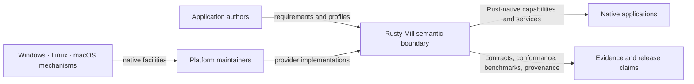
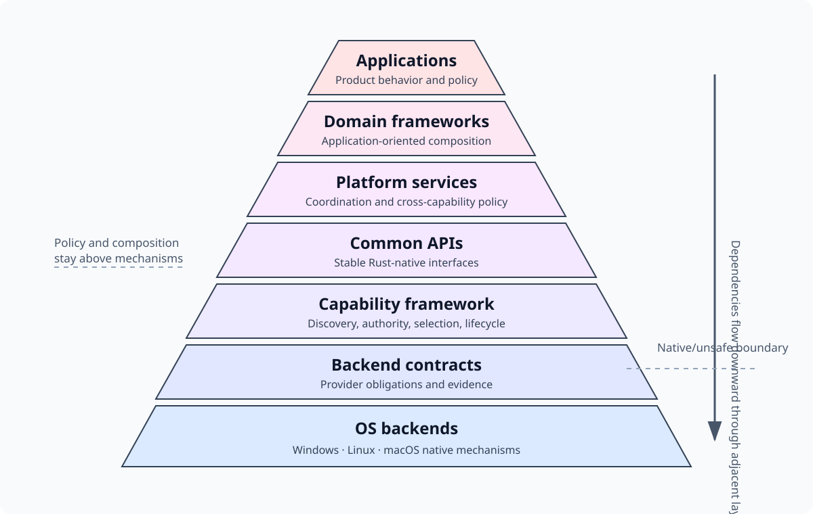
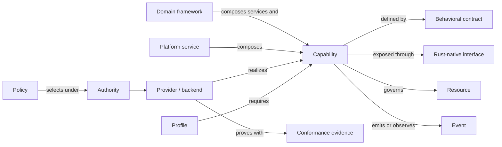
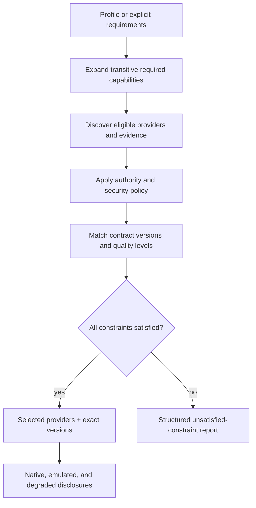
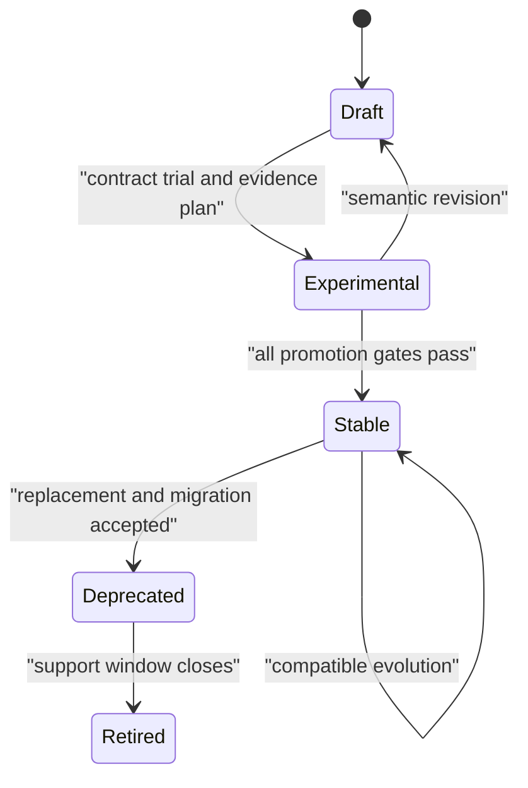
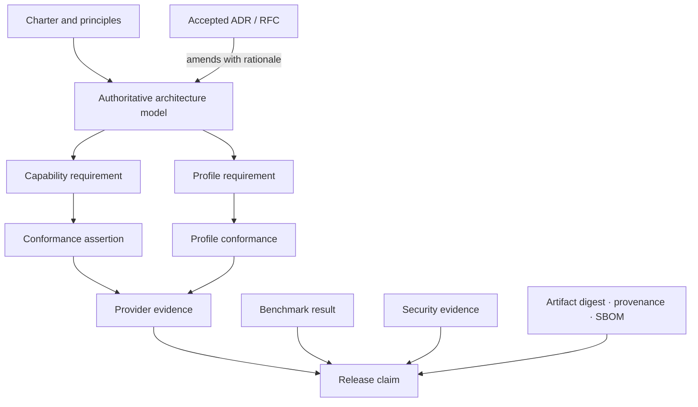
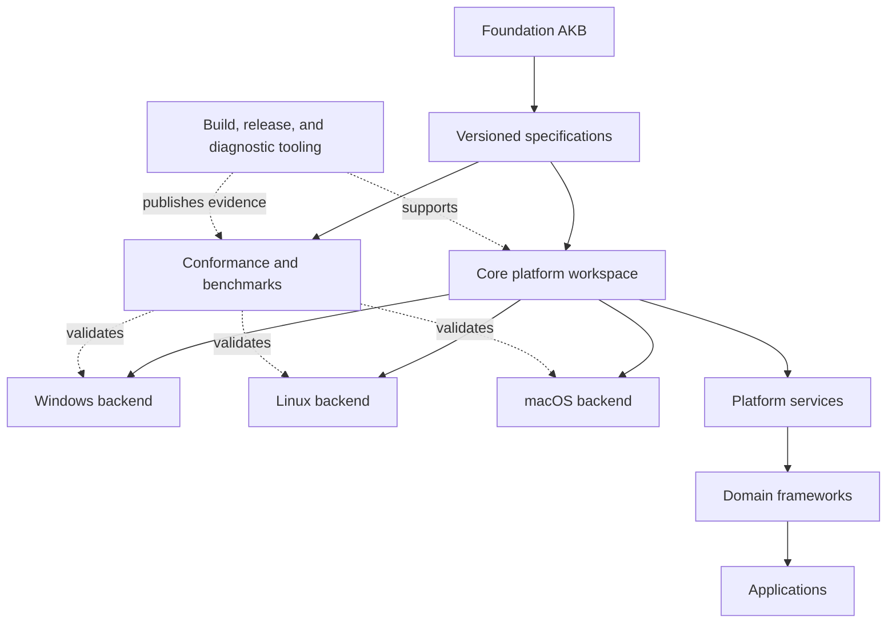

# Rusty Mill authoritative architecture model

**Status:** Accepted  
**Authority:** Normative source of truth  
**Version:** 1.5.0
**Last updated:** 2026-08-08  
**Decision:** [ADR-0004](../adr/0004-authoritative-architecture-model.md)

## 1. Authority and interpretation

This document is the authoritative model for Rusty Mill's platform architecture. It defines the system's boundaries, layers, architectural entities, dependency rules, contract model, quality obligations, evolution process, ecosystem shape, and evidence chain.

Supporting documents provide rationale, templates, domain detail, research, and operational procedure. If a supporting document conflicts with this model, this model governs unless a later accepted ADR explicitly supersedes the relevant rule. Draft capability specifications cannot amend this model implicitly.

Normative terms **MUST**, **MUST NOT**, **SHOULD**, **SHOULD NOT**, and **MAY** express architectural obligations. Examples are illustrative unless labeled normative.

## 2. Mission and boundary

Rusty Mill is a Rust-first, high-performance, capability-based operating-system abstraction and application platform for native applications on Windows, Linux, and macOS.

Its central axiom is:

> **Abstract capabilities, not operating systems.**

Applications state the behavior and quality they require. Rusty Mill selects providers that realize those requirements with native mechanisms, while exposing unsupported behavior and meaningful variance instead of hiding them.

Rusty Mill is not:

- A kernel or replacement for operating-system system libraries.
- A one-for-one wrapper over Win32, POSIX, Cocoa, or another native API family.
- A lowest-common-denominator portability layer.
- A promise that different platforms have identical mechanisms or performance.
- Permission to create public APIs or crates before their contracts and boundaries are understood.

The working maxim is:

> **Specify completely. Implement faithfully. Verify continuously. Evolve deliberately.**

## 3. System context

Application authors consume Rust-native capabilities, services, and frameworks. Platform maintainers implement backend contracts against operating-system mechanisms. Rusty Mill owns the semantic boundary between them and the evidence that the boundary is honored.

## 4. Architecture pyramid

### 4.1 Layers

| Layer | Owns | Must not own |
|---|---|---|
| Applications | Product behavior and product policy | Portable OS mechanism abstractions |
| Domain frameworks | Application-oriented compositions and workflows | Backend selection or raw OS calls |
| Platform services | Coordination, orchestration, and policy across capabilities | Platform-specific mechanisms |
| Common APIs | Stable Rust-native interaction surfaces and semantic types | Native handles as the normal abstraction |
| Capability framework | Discovery, negotiation, authority, provider selection, lifecycle, and degradation reporting | Domain-specific application policy |
| Backend contracts | Provider obligations and adaptation boundary | Application workflows |
| OS backends | Native mechanism use, unsafe/FFI isolation, platform diagnostics | Portable policy or public semantic redefinition |

### 4.2 Dependency rules

1. Dependencies **MUST** point downward through the immediately adjacent layer.
2. A layer **MUST NOT** reach around an intermediate layer to use a lower implementation directly.
3. Shared specifications, schemas, test vectors, and evidence formats **MAY** remain dependency-neutral.
4. Backend-specific handles **MUST NOT** cross common APIs except through an explicitly specified escape hatch.
5. Domain logic **MUST** remain independent of OS APIs, FFI bindings, and I/O frameworks.
6. A cross-layer exception requires an accepted ADR, stated scope, and migration path.

The default deployment architecture is a modular monolith. A separate process or service requires a forcing function such as independent scaling, ownership, language boundary, privilege separation, or fault isolation.

## 5. Architectural entity model

### 5.1 Capability

The smallest independently describable, selectable, securable, testable, and evolvable unit of platform behavior. A capability describes an outcome, not an OS symbol, crate, trait, or implementation.

Stable identity uses `rm.<domain>.<capability>`. Contract versions attach to the identity using SemVer. A capability specification records purpose, non-goals, maturity, owner, dependencies, semantics, authority, quality levels, platform mappings, verification, and history.

### 5.2 Behavioral contract

The normative definition of what consumers may rely on and providers must prove. It covers:

- Preconditions, outputs, invariants, guarantees, and non-guarantees.
- Resource ownership, borrowing, transfer, cleanup, and behavior after failure.
- Ordering, concurrency, thread safety, reentrancy, fairness, and atomicity.
- Async and sync behavior, blocking, cancellation, and backpressure.
- Typed errors, partial completion, recovery, retry safety, and idempotency.
- Authority, privilege, trust boundaries, and sensitive information.
- Performance, accessibility, internationalization, and observability.
- Platform realization, emulation, degradation, and incompatibility.
- Compatibility, deprecation, conformance assertions, and benchmarks.

Every normative statement receives a stable identifier of the form `RM-<DOMAIN>-<CAPABILITY>-<NNNN>`. Identifiers survive editorial movement and are never reused after retirement.

### 5.3 Interface

The Rust-native typed surface through which a consumer uses a contract. Interface design follows accepted semantics. A public type or trait is not itself the contract and cannot silently strengthen or weaken it.

### 5.4 Provider and backend

A provider realizes one or more capabilities. An OS backend is a provider at the native platform boundary. Providers declare exact contract versions, quality levels, platform constraints, and evidence. Selection is based on requirements and evidence, not OS name alone.

### 5.5 Resource

An owned or borrowed entity with explicit lifetime, authority, concurrency, cancellation, and cleanup rules. Illegal resource states should be unrepresentable where practical. Native resource identities stay behind the backend boundary unless an escape contract says otherwise.

### 5.6 Event

A typed observation of a transition or external occurrence. Contracts define ordering, duplication, loss, backpressure, timestamp domain, delivery context, and shutdown behavior.

### 5.7 Policy

A separately configurable rule governing provider selection, authority, fallback, quality, budgets, or orchestration. Backends implement mechanism; policy chooses acceptable behavior. Policy must not be hidden in platform-specific code.

Security policy evaluation is advisory: it may return permit, deny, indeterminate, or not-applicable with provenance and freshness, but the protected native operation remains the authorization point. A prior permit never guarantees later success ([ADR-0010](../adr/0010-native-operation-is-the-authorization-point.md)).

### 5.8 Service

A cohesive runtime facility that coordinates multiple capabilities, resources, and policies. Coordination belongs in a service when placing it in a base capability would create dependency cycles or mix independent lifecycles.

### 5.9 Domain framework

An application-oriented composition above platform services. Frameworks may offer opinionated workflows but cannot redefine capability guarantees.

### 5.10 Profile

A named, versioned declaration of required, conditional, optional, and prohibited capabilities and services, contract ranges, quality levels, and security constraints for a workload class. Initial foundation profile families are CLI, Desktop, Server, and Embedded/headless; their current exact membership is specified while missing application domains remain explicit gaps.

Profiles select exact capability contracts and platform services—not undifferentiated domains, crates, or OS features. Members are required, conditional, optional, or prohibited and carry independent quality, authority, interaction, budget, degradation, and evidence constraints. Current `foundation` profiles preserve explicit domain gaps and cannot imply complete application support. Satisfied resolution produces an immutable evidence-bound report ([ADR-0013](../adr/0013-profiles-select-contracts-not-domains.md)).

## 6. Capability dependency graph

The graph is a versioned architecture artifact derived from capability specifications.

### 6.1 Edge types

- `requires`: the source cannot satisfy its minimum contract without the target.
- `optionally-uses`: the target improves quality or enables declared optional behavior.
- `conflicts-with`: the specified nodes or versions cannot coexist under stated conditions.

Edges may carry version constraints, conditions, rationale, and requirement identifiers.

### 6.2 Invariants

1. The directed `requires` subgraph **MUST** be acyclic.
2. Every edge **MUST** appear in the source specification.
3. A required edge **MUST** target the narrowest sufficient capability.
4. An optional edge **MUST NOT** silently change minimum guarantees.
5. A conflict **MUST** state whether it is semantic, authority, resource, or transitional.
6. OS names, crate names, and implementation symbols **MUST NOT** be graph targets.
7. Resolution **MUST** produce a satisfiable graph or diagnostics for every unsatisfied constraint.

Required cycles indicate an incorrect capability boundary or orchestration that belongs in a service.

## 7. Capability availability and negotiation

Provider availability is one of:

- **Native:** satisfied using a first-class platform mechanism.
- **Emulated:** satisfied with explicitly documented cost or limitations.
- **Degraded:** a declared weaker quality level remains within the contract.
- **Unavailable:** requested semantics or quality cannot be satisfied.

Unknown is a research/specification state, not a runtime availability claim.

Resolution consumes a profile or explicit requirements plus policy and authority. It returns selected providers, exact versions and quality levels, emulation/degradation disclosures, and diagnostics for unsatisfied constraints. Silent fallback or silent weakening is prohibited.

## 8. Portability and platform variance

Portability means stable promised semantics, explicit discovery, typed failures, declared variance, and testable behavior—not identical implementation.

Each capability classifies its expected Windows, Linux, and macOS realization and records native mechanisms as research. Platform-specific extensions are permitted when a truthful common contract is impossible. Consumers opt into them explicitly; their presence cannot be inferred merely from OS identity.

Escape hatches must preserve ownership and safety, declare lost portability, and avoid making common paths depend on native handles.

Filesystem paths are lossless platform-native semantic values, not necessarily Unicode strings. Display conversion, normalization, case behavior, and object identity are separate concerns ([ADR-0006](../adr/0006-paths-are-lossless-native-values.md)). Security-sensitive filesystem lookup begins from explicit directory authority and uses declared handle-relative resolution strength; lexical canonicalization alone cannot prove containment ([ADR-0007](../adr/0007-directory-relative-resolution-is-the-security-boundary.md)).

Filesystem namespace visibility, atomicity, and durability are distinct guarantees. Atomic same-filesystem replacement remains a capability; stronger durable publication may compose it with file/directory synchronization as a platform service ([ADR-0008](../adr/0008-atomic-replacement-is-a-capability.md)). Providers declare resolution quality and durability level against exact filesystem and storage contexts rather than inheriting guarantees from OS identity.

Portable process creation begins with direct launch of an explicit executable, structured native arguments, explicit environment construction, and allowlisted inheritance. Shell parsing, executable search, activation, elevation, and durable service registration are separate opt-in contracts. Where an OS requires command-line serialization, providers declare the target parsing convention and cannot claim universal round-trip fidelity ([ADR-0014](../adr/0014-direct-process-launch-is-the-base-contract.md)).

Executable resolution is separate from launch and consumes explicit ordered directory authority; ambient path/current-directory search is not a base behavior ([ADR-0016](../adr/0016-executable-search-uses-explicit-authority.md)). Control of one owned child is a capability. Supervision of a dynamic process set is a platform service with scoped containment evidence; observed ancestry cannot be represented as a universally contained process tree ([ADR-0015](../adr/0015-process-set-supervision-is-a-service.md)).

## 9. Execution and concurrency model

Rusty Mill is **async-first and sync-complete**.

1. Potentially blocking capabilities **MUST** provide an async path that does not occupy a worker thread solely while waiting when native completion/readiness is available.
2. Stable capabilities **MUST** document a synchronous path.
3. Sync implementations **MUST NOT** create or nest a hidden async runtime.
4. Async implementations **MUST** define cancellation safety, completion ownership, executor assumptions, and backpressure.
5. Sync and async paths **MUST** share behavioral guarantees unless the contract explicitly documents a difference.
6. Thread safety, ordering, reentrancy, and fairness are contract properties, not framework assumptions.

Cancellation is cooperative unless an operation contract proves stronger native behavior. A cancellation request races with normal completion and is not confirmation that an operation was aborted.

## 10. Cross-cutting quality obligations

Every capability, profile, backend, service, framework, and stable release addresses these dimensions or gives a reviewable reason they do not apply.

### 10.1 Security

- Capability possession and authority are distinct where useful.
- Least privilege and safe defaults are mandatory.
- External input is validated at boundaries.
- Unsafe and native boundaries are isolated, documented, reviewed, and tested.
- Sensitive operations provide auditability without exposing secrets.
- Threat assumptions and degradation effects are explicit.

Principal claims, security-context snapshots, authority, grants, and constraints are distinct. Identity does not confer authority. Security-sensitive base contracts accept explicit resource- and operation-scoped authority where practical; portable derivation is attenuation-only; constraints compose by intersection; and missing required evidence fails closed ([ADR-0009](../adr/0009-identity-is-not-authority.md)). Authority is not serializable or transferable unless a dedicated contract defines its security properties.

Restricted execution is a platform service rather than a scalar capability. It composes process creation, authority attenuation, explicit inheritance, native isolation, readiness, and supervision from an immutable deny-by-default manifest. Required restrictions are applied and verified before child-controlled code runs; degradation requires prior policy permission ([ADR-0011](../adr/0011-restricted-execution-is-a-platform-service.md)).

Secret protection is negotiated as a scoped vector of persistence, boundary, subject binding, interaction, exportability, availability, replication, deletion, and assurance—not as a boolean or total security level. Unknown dimensions fail required constraints. Secret-value exposure semantics and secret-store persistence semantics remain distinct ([ADR-0012](../adr/0012-secret-protection-is-a-vector.md)).

### 10.2 Performance

- Native performance is a requirement, not an unsupported claim.
- Avoidable allocations, copies, indirection, context switches, and wakeups are measured and minimized.
- Benchmarks separate native baseline, abstraction overhead, and end-to-end workload.
- Latency distributions, throughput, memory, allocation, startup, binary size, CPU, and power are measured where relevant.
- Regression budgets are capability-specific and evidence-based.

### 10.3 Accessibility

User-facing capabilities preserve semantic roles, focus, input behavior, assistive-technology integration, user preferences, and accessible fallback behavior.

### 10.4 Internationalization

Text, locale, time, collation, input, and layout behavior avoids implicit host-locale assumptions. Encoding, normalization, directionality, and formatting semantics are explicit.

### 10.5 Observability

Diagnostics use stable structured events, correlation, and causal context. Instrumentation is low-overhead, privacy-aware, exporter-neutral, and optional where the contract permits.

## 11. Specification and maturity lifecycle

Capabilities progress through:

- **Draft:** semantics are being discovered; no compatibility promise.
- **Experimental:** implementation may exist for learning; interfaces can change.
- **Stable:** contract and compatibility promises are active.
- **Deprecated:** supported temporarily with replacement and migration path.
- **Retired:** no longer supported; identifiers and history remain reserved.

Stable promotion requires accepted semantics, supported-platform providers, profile analysis, security and quality review, compatibility policy, conformance coverage, benchmark baselines, ownership, and release evidence.

Disposable research spikes are allowed but cannot establish stable precedent or become dependencies of stable code without review.

## 12. Architecture governance

### 12.1 Decision instruments

- **Architecture model:** current normative system rules.
- **ADR:** immutable record of a durable decision, alternatives, and consequences.
- **RFC:** reviewed proposal for new stable capabilities, public contracts, cross-repository changes, governance, compatibility, or delivery mechanisms.
- **Capability specification:** normative domain behavior after acceptance.
- **Research note:** descriptive evidence without decision authority.

### 12.2 Change procedure

A model change requires:

1. An ADR or RFC stating the affected rule, alternatives, and consequences.
2. Impact analysis across capabilities, profiles, security, performance, compatibility, repositories, conformance, benchmarks, and releases.
3. Review by the relevant architecture and specialist owners.
4. An atomic update to this document and affected elaborations.
5. Migration guidance when stable consumers or providers are affected.

Accepted ADRs preserve why the model changed. This document preserves what the architecture currently is.

## 13. Evidence and traceability

### 13.1 Rules

1. A Stable normative requirement **MUST** have a verification method or documented justification for manual evidence.
2. A passing test establishes no promise unless it traces to a normative requirement.
3. Benchmarks identify workload, environment, baseline, contract version, and statistical method.
4. Provider claims identify provider version, platform, architecture, configuration, and evidence.
5. Waivers are explicit, owned, time-bounded, and visible in release claims.
6. Release claims bind evidence to immutable artifact digests and provenance.

## 14. Conformance and benchmark architecture

Contract assertions are backend-neutral. Provider adapters supply setup and platform evidence without changing expected semantics. Suites cover success, failure, boundaries, cancellation, concurrency, cleanup, security, and declared degradation.

Benchmarks compare an idiomatic native baseline, Rusty Mill abstraction path, and representative workload separately. Results include environmental variance and do not compare unlike guarantees.

Stable release gates include required-profile conformance, security and compatibility checks, supply-chain evidence, and performance within accepted budgets. Exceptions require a time-bounded decision with owner and remediation.

## 15. Ecosystem and repository architecture

Repository boundaries follow cohesion, ownership, release cadence, native toolchain boundaries, security isolation, and independent lifecycle—not one repository per concept.

Repository classes may include the foundation AKB, specifications, core platform, backends, frameworks, verification, and tooling. Start cohesive work as a modular monolith. Extract only when a concrete forcing function appears.

Crates have one coherent responsibility and narrow typed interfaces. Workspaces group shared build, test, and release mechanics. Public semantic types live above backend implementations. Platform bindings remain private where possible. Feature flags are additive capability selection, not incompatible product modes. Final names and boundaries require evidence from at least two real call sites or an accepted RFC.

Documentation flows from this model to domain specifications, capability contracts, repository guides, crate/API documentation, and operational runbooks. Lower levels add detail but cannot contradict higher-level rules.

## 16. Compatibility, packaging, and supply chain

SemVer applies to independently published crates and versioned contracts, but behavioral compatibility matters in addition to Rust signatures. Coordinated release labels do not require every repository to share a version.

Release artifacts include appropriate checksums, licenses, debug information, SBOMs, and provenance. Applications use authenticated updates, signed manifests, staged rollout, rollback, and downgrade protection where required. Update mechanism and product update policy remain separate.

CI and release inputs are pinned; third-party dependencies are minimized and reviewed. Publishing credentials use least privilege. Reproducibility, vulnerability response, license policy, signing-key rotation, and maintainer recovery are designed before production release.

## 17. Current application of the model

The [runtime and time vertical slice](../02-capabilities/runtime-time/README.md) is the first trial. Its monotonic-clock, deadline-timer, cancellation, and orderly-shutdown documents exercise the entity, dependency, service, contract, quality, and evidence rules. [ADR-0005](../adr/0005-orderly-shutdown-is-a-platform-service.md) classifies orderly shutdown as a platform service rather than a capability. The specifications remain Draft and cannot amend this model.

The [filesystem foundations vertical slice](../02-capabilities/filesystem/README.md) is the second trial. It exercises lossless semantic values, directory authority, race-resistant resolution, resource identity and lifetime, partial asynchronous I/O, metadata availability, namespace atomicity, and durability boundaries. Its specifications remain Draft and cannot amend this model.

## 18. Deliberately unresolved choices

This model does not yet choose:

- Rust trait, type, or error representations.
- Crate and workspace names or final repository boundaries.
- Runtime or executor implementation.
- Machine-readable metadata serialization.
- Minimum supported OS versions.
- Exact membership of workload profiles.
- Whether every candidate composition is a capability, service, or framework.

Those choices require domain evidence and the ADR/RFC process. Deferring them is part of the architecture, not missing authority.

## 19. Supporting elaborations

- [Architecture overview](overview.md)
- [Behavioral contracts](behavioral-contracts.md)
- [Cross-cutting qualities](cross-cutting-qualities.md)
- [Capability model](../02-capabilities/model.md)
- [Capability graph model](../02-capabilities/graph-model.md)
- [Capability profiles](../02-capabilities/profiles.md)
- [Repository strategy](../04-ecosystem/repository-strategy.md)
- [Verification architecture](../04-ecosystem/verification.md)
- [Traceability model](../04-ecosystem/traceability.md)
- [Delivery strategy](../03-delivery/strategy.md)
- [Governance](../05-governance/governance.md)

These documents should link to this model and elaborate their subject without independently redefining it.
