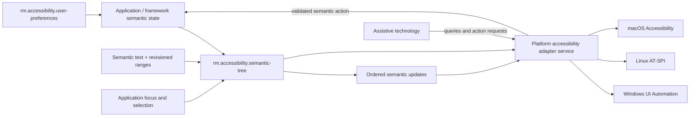

# Accessibility foundations vertical slice

| Field | Value |
|---|---|
| Status | Draft domain analysis |
| Purpose | Define application-owned semantic state and safe native accessibility adapters with equivalent user outcomes across platforms |

## Domain boundary

The application/domain framework owns semantic truth: roles, names, descriptions, values, relationships, focus, selection, text, states, actions, and live-update intent. Platform adapters translate that truth to native accessibility APIs and translate assistive-technology requests back into ordinary domain commands. Pixels, renderer display lists, native adapter objects, and untrusted content do not become the source of truth.

## Architectural conclusions

- Accessibility semantics are primary application state, not metadata reconstructed after rendering.
- Semantic and visual trees may differ, but their relationships and geometry are explicit and revision-bound.
- Native adapters preserve outcomes rather than pretending platform role/pattern vocabularies are identical.
- Accessibility action requests follow the same validation, authority, state transition, and audit path as other user actions.
- High-frequency changes use atomic snapshots/deltas and bounded coalescing; critical focus/action/value/live events are not silently lost.
- Virtualization must preserve navigable semantic structure and truthful realization state.

## Documents

- [`rm.accessibility.semantic-tree`](semantic-tree.md)
- [Accessible text and ranges](text-model.md)
- [Events, live updates, focus, and actions](events-actions.md)
- [`rm.accessibility.user-preferences`](user-preferences.md)
- [Platform adapter service](platform-adapter-service.md)
- [Platform research](platform-research.md)
- [Conformance specification](conformance.md)
- [Benchmark specification](benchmarks.md)

