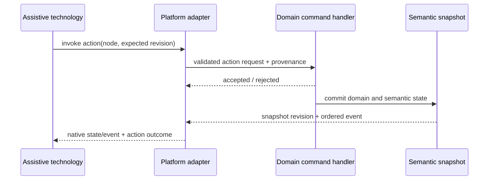

# Accessibility events, live updates, focus, and actions

**RM-ACCESSIBILITY-EVENT-0001:** Each update carries semantic tree revision, monotonically increasing stream sequence, causal prior revision, affected identities/ranges, change class, monotonic time, and provenance.

**RM-ACCESSIBILITY-EVENT-0002:** Atomic changes publish one coherent new snapshot before or with notification. Adapters never expose a mixed tree during query/event races.

**RM-ACCESSIBILITY-EVENT-0003:** Property/geometry/subtree updates may coalesce when final state and covered revision interval remain recoverable. Focus, active-descendant, selection, action result, alert/error, live-announcement intent, node removal, and stream reset are not silently discarded.

**RM-ACCESSIBILITY-EVENT-0004:** Live updates declare politeness/priority, atomicity, relevant change types, busy state, source/trust, language, sensitivity, and rate policy. The platform adapter may coalesce speech events without removing navigable semantic history.

**RM-ACCESSIBILITY-EVENT-0005:** Application focus, accessibility focus/cursor, keyboard focus, active descendant, and text caret are distinct states with explicit relationships. Adapters do not overwrite application focus merely because assistive technology navigates.

**RM-ACCESSIBILITY-EVENT-0006:** An action request identifies node, action, parameters, semantic revision/precondition, provenance, requester/platform context, and correlation ID. It is validated and dispatched through the same domain command path as pointer/keyboard activation.

**RM-ACCESSIBILITY-EVENT-0007:** Action request acceptance, domain completion, state observation, and native notification are separate milestones. Rejected, stale, disabled, unauthorized, cancelled, failed, and completed outcomes are distinct.

**RM-ACCESSIBILITY-EVENT-0008:** Accessibility actions do not bypass confirmation, sandbox, privilege, destructive-operation, or secure-attention policy. Provenance never grants authority.

**RM-ACCESSIBILITY-EVENT-0009:** Backpressure cannot block the native accessibility query/event thread indefinitely. Overflow produces a stream reset/resnapshot requirement rather than silent semantic loss.

