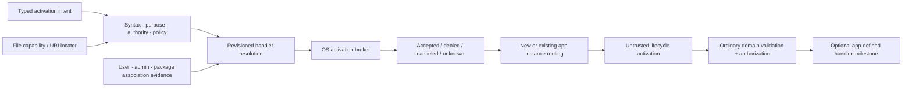

# Application activation and association foundations vertical slice

| Field | Value |
|---|---|
| Status | Draft domain analysis |
| Purpose | Discover eligible handlers and broker user-controlled file, URI, application, and reveal intents without confusing locators, association policy, launch acceptance, focus, readiness, or authority |

## Conclusions

- Intent, target reference, content/scheme classification, handler capability, association preference, selected application, process launch, instance routing, foreground activation, readiness, and domain result are distinct.
- File paths and URI strings are untrusted locators. File activation should carry explicit read/write capability where the platform supports it; URI activation grants no permission to fetch or act.
- Handler registration declares eligibility. User/system policy chooses defaults; applications cannot silently seize them or persist stale default assumptions.
- Broker acceptance is not proof that an app started, became foreground, received the intent, opened content, or completed a task.
- Incoming activation is at-least-once untrusted input with provenance, generation, deduplication policy, and ordinary authorization.

## Documents

- [Typed activation intents](typed-intents.md)
- [Handler discovery and association policy](handler-associations.md)
- [Outgoing brokered activation](outgoing-activation.md)
- [Incoming activation and instance routing](incoming-routing.md)
- [File and object-reference authority](file-authority.md)
- [URI parsing and scheme safety](uri-safety.md)
- [Milestones, cancellation, and ambiguity](completion.md)
- [Registration, packaging, and updates](registration-packaging.md)
- [Security, privacy, and accessibility](security-accessibility.md)
- [Platform research](platform-research.md)
- [Conformance](conformance.md)
- [Benchmarks](benchmarks.md)
