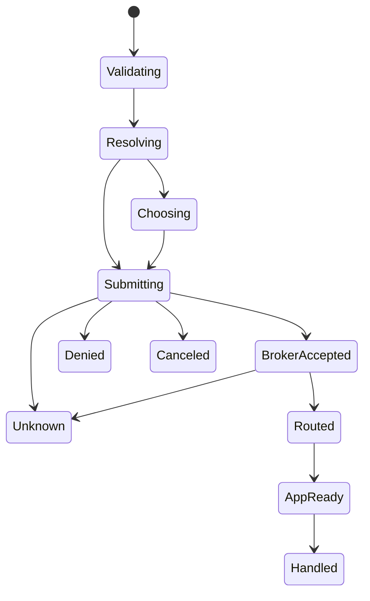

# Milestones, cancellation, and ambiguity

**RM-ACTIVATION-RESULT-0001:** Validation, handler resolution, user choice, broker submission, broker acceptance, process/instance routing, app receipt, readiness, foreground/visibility, target opened, domain handled, and externally visible effect are separate milestones.

**RM-ACTIVATION-RESULT-0002:** Every result names its evidence boundary, provider, target/handler generation, time, outcome quality, and unavailable later milestones. `true` or “opened” is insufficient portable semantics.

**RM-ACTIVATION-RESULT-0003:** Cancellation is a request. It can close a chooser or withdraw undispatched work, but cannot recall delivery, terminate a selected application, undo content opening, revoke granted file capability automatically, or reverse domain effects.

**RM-ACTIVATION-RESULT-0004:** Provider/app crash, timeout, IPC loss, broker restart, session switch, target replacement, or missing acknowledgment yields unknown where acceptance/delivery cannot be proven. Retrying requires explicit duplicate/side-effect policy and new attempt identity.

**RM-ACTIVATION-RESULT-0005:** A readiness/handled acknowledgment is optional and application/protocol-specific. Absence cannot be replaced by process observation, window focus, elapsed time, or file state guessing.

See [ADR-0073](../../adr/0073-activation-acceptance-is-not-handler-completion.md).
