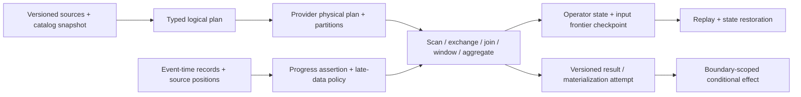

# Analytical data processing and query foundations

| Field | Value |
|---|---|
| Status | Draft domain analysis |
| Purpose | Execute bounded batch and streaming analytical plans over versioned typed data with explicit time, state, effects, lineage, recovery, and reproducibility evidence |

## Conclusions

- Logical types and semantics are authoritative; columnar, row, encoded, compressed, and provider-native layouts are physical representations with declared conversion loss.
- Plans bind catalog/source snapshots, functions, locale/time-zone/numeric policy, optimizer/provider generations, authority, and resource budgets.
- Watermarks are progress assertions under a named source policy, not proof that earlier events cannot arrive.
- Exactly-once claims name operator state and every external effect boundary; replaying a record is compatible with exactly-once state effects.
- Result reproducibility requires immutable inputs and semantics, not merely rerunning the same query text.

## Documents

- [Model, entities, and milestones](model.md)
- [Types, schemas, and columnar batches](types-columnar.md)
- [Catalogs, sources, and formats](catalog-sources-formats.md)
- [Logical queries and expression semantics](logical-query.md)
- [Physical planning and distributed execution](physical-execution.md)
- [Operators, joins, windows, and aggregates](operators.md)
- [Streaming time, watermarks, and late data](streaming-time.md)
- [State, checkpoints, and effect guarantees](state-checkpoints-effects.md)
- [Incremental materialization and serving](materialization.md)
- [Resources, scheduling, and spill](resources-scheduling.md)
- [Lineage, security, and privacy](lineage-security-privacy.md)
- [Migration, recovery, and reproducibility](migration-recovery.md)
- [Cross-cutting qualities](cross-cutting.md)
- [Platform and provider research](platform-research.md)
- [Conformance](conformance.md)
- [Benchmarks](benchmarks.md)

## Decisions

- [ADR-0110: Watermarks are progress assertions, not completeness proof](../../adr/0110-watermarks-are-progress-assertions-not-completeness-proof.md)
- [ADR-0111: Exactly-once is scoped to named state and effect boundaries](../../adr/0111-exactly-once-is-scoped-to-named-state-and-effect-boundaries.md)

## Boundary

This domain does not redefine databases, object stores, messaging, search, source business semantics, file formats, SQL dialects, orchestration products, BI interfaces, or machine-learning training. Products select data/catalog schemas, functions, engines/topology, sources/sinks/formats, time and effect policy, workloads, objectives, and governance through RFCs.
