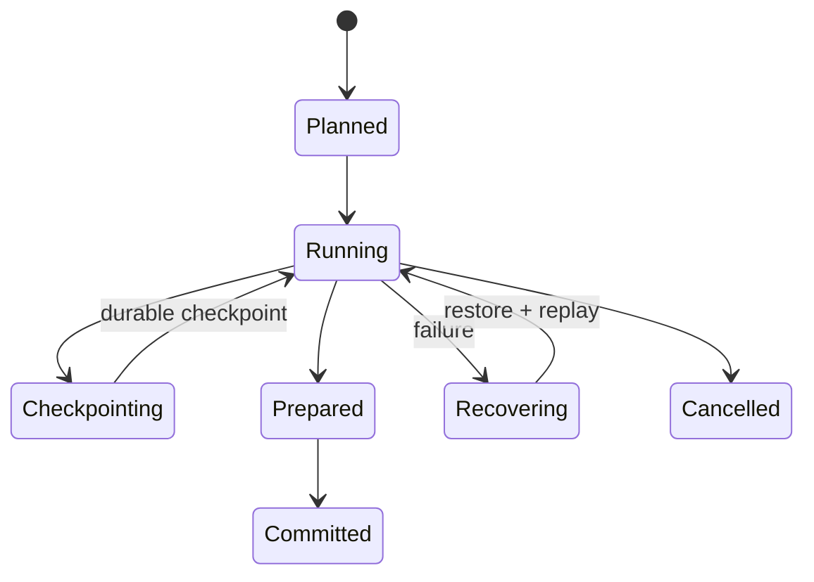

# Model, entities, and milestones

**RM-ANALYTICS-MODEL-0001:** An analytical domain binds catalog snapshot, source/sink generations, logical schema and query, function registry, time/numeric/locale semantics, planner/optimizer/provider, execution topology, security, resource, checkpoint, recovery, and result policy generations.

**RM-ANALYTICS-MODEL-0002:** Distinct entities include dataset/table/stream snapshot, partition/file/split, record batch, logical and physical plan, stage/task/attempt, exchange, state shard, input frontier, watermark, checkpoint/savepoint, result partition, materialization, and external effect.

**RM-ANALYTICS-MODEL-0003:** Milestones distinguish planning, source resolution, scheduling, task start, input read, operator progress, shuffle publication, state snapshot, checkpoint coordination/durability, result production, sink preparation/commit, catalog publication, and caller observation.

**RM-ANALYTICS-MODEL-0004:** Outcomes report successful/failed/cancelled/skipped partitions and attempts, partial rows/aggregates, source frontier, watermark, checkpoint, sink effect, retry/replay safety, data-quality failures, and cleanup/reconciliation.

**RM-ANALYTICS-MODEL-0005:** Batch and streaming are execution modes over bounded or unbounded inputs; micro-batch, continuous, incremental, and hybrid execution expose their own latency, state, ordering, and recovery boundaries.

**RM-ANALYTICS-MODEL-0006:** Async control is cancellation-safe and bounded; sync equivalents disclose blocking and never create a hidden runtime. Cancellation is not rollback of consumed input, state, shuffle, checkpoint, or committed sink effects.

