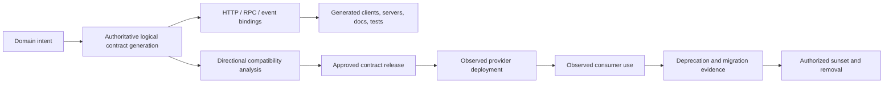

# Application API lifecycle and service-contract governance

| Field | Value |
|---|---|
| Status | Draft domain analysis |
| Purpose | Govern externally observable service contracts from proposal through safe retirement across HTTP, RPC, and event APIs |

## Conclusions

- A logical operation and its protocol bindings, generated artifacts, deployments, and observations are distinct generations.
- Compatibility is directional, multidimensional, and consumer-qualified; parseability alone is insufficient.
- Operation identity survives route, transport, and presentation changes and is never inferred only from a path or method.
- Deprecation is a migration workflow. A date or response header is notice evidence, not removal authority.
- Generated bindings are reproducible projections of an accepted contract and never become its independent source of truth.

## Documents

- [Model and identity](model.md)
- [Compatibility and change analysis](compatibility.md)
- [Protocol composition](protocol-composition.md)
- [Request, result, and interaction semantics](interaction-semantics.md)
- [Registry, generation, and release lifecycle](registry-generation.md)
- [Deprecation, migration, and sunset](deprecation-sunset.md)
- [Cross-cutting qualities](cross-cutting.md)
- [Conformance](conformance.md)
- [Benchmarks](benchmarks.md)
- [Platform and standards research](platform-research.md)

## Decisions

- [ADR-0136: Compatibility is directional and consumer-qualified](../../adr/0136-compatibility-is-directional-and-consumer-qualified.md)
- [ADR-0137: Deprecation notice is not removal authority](../../adr/0137-deprecation-notice-is-not-removal-authority.md)

## Boundary

This domain composes interchange, HTTP, messaging/RPC, real-time transport, policy, authorization, workflow, observability, and delivery. It does not choose a product API, protocol, schema language, gateway, registry product, SDK language, business quota, support period, or release train.
