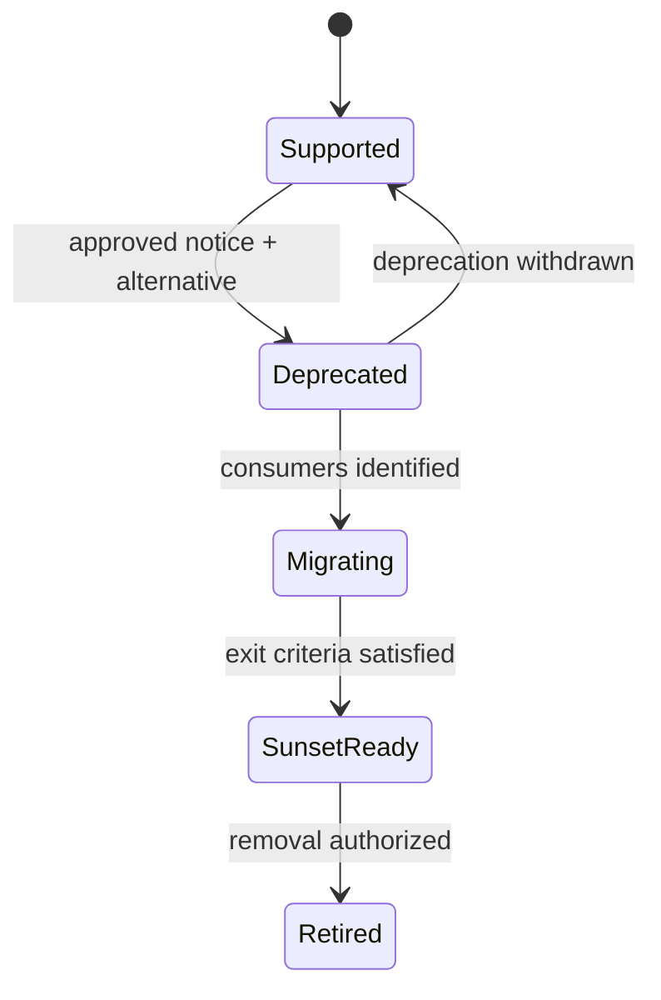

# Deprecation, migration, and sunset

**RM-API-GOV-LIFECYCLE-0001:** Deprecation identifies exact surface/operation/field generations, reason, supported alternative, migration guide, support channel, earliest sunset, owner, and withdrawal policy.

**RM-API-GOV-LIFECYCLE-0002:** Protocol notices such as HTTP `Deprecation` and `Sunset`, schema annotations, registry metadata, SDK diagnostics, and direct communications are delivery evidence; none independently authorizes removal.

**RM-API-GOV-LIFECYCLE-0003:** Consumer inventory distinguishes registered, observed, inferred, unreachable, exempted, and unknown consumers without placing raw personal or secret identifiers into broad telemetry.

**RM-API-GOV-LIFECYCLE-0004:** Sunset readiness requires alternative availability, elapsed minimum support, notification evidence, bounded unknown use, consumer migration or approved exception, rollback/containment, operational readiness, and accountable authorization.

**RM-API-GOV-LIFECYCLE-0005:** Removal preserves an audit record and reserved schema identifiers; late use produces a stable safe diagnostic where policy permits rather than accidental semantic reuse.

**RM-API-GOV-LIFECYCLE-0006:** Emergency retirement records threat, scope, compensating controls, exceptional authority, consumer impact, restoration/replacement path, and retrospective review.
