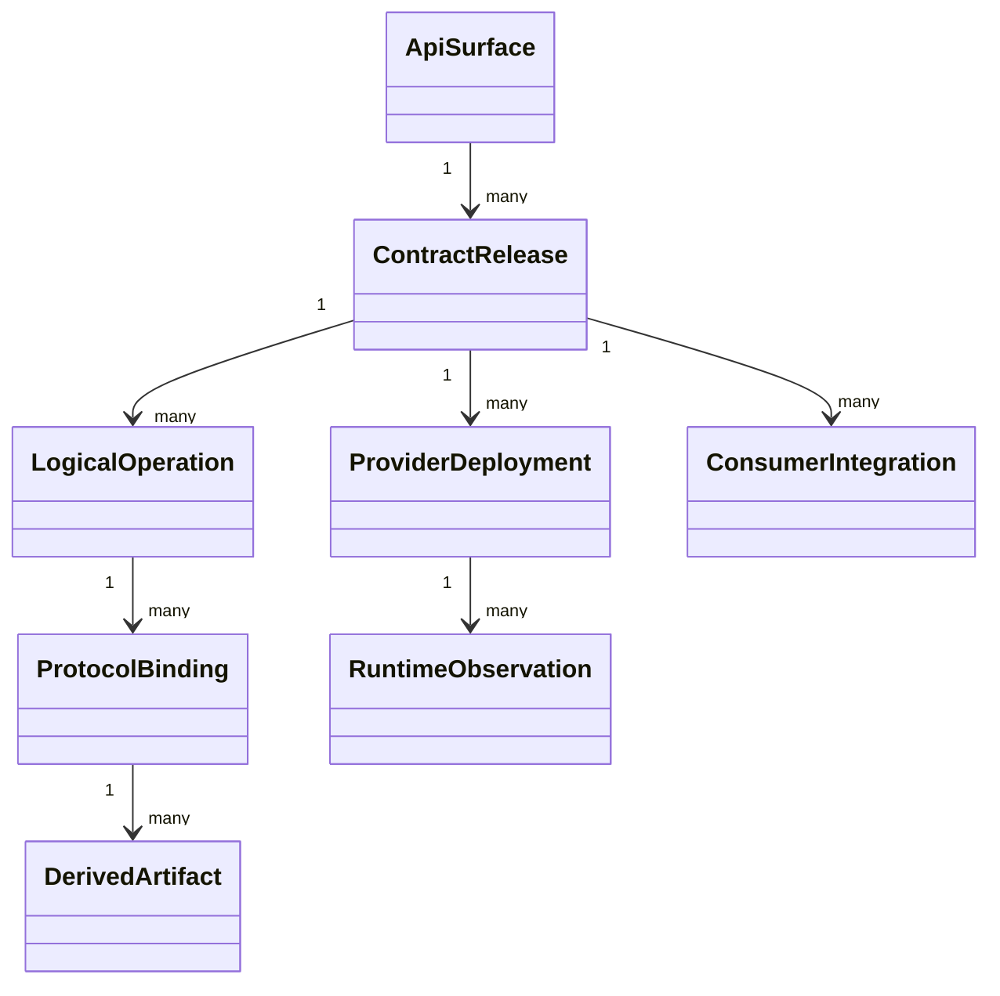

# Model and identity

## Entities

**RM-API-GOV-MODEL-0001:** An API surface has stable identity, owner, audience, lifecycle state, policy generation, and one or more immutable contract releases.

**RM-API-GOV-MODEL-0002:** A logical operation has stable operation identity, purpose, authority, request, outcomes, effects, idempotency class, consistency, and observability semantics independent of any route, RPC method, topic, or generated method name.

**RM-API-GOV-MODEL-0003:** Logical types, protocol bindings, generated artifacts, provider deployments, consumer integrations, and runtime observations carry separate identities and provenance.

**RM-API-GOV-MODEL-0004:** A contract release binds exact operation/type generations, protocol profiles, compatibility policy, security/privacy classification, support state, and artifact digests.

## Lifecycle

**RM-API-GOV-MODEL-0005:** Candidate, accepted, published, deployed, deprecated, sunset, and retired are distinct states with explicit transition authority and evidence.

**RM-API-GOV-MODEL-0006:** Publication does not prove deployment; deployment does not prove reachability; successful calls do not prove every consumer is compatible.

**RM-API-GOV-MODEL-0007:** Contract identity and semantic version are explicit. Mutable aliases such as `latest` resolve to a recorded immutable generation before validation, generation, deployment, or audit.
