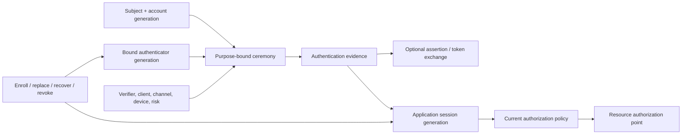

# Application authentication, authenticator lifecycle, federation, and session assurance

| Field | Value |
|---|---|
| Status | Draft domain analysis |
| Purpose | Authenticate application subjects and maintain sessions without confusing factors, authenticators, ceremony evidence, assertions, tokens, sessions, or effective authority |

## Conclusions

- A factor is not an authenticator, an authenticator is not a ceremony, and ceremony success is neither a credential nor resource authority.
- Authentication plans bind the verifier, audience, purpose, transaction, allowed methods, interaction, freshness, risk, and required properties before prompting.
- Phishing resistance is proven by the end-to-end protocol and verifier/channel binding; OTP, push approval, and manual code entry are not upgraded by calling them multi-factor.
- Application federation accepts issuer-qualified assertions under exact trust, audience, nonce, time, subject-mapping, and token-policy generations.
- Recovery is a high-risk authenticator lifecycle transition. It cannot silently provide a weaker path to the same account or preserve compromised sessions.

## Documents

- [Model and ceremony milestones](model.md)
- [Authentication plans and evidence](ceremonies-evidence.md)
- [Passwords and shared-secret verification](passwords.md)
- [WebAuthn, passkeys, and cryptographic authenticators](webauthn-passkeys.md)
- [OTP, recovery codes, and out-of-band methods](otp-out-of-band.md)
- [Authenticator enrollment, replacement, and revocation](authenticator-lifecycle.md)
- [Recovery and identity re-establishment](recovery.md)
- [Risk, assurance, step-up, and transaction binding](risk-assurance.md)
- [Application federation and assertions](federation.md)
- [OAuth and token lifecycle](tokens.md)
- [Application sessions, logout, and revocation](sessions.md)
- [Platform research](platform-research.md)
- [Cross-cutting qualities](cross-cutting.md)
- [Conformance](conformance.md)
- [Benchmarks](benchmarks.md)

## Decisions

- [ADR-0128: Phishing resistance is an end-to-end protocol property](../../adr/0128-phishing-resistance-is-an-end-to-end-protocol-property.md)
- [ADR-0129: Account recovery is an authenticator replacement ceremony](../../adr/0129-account-recovery-is-an-authenticator-replacement-ceremony.md)

## Boundary

This domain does not perform identity proofing, define legal identity, choose an identity provider, grant application entitlements, define product authorization, or standardize UI branding. It composes the existing identity-session and identity-governance foundations and leaves exact providers, assurance/risk policy, federation relationships, client registration, session objectives, and recovery policy to product RFCs.
