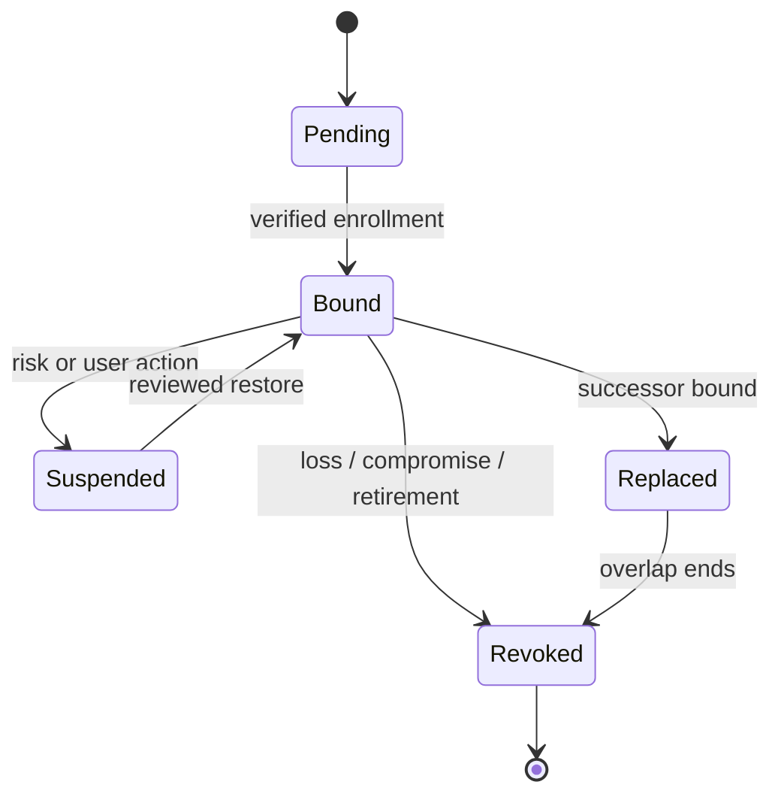

# Authenticator enrollment, replacement, and revocation

**RM-APP-AUTH-LIFECYCLE-0001:** Binding records subject/account and authenticator generations, method, verifier/provider, proof used to authorize enrollment, issuance or bring-your-own provenance, properties, name, created/activated/expiry times, and notification evidence.

**RM-APP-AUTH-LIFECYCLE-0002:** Adding an authenticator requires policy-selected current evidence resistant to session theft and confused-deputy enrollment. An authenticated session alone is not sufficient unless policy explicitly accepts its age and method.

**RM-APP-AUTH-LIFECYCLE-0003:** Replacement supports bounded overlap, confirms successor usability, identifies whether keys/secrets are migrated or newly generated, and revokes the predecessor under an explicit failure policy.

**RM-APP-AUTH-LIFECYCLE-0004:** Loss, theft, compromise, device transfer, employee departure, provider breach, algorithm withdrawal, and inactivity can suspend or revoke an authenticator and trigger session/token/risk reconciliation.

**RM-APP-AUTH-LIFECYCLE-0005:** Users and administrators can enumerate recognizable authenticator records without exposing secrets, revoke them through appropriately verified ceremonies, and receive independent notifications of security-relevant changes.

**RM-APP-AUTH-LIFECYCLE-0006:** Administrative operations retain actor, reason, scope, approval, expiry, affected generations, downstream effects, and appeal/recovery evidence and never fabricate user verification.
