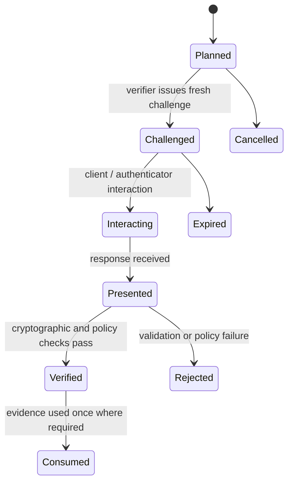

# Model and ceremony milestones

**RM-APP-AUTH-MODEL-0001:** Subject/account, factor, authenticator, credential handle, ceremony, challenge, response, authentication evidence, federation assertion, authorization grant, token, session, device evidence, and resource authority are distinct typed entities.

**RM-APP-AUTH-MODEL-0002:** Every mutable entity has an immutable generation. Rebinding, key rotation, password change, recovery, token rotation, session renewal, trust-metadata update, and subject remapping create new generations or explicit successor links.

**RM-APP-AUTH-MODEL-0003:** Ceremony milestones distinguish planned, challenge issued, interaction started, response received, cryptographically verified, policy accepted, evidence issued, session created, and resource effect. No earlier milestone implies a later one.

**RM-APP-AUTH-MODEL-0004:** Terminal outcomes distinguish success, refusal, cancellation, timeout, unavailable, unsupported, malformed, replayed, rate-limited, locked, compromised, policy denied, stale context, and indeterminate provider result without leaking account existence.

**RM-APP-AUTH-MODEL-0005:** Evidence records verifier, issuer, subject/account generation, audience, purpose, ceremony and method, authenticator properties with provenance, interaction, authentication time, expiry, risk/assurance policy, channel/client/device context, and explicit nonclaims.

**RM-APP-AUTH-MODEL-0006:** Sync and async entry points share the same state machine. Cancellation stops further framework work but reports whether an external prompt, authenticator operation, token issuance, or session effect may already have occurred.
