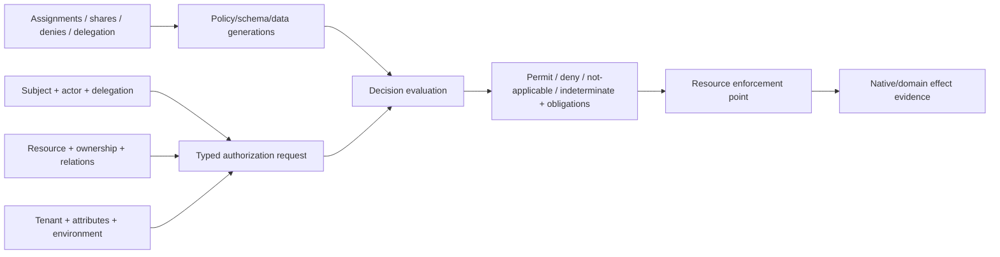

# Application authorization administration and effective-access foundations

| Field | Value |
|---|---|
| Status | Draft domain analysis |
| Purpose | Define and administer application access while keeping identity, policy evidence, grants, effective access, capability authority, and native resource enforcement distinct |

## Conclusions

- Roles, attributes, relationships, ownership, grants, denies, and delegated capabilities are composable evidence; none is a universal authorization model by itself.
- Effective access is a versioned derivation over exact identity, relation, attribute, policy, data, and resource generations—not a durable Boolean property.
- Policy decision and enforcement are separate. The resource-owning boundary checks the current request and performs the native or domain effect.
- List filtering, search, batch checks, and point authorization share one declared semantic contract; optimization may be incomplete but cannot expose unauthorized resources.
- Delegation and sharing create explicit, attenuated, revocable grant generations with provenance, audience, expiry, and downstream reconciliation.

## Documents

- [Model and authorization pipeline](model.md)
- [Resource, action, and scope semantics](resources-actions.md)
- [Roles, attributes, and relationships](rbac-abac-rebac.md)
- [Policy administration and distribution](policy-administration.md)
- [Decision and enforcement contracts](decision-enforcement.md)
- [Ownership, sharing, grants, and denies](ownership-sharing.md)
- [Delegation, attenuation, and confused deputies](delegation.md)
- [Filtering, batch checks, and permission discovery](filtering-discovery.md)
- [Caching, consistency, and revocation](caching-revocation.md)
- [Effective access, explanation, and simulation](effective-access.md)
- [Cross-service and native enforcement](cross-service-native.md)
- [Platform and standards research](platform-research.md)
- [Cross-cutting qualities](cross-cutting.md)
- [Conformance](conformance.md)
- [Benchmarks](benchmarks.md)

## Decisions

- [ADR-0130: Effective access is a versioned derivation, not stored truth](../../adr/0130-effective-access-is-a-versioned-derivation.md)
- [ADR-0131: Authorization filtering must be sound with point enforcement](../../adr/0131-authorization-filtering-must-be-sound-with-point-enforcement.md)

## Boundary

This domain composes the authority, policy, identity-governance, authentication, persistence, search, caching, and observability foundations. It does not choose an authorization language or service, product roles/attributes/relations, resource hierarchy, ownership rules, sharing UX, tenant policy, legal meaning, or native ACL strategy.
