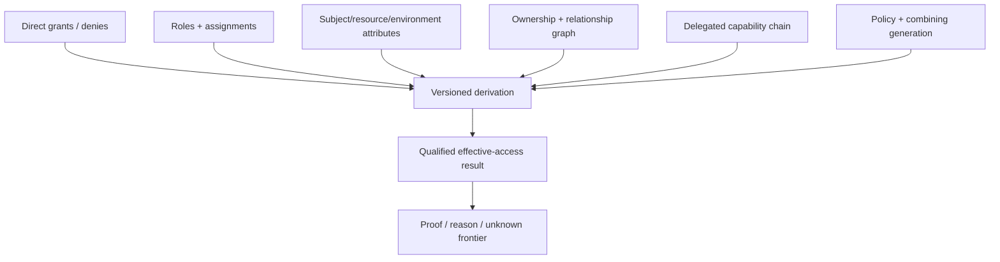

# Effective access, explanation, and simulation

**RM-APP-AUTHZ-EFFECTIVE-0001:** Effective-access queries name subject/actor, resource/action scope, tenant, time/context assumptions, policy and data frontiers, consistency, traversal limits, and desired proof or summary mode.

**RM-APP-AUTHZ-EFFECTIVE-0002:** Results distinguish definitely permitted, definitely denied, not applicable, indeterminate, potentially permitted under unobserved context, and truncated/unsupported, with direct and derived provenance.

**RM-APP-AUTHZ-EFFECTIVE-0003:** Explanations identify applicable policy/rules, roles/attributes/relations/grants/denies/delegation paths, combining outcome, missing/unknown evidence, obligations, and freshness while redacting sensitive policy and third-party information.

**RM-APP-AUTHZ-EFFECTIVE-0004:** Proofs and explanations are evidence for review/debugging and cannot be replayed as authorization unless represented by a separately validated capability contract.

**RM-APP-AUTHZ-EFFECTIVE-0005:** Simulation uses immutable proposed policy/data changes and a declared corpus or workload, compares decision/effective-access deltas, identifies newly allowed/denied/indeterminate cases and blast radius, and performs no production effect.

**RM-APP-AUTHZ-EFFECTIVE-0006:** Access reviews consume qualified effective-access evidence but retain independent reviewer, risk, approval, revocation, and downstream-verification workflows.
