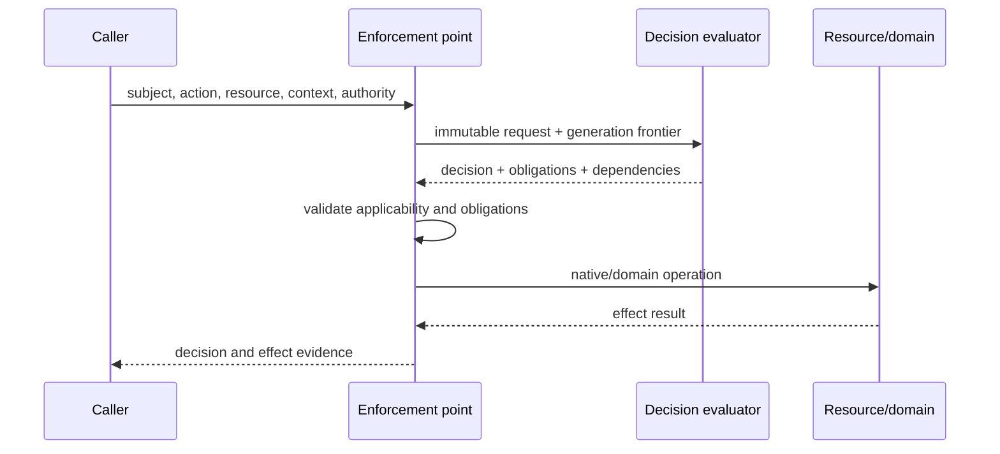

# Model and authorization pipeline

**RM-APP-AUTHZ-MODEL-0001:** Principal/subject, actor, delegate, tenant, resource, action, scope, attribute, relationship, role, entitlement, assignment, grant, deny, ownership, policy, decision, obligation, authority, and effect are distinct typed entities.

**RM-APP-AUTHZ-MODEL-0002:** Every request binds immutable subject/account/session, actor/delegation, tenant, action, resource generation or selector, environment, policy/data/schema/evaluator generations, purpose, authority, freshness, deadline, and enforcement intent.

**RM-APP-AUTHZ-MODEL-0003:** Decision outcomes distinguish permit, deny, not-applicable, and indeterminate with reasons, missing/unknown dependencies, obligations, advice, validity interval, cache dependencies, provenance, and explicit nonclaims.

**RM-APP-AUTHZ-MODEL-0004:** Evaluation, enforcement acceptance, obligation completion, native/domain operation acceptance, commit, visibility, and downstream effect are separate milestones.

**RM-APP-AUTHZ-MODEL-0005:** Security-sensitive indeterminate, malformed, stale, unsupported, missing-obligation, or provider-unavailable results fail closed under product policy without being relabeled as an explicit policy deny.

**RM-APP-AUTHZ-MODEL-0006:** Authorization context is passed explicitly across async tasks and service boundaries; thread locals, ambient process identity, unvalidated token claims, or hidden global policy cannot silently supply authority.
