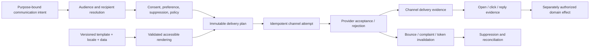

# Application communications delivery and preference governance

| Field | Value |
|---|---|
| Status | Draft domain analysis |
| Purpose | Deliver purpose-bound application communications through email, SMS, push, and in-application channels with explicit recipient, preference, rendering, provider, delivery, engagement, and effect evidence |

## Conclusions

- Communication intent, rendered content, delivery plan, channel attempt, provider acceptance, carrier/mailbox/device delivery, presentation, engagement, reply, and domain effect are distinct.
- Provider acceptance is responsibility-transfer evidence at a named boundary, never proof of delivery, reading, comprehension, or action.
- Preferences and consent are purpose-, topic-, channel-, recipient-, tenant-, and time-scoped evidence; suppression and mandatory-service exceptions remain explicit.
- Transactional, security, operational, legal, and promotional classifications are policy inputs, not labels chosen to bypass preference or abuse controls.
- Opens, clicks, reads, and replies are partial privacy-sensitive observations with bot/proxy/scanner and client-support uncertainty.

## Documents

- [Model and lifecycle](model.md)
- [Recipients, endpoints, and audience resolution](recipients-audiences.md)
- [Purpose, consent, preferences, and suppression](preferences-suppression.md)
- [Templates, localization, accessibility, and rendering](templates-rendering.md)
- [Delivery planning, scheduling, and orchestration](planning-scheduling.md)
- [Email binding](email.md)
- [SMS, MMS, RCS, and messaging-provider binding](sms-messaging.md)
- [Mobile and web push binding](push.md)
- [In-application inbox and conversations](in-app-inbound.md)
- [Attachments, links, and content safety](content-safety.md)
- [Provider evidence, outcomes, and reconciliation](outcomes-reconciliation.md)
- [Rate, reputation, and abuse controls](rate-abuse.md)
- [Migration and lifecycle](migration.md)
- [Cross-cutting qualities](cross-cutting.md)
- [Platform and standards research](platform-research.md)
- [Conformance](conformance.md)
- [Benchmarks](benchmarks.md)

## Decisions

- [ADR-0142: Provider acceptance is not recipient delivery](../../adr/0142-provider-acceptance-is-not-recipient-delivery.md)
- [ADR-0143: Communication preference is scoped evidence](../../adr/0143-communication-preference-is-scoped-evidence.md)

## Boundary

This domain composes native notifications, messaging, HTTP, identity, authorization, privacy, information protection, workflow, tenant governance, content inspection, observability, and API governance. It does not choose product campaigns, legal classifications, consent language, quiet hours, providers, sender identities, templates, routing, retention, engagement tracking, or service objectives.
