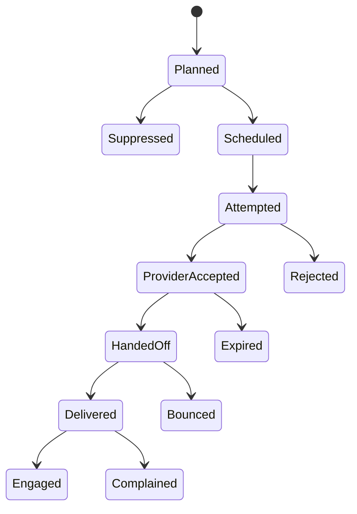

# Model and lifecycle

**RM-COMMS-MODEL-0001:** Communication intent binds stable message/notification/campaign/conversation identity, tenant, purpose/topic/classification, subject/actor, trigger/effect evidence, audience expression, content/template generation, urgency, timing, policy, and idempotency.

**RM-COMMS-MODEL-0002:** Intent acceptance, audience resolution, eligibility, rendering, scheduling, channel selection, attempt, provider acceptance, downstream handoff, delivery, presentation, engagement, reply, and domain effect are separate milestones.

**RM-COMMS-MODEL-0003:** Logical message, per-recipient delivery, per-channel attempt, provider message, rendered artifact, inbound message, conversation, and suppression record have separate stable identities and provenance.

**RM-COMMS-MODEL-0004:** Every status records source/boundary, observation time, claimed event time, confidence, provider/profile generation, terminality, supersession, and raw evidence reference; later callbacks never rewrite prior observations.

**RM-COMMS-MODEL-0005:** Aggregate campaign evidence preserves exact denominators and unknowns; it cannot relabel provider acceptance as delivery or missing engagement as non-reading.
