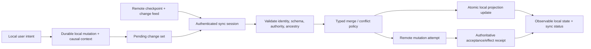

# Application synchronization, offline state, and conflict-resolution foundations

| Field | Value |
|---|---|
| Status | Draft domain analysis |
| Domain version | 0.1.1 |
| Accountable role | Application synchronization capability owner; named assignee required for promotion |
| Purpose | Synchronize selectively replicated application state across intermittently connected replicas without confusing local acceptance, transport, merge, authoritative effects, or convergence |

## Conclusions

- Dataset, replica, object, change, checkpoint, sync session, local projection, authoritative state, and effect receipt have distinct identity and generations.
- Local durability and optimistic presentation do not prove remote acceptance or authoritative domain effects.
- Conflict resolution is typed domain policy; timestamps, arrival order, and a generic last-writer-wins rule are not universal semantic truth.
- Deletion is replicated information. Tombstones can be reclaimed only past a proven retirement frontier and privacy policy.
- Synchronization is scoped convergence under declared availability, authority, topology, and history assumptions—not universal real-time equality.

## Documents

- [Model and lifecycle](model.md)
- [Datasets, replicas, objects, and topology](datasets-replicas.md)
- [Sessions, checkpoints, and reconnect](sessions-checkpoints.md)
- [Snapshots, changes, and atomic application](snapshots-changes.md)
- [Causality, ordering, and convergence](causality-convergence.md)
- [Conflict detection and merge policy](conflicts-merge.md)
- [Offline reads, writes, and optimistic effects](offline-effects.md)
- [Selective synchronization and queries](selective-sync.md)
- [Deletion, tombstones, compaction, and retirement](deletion-compaction.md)
- [Schema and data migration](schema-migration.md)
- [Attachments and large objects](attachments.md)
- [Security, privacy, accessibility, i18n, and observability](cross-cutting.md)
- [Operations and recovery](operations-recovery.md)
- [Platform and standards research](platform-research.md)
- [Conformance](conformance.md)
- [Benchmarks](benchmarks.md)
- [Assertion traceability](traceability.md)
- [Dependency and profile composition](dependencies.md)
- [Source freshness review](source-review.md)
- [Ownership and bounded trial planning](ownership.md)
- [Experimental promotion review](promotion-review.md)

## Decisions

- [ADR-0138: Local acceptance is not authoritative effect completion](../../adr/0138-local-acceptance-is-not-authoritative-effect-completion.md)
- [ADR-0139: Conflict resolution is typed domain policy](../../adr/0139-conflict-resolution-is-typed-domain-policy.md)

## Boundary

This domain's required, conditional, and governance relationships are defined in the [composition register](dependencies.md). It does not choose product datasets, authoritative replicas, topology, database, wire protocol, CRDT/OT algorithm, clock service, merge policy, offline-write eligibility, retention, or service objective.
