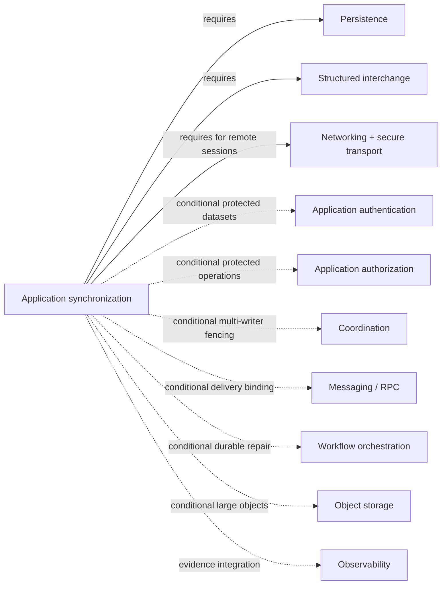

# Application synchronization dependency and profile composition

**Status:** Reviewed domain composition  
**Scope:** Application synchronization 0.1.1

These are domain-composition relationships, not yet stable capability-graph edges. They cannot be copied into the capability graph until the source and target capability identities and exact semantic condition are reviewed.

| Relationship | Type | Source evidence and required effect |
|---|---|---|
| [Persistence](../persistence/README.md) | required | Durable local mutation, outbox, checkpoint, metadata, and atomic projection boundaries |
| [Interchange](../interchange/README.md) | required | Versioned logical schema, wire mapping, limits, unknown-field, and canonical-view semantics |
| [Networking](../networking/README.md) and [secure transport](../networking/secure-transport-README.md) | required for remote sessions | Authenticated bounded streaming; connectivity is not readiness or authority |
| [Application authentication](../application-authentication/README.md) | conditional | Required when peer/workload/device/account identity is protected rather than supplied by a trusted embedding |
| [Application authorization](../application-authorization/README.md) | conditional | Required for protected upload, download, selection, merge, resolution, and administration |
| [Coordination](../coordination/README.md) | conditional | Required when authoritative multi-writer effects need fencing or consistency beyond typed merge |
| [Messaging/RPC](../messaging/README.md) | conditional | May carry changes/commands/receipts; delivery acknowledgment never proves synchronized effect |
| [Workflow orchestration](../workflow-orchestration/README.md) | conditional | Durable repair/migration/human resolution may compose workflows without making replay repeat effects |
| [Object storage](../object-storage/README.md) | conditional | Attachment bytes may use content-addressed multipart transfer; object presence is not reference authority |
| [Observability](../observability/README.md) | evidence integration | Loss-aware diagnostics correlate generations/frontiers without becoming domain truth |

## Profile impact

- [Windowed desktop](../profiles/foundation-windowed-desktop.md) conditionally selects contract `>=0.1.0,<0.2.0` for offline application state.
- [Server](../profiles/foundation-server.md) conditionally selects the same contract for partially replicated/intermittently connected datasets.
- [Repository operator](../profiles/foundation-repository-operator.md) constrains it to mirrors, caches, and offline metadata while preserving publication authority.
- [CA operator](../profiles/foundation-ca-operator.md) constrains it to projections and prohibits offline issuance, revocation, signing, or key authority.
- Foundation CLI prohibits synchronization side effects.

**RM-APP-SYNC-DEPENDENCY-0001:** A selected profile or trial MUST resolve every required and applicable conditional relationship to an exact compatible contract generation or declare the synchronization subject unsupported.

**RM-APP-SYNC-DEPENDENCY-0002:** A transport, database, broker, workflow, object store, or platform synchronization facility MUST NOT silently supply conflict, authority, convergence, deletion, or completion semantics absent from the synchronization contract.

**RM-APP-SYNC-DEPENDENCY-0003:** Promotion evidence MUST report unresolved composition relationships separately from capability-graph coverage and MUST NOT infer independence from a missing graph edge.

