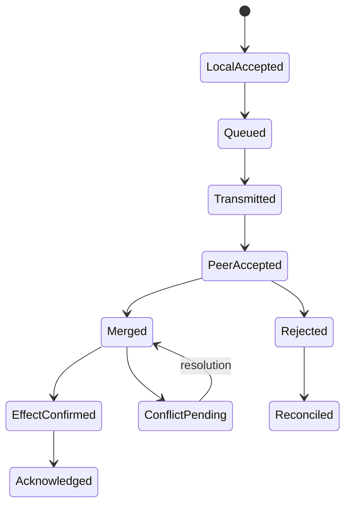

# Model and lifecycle

**RM-APP-SYNC-MODEL-0001:** A synchronization plan binds immutable dataset/schema/policy generations, replica set or eligibility, topology, directions, selection, authority, consistency and convergence claims, limits, retention, and security/privacy context.

**RM-APP-SYNC-MODEL-0002:** Replica observation, durable local mutation, queued submission, transmitted change, peer acceptance, merge, authoritative commit/effect, projection visibility, acknowledgement, and convergence are separate milestones.

**RM-APP-SYNC-MODEL-0003:** Every object and relationship has stable dataset-scoped identity plus incarnation/generation rules. A provider key, array position, display name, timestamp, or content hash is not durable application identity by default.

**RM-APP-SYNC-MODEL-0004:** Change identity is stable across retry and carries origin replica/incarnation, actor/subject, causal context, schema, operation, target generation or precondition, authority evidence, payload digest, and lifecycle state.

**RM-APP-SYNC-MODEL-0005:** Results disclose achieved milestones and residual uncertainty; `synced` without exact scope, frontier, peers, and authority is prohibited.
