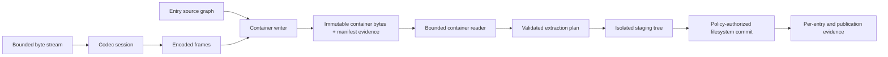

# Compression, archive, and package-container foundations

| Field | Value |
|---|---|
| Status | Draft domain analysis |
| Purpose | Transform byte streams and portable entry graphs without conflating codecs, containers, filesystem effects, packages, or trust |

## Conclusions

- Compression codecs, framing, archive containers, package semantics, encryption, signatures, and installation are separate negotiated capabilities.
- Listing and validation are inert; extraction is an authority-bearing filesystem transaction planned against a destination snapshot.
- Entry names and metadata are portable data, not trusted host paths or permission instructions.
- Expansion, nesting, entry count, metadata, CPU, memory, storage, time, and diagnostic work are bounded before and during processing.
- Reproducibility is an explicit creation profile over ordering, metadata, codec parameters, format extensions, and exact tool/provider generations.

## Documents

- [Model and lifecycle](model.md)
- [Codec identity, parameters, and negotiation](codecs-negotiation.md)
- [Streaming, framing, dictionaries, and integrity](streaming-integrity.md)
- [Container entries and metadata](entries-metadata.md)
- [Paths, links, and special objects](paths-links.md)
- [Reading, indexing, and multipart containers](reading-indexing.md)
- [Creation and reproducibility](creation-reproducibility.md)
- [Extraction planning and transactions](extraction-transactions.md)
- [Encryption, signatures, and trust](encryption-trust.md)
- [Mutation, update, repair, and recovery](mutation-recovery.md)
- [Format and platform research](platform-research.md)
- [Security and cross-cutting qualities](cross-cutting.md)
- [Conformance](conformance.md)
- [Benchmarks](benchmarks.md)

## Decisions

- [ADR-0118: Codecs and containers are independently negotiated capabilities](../../adr/0118-codecs-and-containers-are-independently-negotiated-capabilities.md)
- [ADR-0119: Extraction is a validated filesystem transaction](../../adr/0119-extraction-is-a-validated-filesystem-transaction.md)

## Boundary

This domain composes byte streams, filesystem authority, cryptography, signed artifacts, interchange, storage, observability, and policy. It does not select product formats, codec parameters, package manifests, trust roots, keys, installation behavior, update channels, retention, or legal policy.
