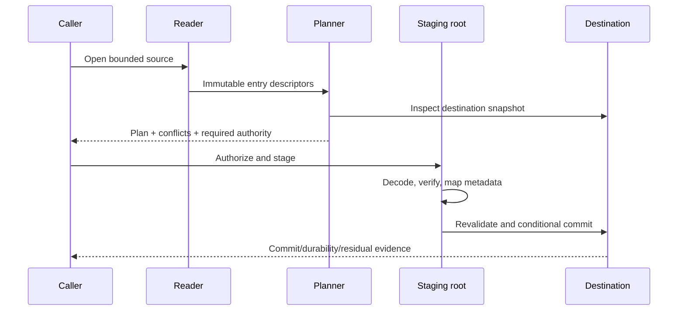

# Extraction planning and transactions

**RM-ARCHIVE-EXTRACT-0001:** Extraction separates inert enumerate/validate/plan from effectful stage/commit. The immutable plan binds source generation, destination capability and snapshot, selected entries, mapped paths, conflicts, metadata, limits, overwrite policy, and authority.

**RM-ARCHIVE-EXTRACT-0002:** Planning rejects traversal, ambiguous/colliding mappings, unsupported critical metadata, unsafe links/special objects, impossible space/resource budgets, duplicate policy violations, and destination conflicts before content effects where discoverable.

**RM-ARCHIVE-EXTRACT-0003:** Content is decoded into isolated staging using no-follow relative operations, per-entry and aggregate quotas, integrity/authentication gates, sparse-allocation accounting, and cancellation-safe cleanup.

**RM-ARCHIVE-EXTRACT-0004:** Commit revalidates destination identity and conflicts, then publishes the complete staged graph atomically when the provider can prove it. Otherwise it returns an explicit journaled multi-step boundary with recovery and residual evidence.

**RM-ARCHIVE-EXTRACT-0005:** Overwrite defaults deny. Replace, merge, skip, rename, compare-identical, and fail policies are per-kind and cover existing links, directories, case aliases, metadata, open handles, cross-volume moves, and concurrent mutation.

**RM-ARCHIVE-EXTRACT-0006:** Permissions and security-sensitive metadata are applied in a safe order that never makes partial content broadly executable/readable. Temporary files and directories remain least-privileged.

**RM-ARCHIVE-EXTRACT-0007:** Cancellation distinguishes no effects, staged residuals, commit not started, commit partially applied, committed, and indeterminate. Cleanup failure is returned and observable.

