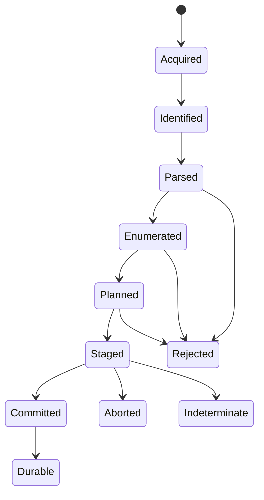

# Model and lifecycle

**RM-ARCHIVE-MODEL-0001:** A codec identity names algorithm, framing/profile/version, parameter schema, dictionary requirements, integrity fields, implementation/provider generation, and recognized extension policy; a filename suffix is only a hint.

**RM-ARCHIVE-MODEL-0002:** A container identity names format/profile/version, entry model, metadata namespaces, addressing/index rules, supported codecs/encryption/signatures, extension policy, and provider generation.

**RM-ARCHIVE-MODEL-0003:** Package identity and install meaning are outside container identity. Opening a ZIP, tar, cpio, package bundle, or disk image does not authorize interpreting scripts, manifests, executable bits, mounts, or installation actions.

**RM-ARCHIVE-MODEL-0004:** Source acquired, type identified, header parsed, index available, entry enumerated, entry decoded, integrity verified, extraction planned, staged, committed, durable, and externally published are distinct milestones.

**RM-ARCHIVE-MODEL-0005:** Results bind source identity/generation and digest when known, exact provider and format profile, policy and resource-budget generations, bytes consumed/produced, entries observed/selected/skipped, integrity coverage, warnings/losses, and terminal milestone.

**RM-ARCHIVE-MODEL-0006:** Errors distinguish unsupported identity/profile/feature, malformed/truncated/trailing data, missing dictionary/volume/key, authentication/integrity failure, ambiguity/collision, policy rejection, limit exhaustion, storage failure, cancellation, and indeterminate commit.

