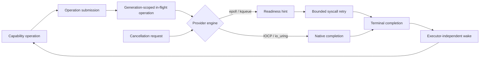

# Asynchronous I/O foundations vertical slice

| Field | Value |
|---|---|
| Status | Draft domain analysis |
| Domain version | 0.1.1 |
| Accountable role | Async I/O integration owner |
| Purpose | Define portable operation submission, completion, cancellation, backpressure, and runtime integration across readiness- and completion-based platforms |

## Conclusions

- Portable async I/O is completion-oriented; readiness is an internal provider strategy and only a hint to retry.
- An operation has exactly one terminal outcome, including exact partial progress and cancellation-race evidence.
- Cancellation requests compete with normal completion. Buffers, native control blocks, and resource registrations live until terminal acknowledgement.
- The I/O engine detects progress; an executor schedules consumer work. Neither owns the other's policy.
- Queue depth, memory, notifications, retry work, and completion delivery are bounded with explicit overload behavior.
- Sync-complete means real synchronous contracts exist; it does not mean every sync call secretly creates or blocks an async runtime.

## Documents

- [Operation model](operation-model.md)
- [Readiness and completion](readiness-completion.md)
- [Cancellation and lifetime](cancellation-lifetime.md)
- [Registration and resource generations](registration-resources.md)
- [Backpressure and fairness](backpressure-fairness.md)
- [Runtime and executor integration](runtime-integration.md)
- [Errors and observability](errors-observability.md)
- [Platform research](platform-research.md)
- [Conformance](conformance.md)
- [Benchmarks](benchmarks.md)
- [Assertion and benchmark traceability](traceability.md)
- [Dependency and provider composition](dependencies.md)
- [Cross-cutting review](cross-cutting.md)
- [Source review](source-review.md)
- [Ownership and bounded trial plan](ownership.md)
- [Experimental promotion review](promotion-review.md)
