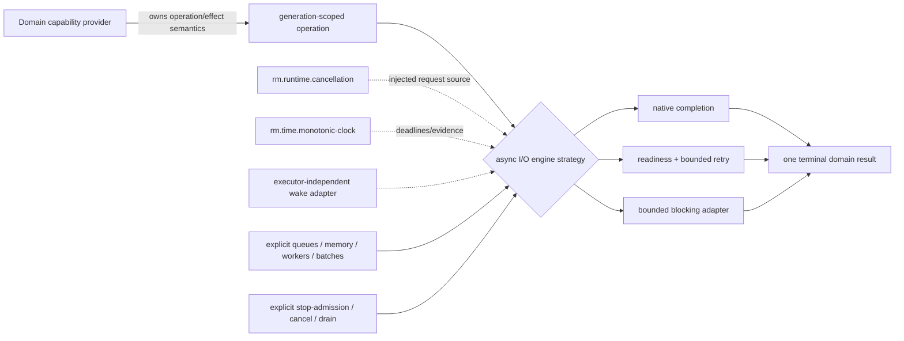

# Async I/O dependency and provider composition

**Status:** Reviewed framework composition  
**Scope:** Async I/O foundations 0.1.1

Async I/O is a provider-integration framework, not a new universal application-facing operation capability and not a mandated runtime. Filesystem file I/O, IPC endpoints, process waits, networking, and later device capabilities retain their own progress, EOF, message, ordering, side-effect, error, and authority semantics while reusing these lifecycle invariants.

| Relationship | Type | Required boundary |
|---|---|---|
| domain provider → operation framework | framework conformance | domain owns semantics; engine owns safe issue/readiness/completion/lifetime mechanics |
| cancellation/clock/wake/limits/shutdown | injected integration dependencies | exact versions/adapters and budgets are construction inputs; no globals or hidden runtime |
| readiness/completion/blocking | provider strategies | per operation/resource/platform matrix; strategy names do not imply equivalent quality |
| filesystem/IPC/process/network consumers | composition | each capability declares support and quality without changing its synchronous contract |

Foundation profiles require async-first but sync-complete behavior in the capabilities they select; they do not select a universal async engine. A provider profile must resolve operation/resource support, strategy, cancellation, clock, wake/executor, queue/memory/thread/batch bounds, affinity/fork constraints, and shutdown policy. Q-levels in byte-pipe remain capability quality; they are not replaced by engine marketing names.

**RM-ASYNC-DEPENDENCY-0001:** Every engine instance MUST receive explicit compatible cancellation, monotonic-time-if-used, wake, resource-limit, and shutdown dependencies and bind a declared operation/resource/provider matrix.

**RM-ASYNC-DEPENDENCY-0002:** Framework reuse MUST NOT move domain progress, EOF, message, ordering, side-effect, error, or authority semantics into the engine.

**RM-ASYNC-DEPENDENCY-0003:** Framework integration, data flow, provider strategy, profile selection, and stable capability-graph edges MUST remain distinct; this domain creates no graph node until a concrete independently selectable capability contract is accepted.

**RM-ASYNC-DEPENDENCY-0004:** Engine compatibility MUST NOT imply executor/runtime compatibility, universal operation support, native cancellation, safe fork/inheritance, or equivalent readiness/completion/blocking quality.
