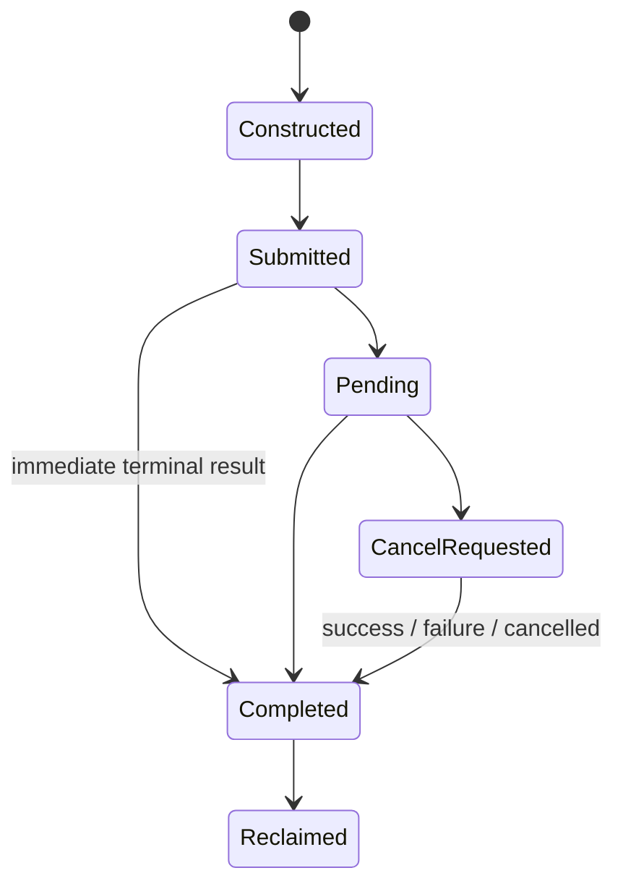

# Asynchronous I/O operation model

`rm.io.operation` is the common lifecycle contract used by domain capabilities that perform native I/O. It is infrastructure, not a generic untyped read/write API. Domain contracts still define offsets, message boundaries, EOF, atomicity, partial progress, and authority.

**RM-ASYNC-OP-0001:** Every submitted operation MUST have a provider-unique generation-scoped identity and exactly one terminal completion.

**RM-ASYNC-OP-0002:** Completion MUST report operation kind, resource generation, terminal status, exact progress, result metadata, and completion observation context.

**RM-ASYNC-OP-0003:** Immediate and deferred completion MUST have identical semantic outcomes. Provider fast paths MUST NOT bypass accounting, cancellation arbitration, or lifetime rules.

**RM-ASYNC-OP-0004:** Partial progress MUST follow the domain operation's contract and remain distinguishable from zero progress, EOF, would-block retry, cancellation, timeout, and failure.

**RM-ASYNC-OP-0005:** Dropping a consumer future MUST invoke the declared detach-or-cancel policy; it MUST NOT orphan untracked native work or free operation state early.

Submission consumes a bounded operation slot only after all buffers, resource generations, authority, deadlines, and provider support are validated. Failure before native submission is a submission failure, not an asynchronous completion.
