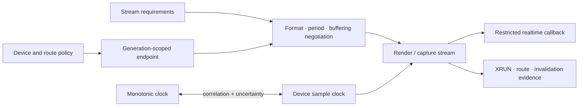

# Audio foundations vertical slice

| Field | Value |
|---|---|
| Status | Draft domain analysis |
| Purpose | Model native PCM devices, formats, streams, timing, routing, and realtime processing without conflating them with codecs or product media policy |

## Conclusions

- Audio endpoints, default-route policy, streams, processing graphs, and codecs are separate capabilities.
- Device identities and default routes are observations with generations, not permanent authority-bearing names.
- Requested, negotiated, and effective formats and buffering are distinct.
- Stream progress is measured in frames on the device sample clock; correlation to monotonic time carries uncertainty and drift.
- Realtime callbacks form a restricted execution domain. Allocation, blocking, ordinary locks, I/O, logging, and runtime scheduling are excluded.
- Underruns, overruns, discontinuities, route changes, and invalidation are explicit events; recovery never silently pretends continuity.
- Capture, loopback capture, exclusive access, routing control, and persistent monitoring require separately scoped authority.
- Encoders, decoders, containers, MIDI, speech, spatial scene models, and a general media graph remain outside this slice.

## Documents

- [Device topology](device-topology.md)
- [Formats and channel layouts](format-layout.md)
- [Render and capture streams](streams.md)
- [Clock and timing](clock-timing.md)
- [Routing and policy](routing-policy.md)
- [Realtime processing](realtime-processing.md)
- [Platform research](platform-research.md)
- [Conformance](conformance.md)
- [Benchmarks](benchmarks.md)
