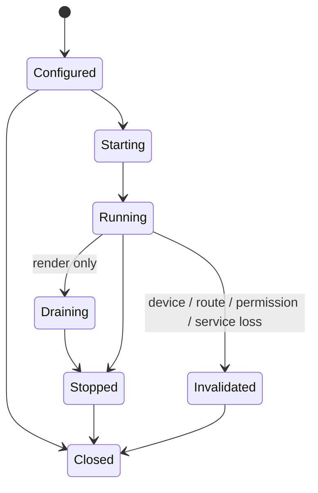

# Render and capture streams

## Contract

`rm.audio.render-stream` consumes PCM frames; `rm.audio.capture-stream` produces PCM frames. Each open request names an endpoint generation or an explicit route-following policy, format constraints, sharing mode, latency/period bounds, callback or queued transfer mode, and authority.

**RM-AUDIO-STREAM-0001:** Stream creation MUST report requested, negotiated, and effective format, period, buffer capacity, sharing mode, conversion path, endpoint generation, and clock identity.

**RM-AUDIO-STREAM-0002:** Frame transfer MUST report exact progress. Partial transfer, backpressure, end-of-input, cancellation, timeout, and invalidation remain distinguishable.

**RM-AUDIO-STREAM-0003:** Render underrun and capture overrun MUST emit a discontinuity record with affected frame range or bounded estimate, observed clock state, recovery action, and evidence quality.

**RM-AUDIO-STREAM-0004:** Restart after invalidation creates a new stream generation. It MUST NOT extend the prior sample timeline or claim gapless continuity without measured proof.

**RM-AUDIO-STREAM-0005:** Sync operations MAY block only as declared and MUST NOT silently pump a UI loop or occupy an async executor worker indefinitely. Async operations support cancellation and bounded buffering.

**RM-AUDIO-STREAM-0006:** Exclusive access, raw/offload modes, loopback/system capture, and route following are independent optional constraints; failure to obtain one MUST NOT silently weaken it to shared capture or rendering.

Capture buffers are sensitive data. Their ownership, zeroization policy, retention, export, diagnostics, and downstream delegation are explicit. Capture start may be delayed or denied by platform consent; “device exists” never means “capture authorized.”
