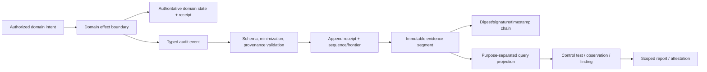

# Application audit trails, evidence ledgers, and compliance reporting

| Field | Value |
|---|---|
| Status | Draft domain analysis |
| Purpose | Capture, preserve, verify, query, and report scoped evidence of consequential application activity without confusing logs with domain truth, integrity with completeness, or reports with compliance conclusions |

## Conclusions

- Domain fact, audit event, diagnostic log, trace, metric, evidence artifact, integrity proof, control test, finding, report, and attestation are distinct.
- Audit events are evidence about effects and decisions; replaying an audit trail cannot recreate authority or silently become the domain source of truth.
- Integrity proves bounded non-modification, origin, sequencing, or external time only as explicitly verified. It does not prove capture completeness or claim truth.
- Correction and redaction create new records or controlled cryptographic projections; they never rewrite history invisibly.
- Compliance reports bind exact controls, system scope, period, procedures, evidence, exceptions, assessor, confidence, and expiry and do not constitute universal compliance.

## Documents

- [Model and evidence classes](model.md)
- [Audit event schema and semantics](event-schema.md)
- [Capture boundaries and atomicity](capture-boundaries.md)
- [Sequencing, time, causality, and completeness](sequence-time.md)
- [Append, corrections, and supersession](append-corrections.md)
- [Integrity, signatures, timestamps, and transparency](integrity-proofs.md)
- [Privacy, redaction, tokenization, and disclosure](privacy-redaction.md)
- [Retention, legal hold, erasure, and disposal](retention-holds.md)
- [Query, investigation, export, and reporting](query-reporting.md)
- [Controls, assessments, findings, and attestations](controls-assessments.md)
- [SIEM, archive, and external mappings](external-mappings.md)
- [Incident, case, and workflow linkage](cases-incidents.md)
- [Operations, recovery, and migration](operations-recovery.md)
- [Cross-cutting qualities](cross-cutting.md)
- [Platform and standards research](platform-research.md)
- [Conformance](conformance.md)
- [Benchmarks](benchmarks.md)
- [Assertion traceability pilot](traceability.md)

## Decisions

- [ADR-0144: Audit events are evidence, not domain truth](../../adr/0144-audit-events-are-evidence-not-domain-truth.md)
- [ADR-0145: Integrity proofs do not prove capture completeness](../../adr/0145-integrity-proofs-do-not-prove-capture-completeness.md)

## Boundary

This domain composes observability, persistence, object storage, cryptography, signed evidence, time, workflow, privacy, authorization, search, analytics, content inspection, and governance. It does not choose product audit classes, legal requirements, retention periods, controls/frameworks, assessor qualifications, SIEM/archive provider, report language, or compliance conclusions.
