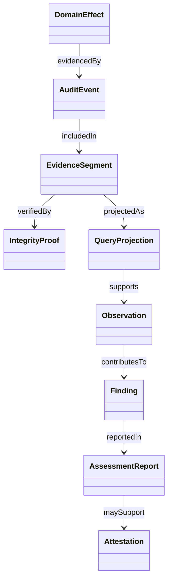

# Model and evidence classes

**RM-AUDIT-MODEL-0001:** Business, security, privacy, access, administrative, financial/metering, lifecycle, evidence-management, and operational audit classes have independent schemas, capture requirements, audiences, protections, and retention.

**RM-AUDIT-MODEL-0002:** Audit event, ordinary structured log, trace/span, metric, domain event, outbox message, workflow history, ledger entry, evidence artifact, report, and alert retain separate identity and authority even when correlated.

**RM-AUDIT-MODEL-0003:** An evidence collection binds system/component/tenant scope, event classes/schema generations, capture points, source populations, sequence/frontier, storage/protection profile, retention, access, and known gaps.

**RM-AUDIT-MODEL-0004:** Proposed action, authorization decision, native/domain acceptance, durable effect, observed result, audit-event creation, append acceptance, durable inclusion, integrity anchoring, indexing, export, and review are distinct milestones.

**RM-AUDIT-MODEL-0005:** Every claim exposes subject, predicate/action, object/resource, actor/responsible agent, authority and policy, outcome, time/sequence quality, provenance, confidence, and exact nonclaims.
