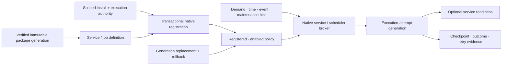

# Application services, background execution, and durable scheduling foundations

| Field | Value |
|---|---|
| Status | Draft domain analysis |
| Purpose | Register, activate, supervise, update, and schedule background work across user and system contexts without confusing installation, enablement, trigger observation, process lifetime, readiness, execution, or completion |

## Conclusions

- Package installation, service/job registration, enablement, trigger subscription, process start, readiness, work claim, completion, result persistence, and removal are separate milestones.
- Demand-started service, long-lived service, user-session agent, login item, finite background task, and durable scheduled job are distinct workload contracts.
- A durable schedule persists intent and policy, not a promise of exact wall-clock execution. Sleep, downtime, power, network, quota, policy, and update changes produce explicit missed/coalesced/deferred outcomes.
- Trigger delivery is an at-least-once hint to reconcile authoritative state. It is not a durable event payload, authority, or exactly-once work claim.
- Each execution has an immutable definition/package generation, principal/security context, trigger evidence, resource budget, attempt identity, deadline, cancellation path, and terminal evidence.
- Background contexts cannot prompt or present arbitrary UI. User interaction is brokered to an appropriate foreground session through separate activation/notification contracts.

## Documents

- [Definitions, registration, and enablement](definitions-registration.md)
- [Execution scopes, principals, and authority](scope-authority.md)
- [Service activation, readiness, and IPC](service-activation.md)
- [Schedules, clocks, and missed work](schedules-clocks.md)
- [Triggers and state reconciliation](triggers-reconciliation.md)
- [Attempts, checkpoints, retries, and results](attempts-retries.md)
- [Budgets, power, network, and concurrency](budgets-policy.md)
- [Updates, rollback, removal, and recovery](updates-recovery.md)
- [Security, privacy, and accessibility](security-accessibility.md)
- [Platform research](platform-research.md)
- [Conformance](conformance.md)
- [Benchmarks](benchmarks.md)
