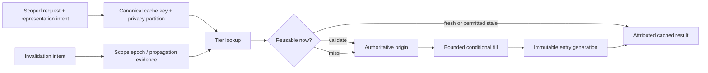

# Caching and content-delivery foundations

| Field | Value |
|---|---|
| Status | Draft domain analysis |
| Purpose | Reuse derived representations safely across local, shared, distributed, and edge tiers without confusing reuse policy with source authority |

## Conclusions

- A cached value is reusable only under an exact key, partition, generation, policy, and time context; cache presence alone grants no reuse authority.
- Freshness, validation, invalidation, eviction, and origin truth are distinct. A miss is not nonexistence, and a hit is not current source truth.
- Concurrent fills use bounded request collapse without transferring one caller's credentials, cancellation, deadline, or privacy context to another.
- Distributed purge completion is boundary-scoped evidence; immutable versioned names are preferred where obsolete bytes must become unreachable predictably.
- Cache layers expose origin load, latency, cost, staleness, privacy, and failure tradeoffs rather than promising transparent performance.

## Documents

- [Model and milestones](model.md)
- [Identity and privacy partitions](identity-partitions.md)
- [Freshness and validation](freshness-validation.md)
- [Admission, eviction, and tiers](admission-eviction-tiers.md)
- [Concurrency and stampede control](concurrency-stampede.md)
- [Mutation, invalidation, and coherence](invalidation-coherence.md)
- [Content delivery and edge behavior](content-delivery.md)
- [Cross-cutting qualities](cross-cutting.md)
- [Platform research](platform-research.md)
- [Conformance](conformance.md)
- [Benchmarks](benchmarks.md)

## Decisions

- [ADR-0106: Cache presence is not reuse authority](../../adr/0106-cache-presence-is-not-reuse-authority.md)
- [ADR-0107: Invalidation completion is boundary-scoped evidence](../../adr/0107-invalidation-completion-is-boundary-scoped-evidence.md)

## Boundary

This domain does not redefine HTTP caching, database correctness, object identity, application consistency, repository publication, service routing, authorization, or offline synchronization. Products select cached representations, keys, providers, topology, objectives, privacy partitions, invalidation authority, and acceptable-staleness policy through RFCs.
