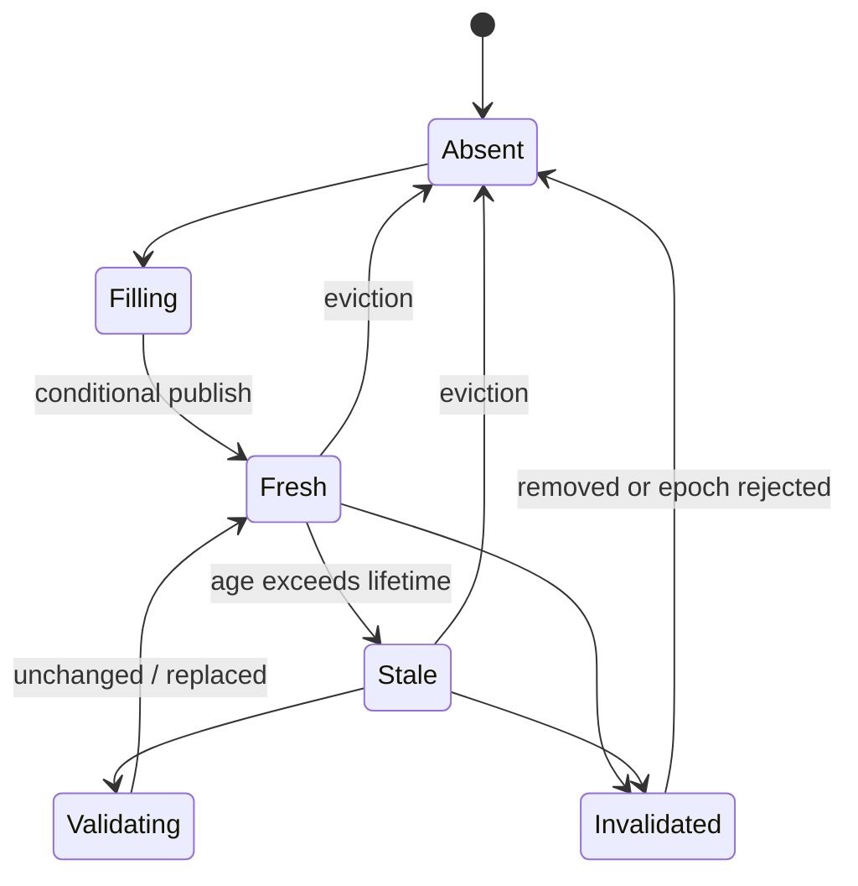

# Model and milestones

**RM-CACHE-MODEL-0001:** A cache service declares scope, provider and configuration generation, tier topology, capacity/cost limits, supported entry forms, consistency limits, clock source, durability, encryption, and failure behavior.

**RM-CACHE-MODEL-0002:** An entry binds canonical key, privacy partition, representation descriptor, immutable value or object reference, origin/entry generation, creation and validation evidence, freshness policy, tags/dependencies, size, and provenance.

**RM-CACHE-MODEL-0003:** Lookup outcomes distinguish fresh hit, permitted stale hit, validation hit, miss, bypass, negative hit, corrupt entry, unavailable tier, and policy rejection.

**RM-CACHE-MODEL-0004:** Milestones distinguish lookup started, candidate found, reuse authorized, bytes verified, response served, origin requested, fill accepted, entry published, invalidation accepted, propagation observed, eviction, and durable effect.

**RM-CACHE-MODEL-0005:** Errors preserve phase, key fingerprint rather than sensitive key, tier, retry safety, partial progress, origin involvement, stale alternative, corruption, and cleanup/reconciliation obligations.

**RM-CACHE-MODEL-0006:** Async operations are cancellation-safe and bounded; sync equivalents never create a hidden runtime and disclose blocking, thread, network, and callback behavior.

