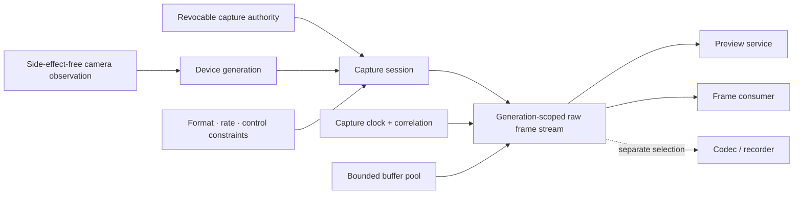

# Camera and media-capture foundations vertical slice

| Field | Value |
|---|---|
| Status | Draft domain analysis |
| Purpose | Define consent-bound camera discovery, negotiated capture sessions, timed raw frames, controls, and bounded delivery without embedding codecs or recording policy |

## Conclusions

- Device observation, permission prompting, session opening, raw capture, preview, still-photo processing, encoding, recording, and library storage are distinct.
- Capture authority is explicit, purpose-scoped, revocable, and revalidated when native capture starts; enumerability does not imply access.
- Requested, negotiated, and effective formats, rates, crop/orientation, color, and processing remain distinguishable.
- Frames carry exact plane layout, generation, sequence/discontinuity, capture timestamp source, clock domain, and metadata provenance.
- Buffer retention and consumer work are bounded. Drop, block, copy, and degrade policies are explicit and measurable.
- Camera controls are negotiated state with ranges, units, modes, effective values, conflicts, latency, and user/system override.

## Documents

- [Devices, authorization, and sessions](devices-authorization.md)
- [Formats, color, and orientation](formats-color.md)
- [Frame and buffer model](frames-buffers.md)
- [Timing and synchronization](timing-synchronization.md)
- [Controls and reconfiguration](controls-reconfiguration.md)
- [Delivery, backpressure, and lifecycle](delivery-lifecycle.md)
- [Privacy, security, and accessibility](privacy-accessibility.md)
- [Platform research](platform-research.md)
- [Conformance](conformance.md)
- [Benchmarks](benchmarks.md)
