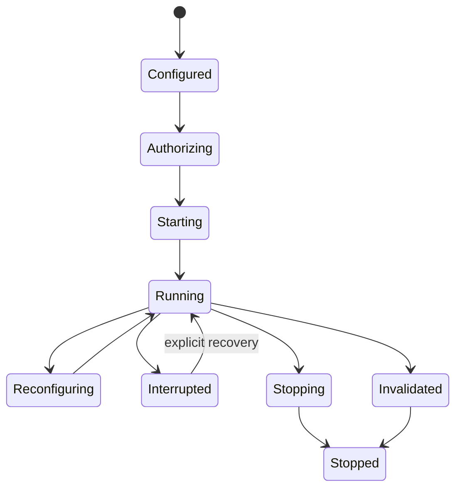

# Capture delivery, backpressure, and lifecycle

**RM-CAPTURE-DELIVERY-0001:** Buffer pools, consumer queues, outstanding frames, callback work, and transformations MUST be bounded and included in negotiation/evidence.

**RM-CAPTURE-DELIVERY-0002:** Overload policy MUST explicitly select newest-only/drop-oldest, drop-newest, bounded block where supported, copy, reduce rate/quality, or fail. Drops MUST be counted with cause and affected sequence range.

**RM-CAPTURE-DELIVERY-0003:** Native delivery callbacks MUST perform bounded handoff only and MUST NOT execute arbitrary product analysis, encoder work, UI calls, blocking I/O, or exporter logging.

**RM-CAPTURE-DELIVERY-0004:** Async frame retrieval MUST be cancellation-safe and shutdown-aware; sync retrieval MUST declare blocking and MUST NOT silently pump UI/runtime callbacks.

**RM-CAPTURE-DELIVERY-0005:** Stop completion MUST state whether native capture has stopped, callbacks are quiesced, buffers are returned, indicators are released, and authority/session resources are closed.

**RM-CAPTURE-DELIVERY-0006:** Recovery after interruption or invalidation creates a new stream generation unless exact buffer/timing/control continuity is proven.
