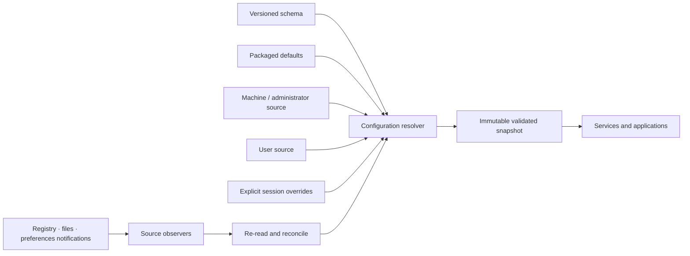

# Configuration and change-notification vertical slice

| Field | Value |
|---|---|
| Status | Draft domain analysis |
| Purpose | Resolve typed application policy from explicit sources and publish validated change snapshots without ambient global state |

## Domain boundary

Configuration is typed input to policy. It is not a generic string map, a hidden process singleton, a secret store, or an excuse to expose registry paths, plist domains, environment variables, or file formats through common APIs.

## Architectural conclusions

- A schema assigns stable key identity, type, constraints, sensitivity class, reload policy, and compatibility rules.
- Resolution consumes an explicit ordered source plan. Every effective value carries provenance and diagnostics.
- Consumers receive immutable, monotonically revisioned snapshots; reads within one snapshot are coherent.
- Change notifications are invalidation hints. Providers re-read affected sources and publish a complete validated replacement snapshot or a structured rejection/resynchronization event.
- Unknown keys, invalid values, unavailable sources, and policy locks remain distinguishable.
- Secrets are references to protected values, never ordinary configuration payloads.
- Environment and command-line inputs are captured explicitly at construction; ambient reads during ordinary operation are prohibited.
- Dynamic reload is opt-in per key. Restart-required changes are reported but do not silently alter live behavior.

## Documents

- [Schema and value model](schema-value-model.md)
- [Sources, precedence, and provenance](sources-precedence.md)
- [Snapshots and resolution](snapshots-resolution.md)
- [Change observation and reload](change-notification.md)
- [Security and secrets boundary](security-secrets.md)
- [Platform research](platform-research.md)
- [Conformance specification](conformance.md)
- [Benchmark specification](benchmarks.md)

