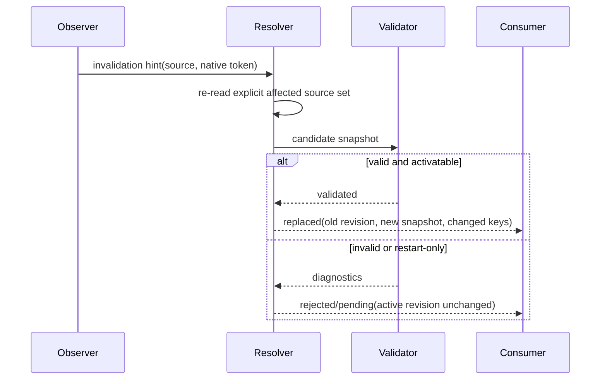

# Snapshots and resolution

## Service contract

The configuration resolver composes schemas and sources into evidence-bearing immutable snapshots.

**RM-CONFIG-RESOLVE-0001:** A snapshot has a monotonically increasing process-local revision, schema identity/version, source-plan identity, creation reason, effective typed values, per-value provenance, rejected-candidate diagnostics, and pending restart/coordinated changes.

**RM-CONFIG-RESOLVE-0002:** All reads against one snapshot observe one coherent resolution result. Publication is atomic from the consumer's perspective.

**RM-CONFIG-RESOLVE-0003:** Resolution is deterministic for the same schema, source-plan policy, ordered source contents, explicit validation context, and provider/parser versions.

**RM-CONFIG-RESOLVE-0004:** A failed candidate does not partially mutate the active snapshot. The service retains the last-known-good snapshot only when policy permits and emits a failure record linked to the attempted source revisions.

**RM-CONFIG-RESOLVE-0005:** Snapshot equality distinguishes semantic value equality from provenance/revision equality. Consumers declare whether provenance-only changes require action.

**RM-CONFIG-RESOLVE-0006:** Sync resolution is complete for nonblocking/in-memory sources. Potentially blocking source acquisition has an async path; sync APIs disclose blocking and never create a hidden runtime.

## Publication sequence

