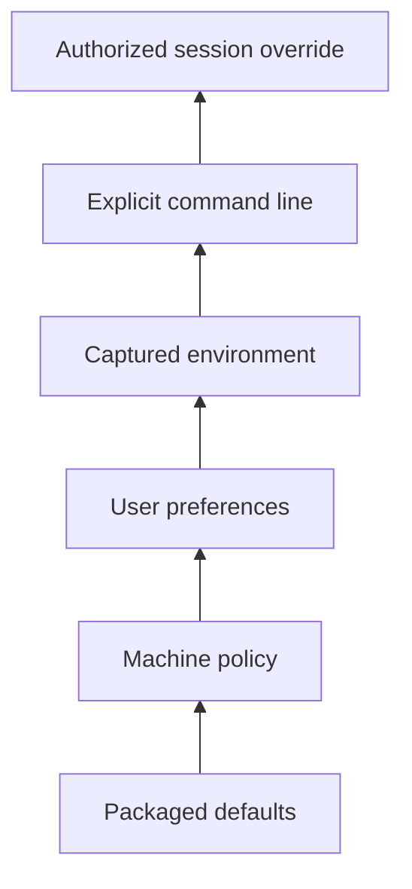

# Sources, precedence, and provenance

## Capability identity

`rm.config.source` reads one explicitly authorized configuration source into typed candidates.

## Normative contract

**RM-CONFIG-SOURCE-0001:** Resolution receives an ordered source plan. Platform identity does not imply a source or precedence order.

**RM-CONFIG-SOURCE-0002:** Each candidate records source identity, source revision when available, original key identity, native representation class, trust/authority class, and whether policy locked the value.

**RM-CONFIG-SOURCE-0003:** A higher-precedence invalid value does not silently reveal a lower-precedence value. Policy explicitly selects fail-closed, retain-last-known-good, or diagnosed fallback behavior per partition.

**RM-CONFIG-SOURCE-0004:** Machine/administrator policy, user preference, packaged defaults, environment capture, command-line input, and ephemeral session override are distinct source classes. A provider cannot merge them before portable precedence and provenance are applied.

**RM-CONFIG-SOURCE-0005:** Source reads are bounded, cancellable where blocking I/O is possible, and protected against unbounded document depth, key count, value size, alias expansion, and repeated parse work.

**RM-CONFIG-SOURCE-0006:** File-backed sources use filesystem capabilities and explicit directory authority. A path string alone conveys no authority, and source replacement follows the filesystem visibility/durability contract selected by policy.

## Example source plan

The diagram is illustrative. Products publish their exact plan; the framework does not impose this order universally.

