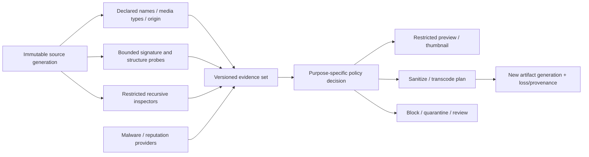

# Content identification, inspection, quarantine, and safe-transformation foundations

| Field | Value |
|---|---|
| Status | Draft domain analysis |
| Purpose | Derive bounded content evidence and restricted representations without conflating type claims, parser success, malware assessment, origin policy, trust, or use authority |

## Conclusions

- Declared type, filename association, detected signatures, validated structure, parser interpretation, executable potential, malware/reputation verdict, signature trust, quarantine state, and use authorization are independent evidence.
- Detection returns candidates with scope and reasons; it does not discover one timeless intrinsic “true type.”
- Inspection and preview are active parsing of hostile input and require restricted providers, budgets, cancellation, and non-effectful output contracts.
- Transformation creates a new artifact generation with explicit semantic loss; “sanitized” is a policy-scoped claim, never universal safety.
- Origin and quarantine evidence propagates through copies, extraction, and derived artifacts under explicit rules and is never silently cleared.

## Documents

- [Model, evidence, and lifecycle](model.md)
- [Media identities, registries, and declarations](media-identities.md)
- [Detection, probing, and confidence](detection.md)
- [Polyglots and interpretation conflicts](polyglots.md)
- [Recursive inspection graphs](recursive-inspection.md)
- [Origin, provenance, and quarantine](origin-quarantine.md)
- [Malware, reputation, and policy providers](malware-reputation.md)
- [Restricted preview and thumbnail generation](preview-thumbnail.md)
- [Transformation, sanitization, and transcoding](transformation.md)
- [Caching, freshness, and invalidation](caching.md)
- [Platform research](platform-research.md)
- [Cross-cutting qualities](cross-cutting.md)
- [Conformance](conformance.md)
- [Benchmarks](benchmarks.md)

## Decisions

- [ADR-0120: Content identification is evidence, not intrinsic truth or use authority](../../adr/0120-content-identification-is-evidence-not-intrinsic-truth-or-use-authority.md)
- [ADR-0121: Safe transformation creates a new artifact generation with bounded claims](../../adr/0121-safe-transformation-creates-a-new-artifact-generation.md)

## Boundary

This domain composes byte streams, files, archives, interchange, media decoders, restricted execution, policy, cryptography, signed artifacts, identity/origin evidence, caches, and observability. It does not choose product allowlists, detector databases, malware vendors, reputation services, trust roots, previewers, transformations, execution/install decisions, retention, or legal meaning.
