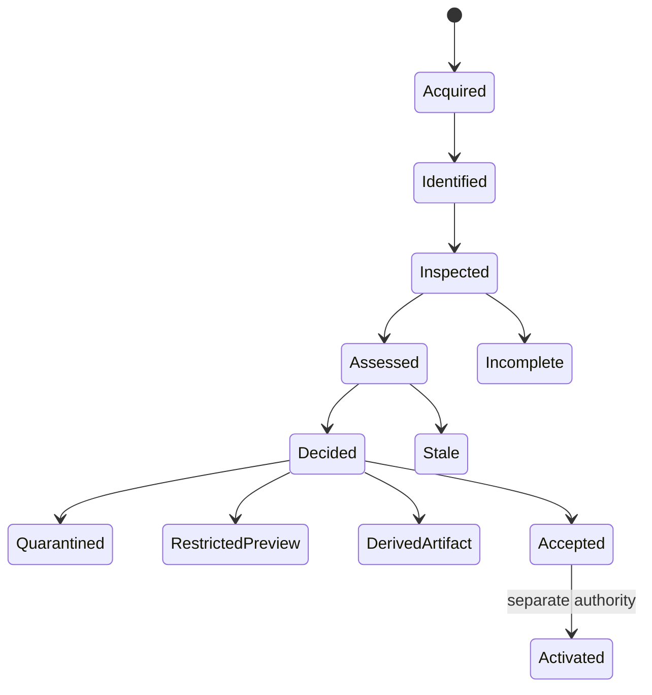

# Model, evidence, and lifecycle

**RM-CONTENT-MODEL-0001:** A content subject binds immutable byte identity or generation, length/bounds, acquisition source, storage handle, declared names/types/encodings, origin chain, quarantine labels, and access authority.

**RM-CONTENT-MODEL-0002:** Evidence is an immutable provider result binding subject generation, operation purpose, rule/signature/model/database and provider generations, bytes/ranges and nested nodes examined, limits, time, platform context, findings, uncertainty, expiry, and nonclaims.

**RM-CONTENT-MODEL-0003:** Declared, associated, signature-detected, structure-validated, parser-interpreted, executable-capable, active-content-bearing, encrypted/opaque, malware-assessed, reputation-assessed, signed/trusted, quarantined, and authorized-for-use are separate dimensions.

**RM-CONTENT-MODEL-0004:** Acquired, identified, structurally inspected, recursively inspected, externally assessed, policy-decided, previewed, transformed, accepted, activated, and effect-completed are distinct milestones.

**RM-CONTENT-MODEL-0005:** Results distinguish clean/no-finding, finding, suspicious, unknown, unsupported, opaque/encrypted, incomplete/partial, stale, unavailable, policy-rejected, malformed, resource-exhausted, cancelled, and failed. “No finding” never means safe.

**RM-CONTENT-MODEL-0006:** Decisions are purpose-scoped: store, display-name, index, preview, transform, share, publish, import, open, install, load, or execute may use different evidence requirements.

