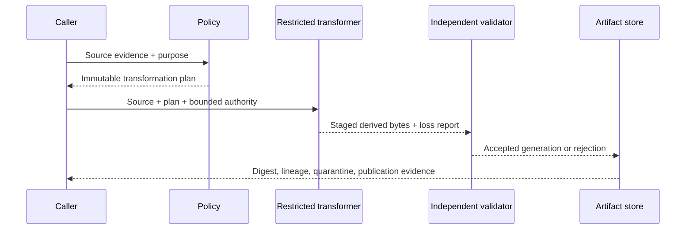

# Transformation, sanitization, and transcoding

**RM-CONTENT-TRANSFORM-0001:** A transformation plan binds immutable source and evidence generations, purpose, exact input interpretations, output format/profile, allowed semantic subset, preservation/removal rules, provider, limits, authority, and validation/acceptance criteria.

**RM-CONTENT-TRANSFORM-0002:** Transformations create new artifact generations with independent bytes, identity, digest, metadata, origin/quarantine, signed view, and lifecycle. They never mutate evidence about the source into evidence about the output.

**RM-CONTENT-TRANSFORM-0003:** Loss reports cover data, metadata, layout, color, fonts, timing, interactivity, macros/scripts, links, attachments, accessibility, signatures, provenance, encryption, fidelity, and unknown/unsupported structures as preserved, normalized, substituted, removed, flattened, rejected, or indeterminate.

**RM-CONTENT-TRANSFORM-0004:** Sanitization names a threat model, target consumer/parser set, forbidden features, canonicalization rules, output validation, residual risks, and provider/database generation. “Safe” without this scope is prohibited.

**RM-CONTENT-TRANSFORM-0005:** Output is parsed and validated independently under the target profile and may be inspected by a different provider. Successful serialization alone does not establish structural, semantic, or security acceptance.

**RM-CONTENT-TRANSFORM-0006:** Transformation uses isolated staging and conditionally publishes only after output validation, integrity, policy, and selected durability. Cancellation and failure return partial/staged/residual evidence.

**RM-CONTENT-TRANSFORM-0007:** Deterministic transformation pins all byte-affecting rules, fonts/codecs/resources, locale/time, metadata, provider/tool versions, concurrency behavior, and nondeterministic inputs; otherwise reproducibility is not claimed.

