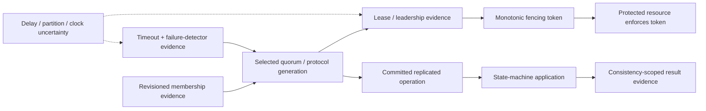

# Distributed coordination and consistency foundations

| Field | Value |
|---|---|
| Status | Draft domain analysis |
| Purpose | Coordinate distributed participants under delay, partition, crash, restart, and clock uncertainty with exact safety, liveness, fencing, and consistency evidence |

## Conclusions

- Silence and timeout produce suspicion, never proof that a participant or old leader cannot still act.
- A lease, lock, or election result becomes safe side-effect authority only when every protected resource rejects stale fencing tokens.
- Consensus orders values within an exact configuration and failure model; it does not automatically provide correct application semantics, durable external effects, or availability.
- Consistency claims name operations, histories, real-time/session/causal scope, transactions, replicas, reads, partitions, and acknowledged boundaries. “Strong” and “eventual” alone are prohibited.
- Transactions and sagas have different atomicity and recovery contracts; compensation is a new authorized effect, not time reversal.

## Documents

- [Coordination model and authority](coordination-model.md)
- [Membership and failure evidence](membership-failure.md)
- [Leases and fencing](leases-fencing.md)
- [Leader election, locks, semaphores, and barriers](election-locks.md)
- [Consensus and replicated state](consensus-replication.md)
- [Consistency and read/write semantics](consistency-models.md)
- [Distributed transactions and workflows](transactions-workflows.md)
- [Failure, recovery, reconfiguration, and lifecycle](recovery-lifecycle.md)
- [Security, privacy, accessibility, i18n, and observability](cross-cutting.md)
- [Protocol and platform research](platform-research.md)
- [Conformance specification](conformance.md)
- [Benchmark specification](benchmarks.md)

