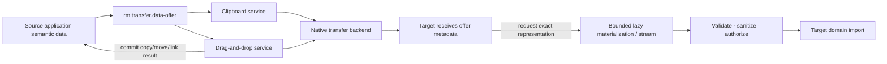

# Clipboard and drag-and-drop data-transfer vertical slice

| Field | Value |
|---|---|
| Status | Draft domain analysis |
| Purpose | Define typed, lazy, bounded, user-mediated cross-application data transfer while preserving ownership, provenance, consent, and failure semantics |

## Domain boundary

The common transfer capability describes immutable items and representations plus lazy materialization. Clipboard and drag-and-drop are separate services over it: clipboard has selection ownership and persistence; drag has a user gesture, location, target negotiation, feedback, and a terminal operation result. File promises are a specialized transactional transfer service.

## Architectural conclusions

- Offered metadata is not payload materialization and never proves the data is still available.
- Formats are typed/versioned representation identifiers with declared encoding and semantics, not filename extensions alone.
- Conversion is explicit, attributable, bounded, and does not silently strengthen trust.
- A drop target chooses an accepted representation and operation before expensive materialization where possible.
- `move` is a commit protocol: source deletion follows proven target acceptance, not pointer release or optimistic UI feedback.
- Clipboard/drag content is untrusted cross-process input even when the source appears local.

## Documents

- [`rm.transfer.data-offer`](data-offer.md)
- [Clipboard service](clipboard-service.md)
- [Drag-and-drop service](drag-drop-service.md)
- [File and content promises](file-promises.md)
- [Security, privacy, accessibility, and i18n](cross-cutting.md)
- [Platform research](platform-research.md)
- [Conformance specification](conformance.md)
- [Benchmark specification](benchmarks.md)

