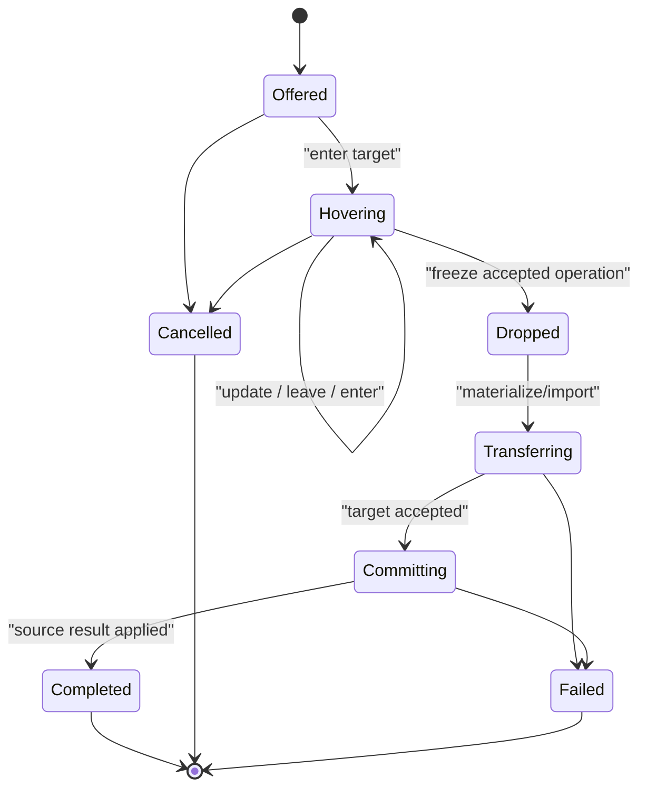

# Drag-and-drop service

| Field | Value |
|---|---|
| Status | Draft platform service 0.1.0 |

**RM-TRANSFER-DRAG-0001:** A drag begins only from a qualifying user or accessibility action and binds source node/window, input provenance, immutable offer, allowed/preferred operations (`copy`, `move`, `link`, or domain extension), visual/accessible description, and cancellation policy.

**RM-TRANSFER-DRAG-0002:** A session has one identity and ordered lifecycle: `offered -> entered/updated* -> accepted-or-rejected -> dropped-or-cancelled -> transfer -> terminal-result`. Native reentrancy is contained behind a non-reentrant portable stream.

**RM-TRANSFER-DRAG-0003:** Target updates carry window/logical location and transform revision, modifier/action intent, offered representation metadata, accepted representation/operation, insertion semantics, and feedback. Hover does not materialize payload by default.

**RM-TRANSFER-DRAG-0004:** Acceptance is provisional until drop. Drop freezes target, operation, representation, authority/policy, and destination revision before materialization or file-promise creation.

**RM-TRANSFER-DRAG-0005:** Target import and source operation result are distinct. `copy` completes after proven import; `move` additionally requires an explicit target commit acknowledgement before the source may delete/mutate original data; `link` states exact link semantics.

**RM-TRANSFER-DRAG-0006:** Cancellation at hover, drop, transfer, target import, commit, source cleanup, window destruction, focus/session loss, or source/target exit has a typed outcome and bounded cleanup. Partial target artifacts follow an explicit rollback/quarantine policy.

**RM-TRANSFER-DRAG-0007:** Autoscroll, spring loading, drag image/preview, and pointer capture are UI-framework compositions. They obey reduced motion, zoom/contrast, accessibility, and untrusted-preview policy without altering transfer semantics.

**RM-TRANSFER-DRAG-0008:** Keyboard and assistive-technology users can select source, operation, target/insertion point, inspect offered/accepted semantics, confirm, cancel, and observe completion without pointer precision.

**RM-TRANSFER-DRAG-0009:** Cross-application targets are untrusted. Target identity/provenance informs policy but does not authorize reading source data or deleting originals.

