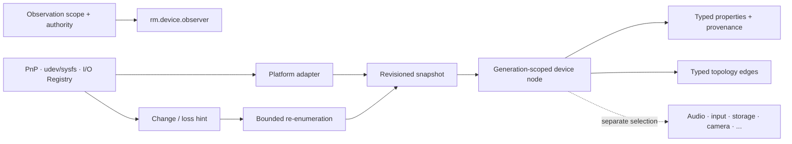

# Device discovery and hardware-change foundations vertical slice

| Field | Value |
|---|---|
| Status | Draft domain analysis |
| Purpose | Discover and observe platform devices without treating metadata as physical identity, authority, or an open device protocol |

## Conclusions

- Discovery observes OS device/service objects. It does not provide device-class protocols.
- A device reference is provider-, scope-, and generation-bound. Serial numbers, paths, labels, vendor/product identifiers, and registry IDs are evidence attributes, not universal physical identity.
- Snapshots are coherent at a declared observation boundary; topology may change immediately afterward.
- Native notifications are invalidation hints. Overflow, coalescing, races, and missed delivery require reconciliation.
- Enumeration is side-effect-minimal and does not open devices, mount media, request capture consent, load arbitrary code, or grant authority.
- Sensitive identifiers, location, network addresses, and user-assigned labels are classified and minimized.

## Documents

- [Scope and scenarios](scope-scenarios.md)
- [Identity and generations](identity-generation.md)
- [Snapshots and queries](snapshots-queries.md)
- [Properties and topology](properties-topology.md)
- [Change observation and reconciliation](change-reconciliation.md)
- [Authority, privacy, and class handoff](authority-handoff.md)
- [Platform research](platform-research.md)
- [Conformance](conformance.md)
- [Benchmarks](benchmarks.md)
