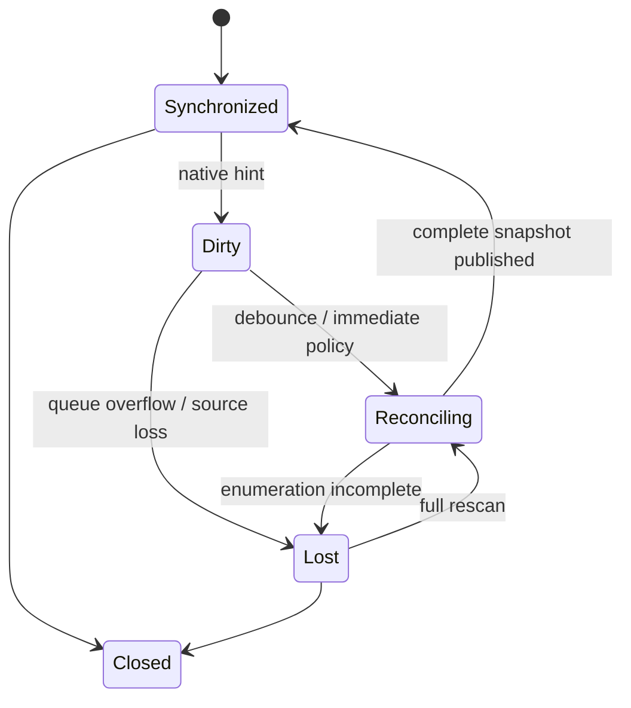

# Device change observation and reconciliation

Native callbacks enqueue bounded invalidation records. They do not perform enumeration, property I/O, product callbacks, logging export, or class-specific opens. A coordinator coalesces hints, re-enumerates, computes a bounded diff, and atomically publishes a new snapshot.

**RM-DEVICE-CHANGE-0001:** Change delivery MUST be modeled as an invalidation hint followed by reconciliation, not as a lossless portable event journal.

**RM-DEVICE-CHANGE-0002:** A published diff MUST bind old/new snapshot revisions and classify add, remove, generation replace, state/property/topology change, and redaction-quality change.

**RM-DEVICE-CHANGE-0003:** Queue overflow, callback registration gaps, source restart, suspend/resume, and unknown native actions MUST mark the observer dirty or lost and force full reconciliation.

**RM-DEVICE-CHANGE-0004:** Debouncing/coalescing MUST be bounded, policy-visible, and unable to indefinitely postpone convergence under continuous change.

**RM-DEVICE-CHANGE-0005:** Callback teardown MUST prevent use-after-close while permitting already queued reconciliation to finish or cancel with a defined terminal outcome.

See [ADR-0051](../../adr/0051-device-notifications-trigger-reconciliation.md).
