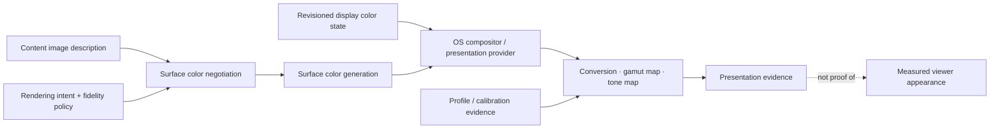

# Display and color-management foundations vertical slice

| Field | Value |
|---|---|
| Status | Draft domain analysis |
| Purpose | Describe content and display color semantics, negotiate compositor presentation, and expose conversion evidence without reducing color management or HDR to booleans |

## Conclusions

- Pixel encoding, colorimetry, target color volume, mastering metadata, content light metadata, display capability, current headroom, compositor policy, calibration, and measured appearance are distinct.
- `HDR`, wide gamut, bit depth, peak luminance, profile presence, and automatic color management are independent dimensions—not one quality level.
- Content uses immutable image descriptions. ICC is one representation alongside parameterized primaries, transfer functions, luminance, matrices, and named standards.
- Presentation binds a surface generation, content description, rendering intent, compositor/provider generation, and fallback policy. Moving or spanning displays may require a new generation.
- The OS compositor normally owns final display mapping. Direct scan-out, exclusive display control, calibration installation, and hardware adjustment are separate privileged capabilities.

## Documents

- [Image descriptions and color semantics](image-description.md)
- [Display color observation](display-observation.md)
- [Surface negotiation and presentation](surface-negotiation.md)
- [Conversion, gamut mapping, and tone mapping](conversion-tone-mapping.md)
- [Profiles, calibration, and measurement](profiles-calibration.md)
- [Dynamic change and lifecycle](dynamic-change.md)
- [Security, privacy, and accessibility](security-accessibility.md)
- [Platform research](platform-research.md)
- [Conformance](conformance.md)
- [Benchmarks](benchmarks.md)
