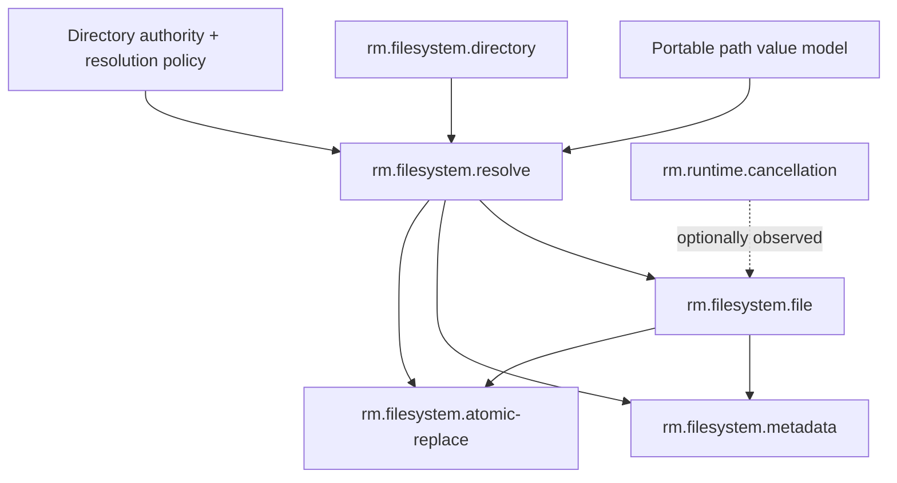

# Filesystem foundations vertical slice

| Field | Value |
|---|---|
| Status | Draft domain analysis |
| Purpose | Exercise names, resources, authority, races, partial I/O, metadata variance, and atomic namespace change |

## Domain boundary

The filesystem domain provides typed access to hierarchical names and durable or ephemeral byte-oriented resources. The initial slice covers path values, directory-relative resolution, regular-file handles and positional I/O, metadata snapshots, and same-filesystem atomic replacement.

Directory enumeration, links, watching, permissions/ACL mutation, memory mapping, sparse files, locking, extended attributes, streams/forks, durability transactions, and temporary-file policy remain later capabilities or services.

## Candidate model

The path model is a semantic type model, not a capability. Resolution is a capability because it consumes authority and produces a resource under race-resistant policy. File I/O and metadata operate primarily on resolved handles. Atomic replacement changes a namespace binding and therefore depends on directory authority in addition to file content.

## Scenarios

| ID | Scenario | Primary concern |
|---|---|---|
| FS-001 | Open a configuration file beneath an authorized directory | Traversal containment and authority |
| FS-002 | Read a file concurrently at independent offsets | Cursor independence and partial reads |
| FS-003 | Cancel an async read while completion races | Buffer ownership and terminal outcome |
| FS-004 | Inspect metadata without following the final symbolic link | Resolution policy and metadata subject |
| FS-005 | Compare whether two handles refer to the same live object | Identity scope and reuse |
| FS-006 | Replace a destination atomically with prepared content | Namespace atomicity and metadata policy |
| FS-007 | Crash after replacement but before directory persistence | Visibility versus durability |
| FS-008 | Encounter names not representable as Unicode | Lossless path representation |
| FS-009 | Operate on a case-insensitive, case-preserving filesystem | Comparison policy versus stored spelling |
| FS-010 | Access a network or removable filesystem | Capability discovery and weaker guarantees |

## Boundary conclusions

- A path is an uninterpreted platform-native sequence plus structural operations; it is not necessarily Unicode text.
- Lexical normalization is not filesystem resolution and cannot prove containment.
- Directory-relative resolution is the portable security boundary; process current directory is ambient policy.
- A resolved handle is more stable than a path but is not an eternal identity.
- Positioned I/O is the concurrency primitive; a shared cursor is optional higher-level state.
- Short reads and writes are successful partial progress, not exceptional failure.
- Atomic namespace replacement does not imply durable persistence after power loss.
- Metadata fields are individually available, unavailable, or unknown; fabricated zero/default values are prohibited.

## Documents

- [Path value model](path-model.md)
- [Platform research](platform-research.md)
- [`rm.filesystem.resolve`](resolve.md)
- [`rm.filesystem.directory`](directory.md)
- [`rm.filesystem.file`](file.md)
- [`rm.filesystem.metadata`](metadata.md)
- [`rm.filesystem.atomic-replace`](atomic-replace.md)
- [Filesystem error model](error-model.md)
- [Resolution quality levels](resolution-quality.md)
- [Filesystem durability model](durability-model.md)
- [Provider support matrix](support-matrix.md)
- [Conformance specification](conformance.md)
- [Benchmark specification](benchmarks.md)
- [Open questions](open-questions.md)
